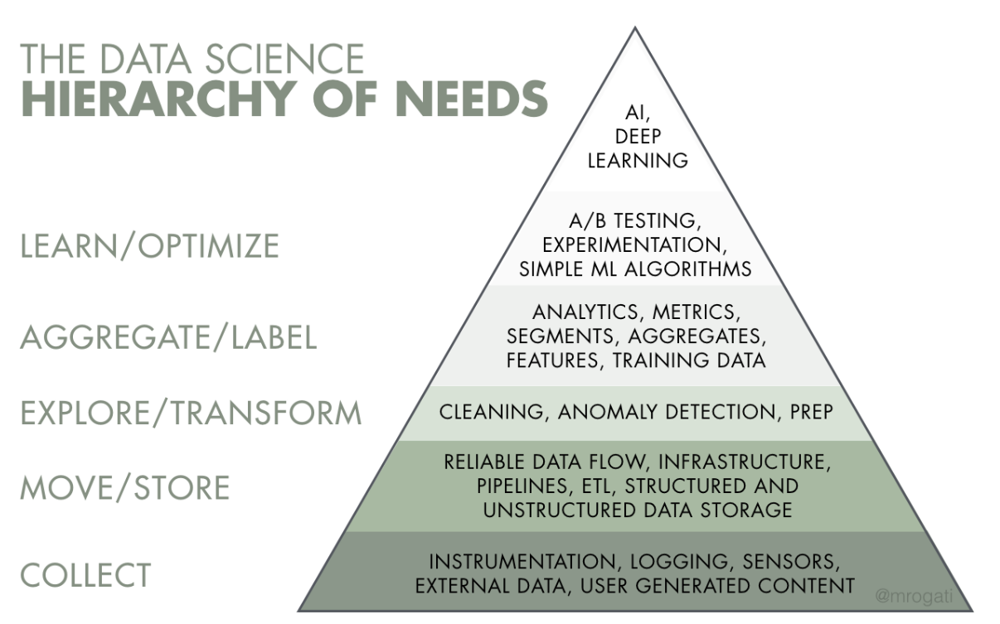
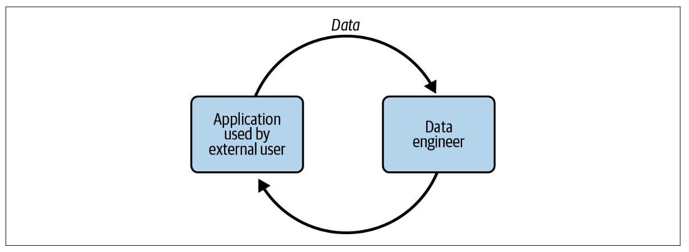
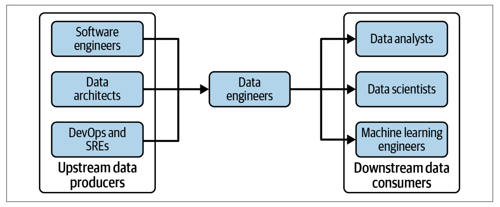

# Chapter 1 - Data Engineering Described

## What is Data Engineering?

***Data engineering*** is the development, implementation, and maintenance of systems and processes that take in raw data and produce high-quality, consistent information that supports downstream use cases, such as analysis and machine learning. Data engineering is the intersection of **security**, **data management**, **DataOps**, **data architecture**, **orchestration**, and **software engineering**. 

### The Data Engineering Lifecycle

### Data Engineering and Data Science

It's believed that data engineering is *separate* from data science and analytics. They compliment each other, but they are distincly difference. Data Engineering sits upstream from data science meaning data engineers provide the inputs used by data data scientist (downstream from data engineering).

Accoding to this [article](https://oreil.ly/pGg9U) (2017) by Monica Rogati. Considering the Data Science Hierarchy of Needs.

The reality shows that an estimated 70%-80% of data scientist time is spent toiling in the bottom three parts of the hierarchy—gathering data, cleaning data, processing data—and only tiny slice of their time on analysis and ML. Rogati argues that companies need to build a solid data foundatation (bottom 3 levels of the hierarchy) before tackling areas such as AI and ML.

## Data Engineering skills and Activities

The skill set of a data engineers encompasses the ***undercurrents*** of data engineering: *Security*, *data management*, *DataOps*, *data architecture* and *software engineering*.

Data engineers deals with a lot of complex moving parts and must constantly optimize along the axes of *cost*, *agility*, *scalability*, *simplicity*, *reuse* and *interoperability*

### Data Maturity and the Data Engineering

***Data Maturity*** is the progression toward higher data utilization, capabilities, and integration across the organization.

Based on this book, a simplified data maturity model has three stages:
1. Starting with data

    An organization that is in the very early stages of data maturity

    A data engineer should focus on the following in organizations getting started with data:
    
    - Get buy-in (support) from key stakeholders, including executive management.
    - Define the right data architecture.
    - Identify and audit data that will support key initiatives and operate within the data architecture that have been designed.
    - Build a solid data foundation for future data analyst and data scientists to generate reporst and models that provide competitice value.

    Tips for this stage:

    - Organizational willpower may wane if a lot of visible successes don’t occur with
data. Getting quick wins will establish the importance of data within the organization.
    - Get out and talk to people, and avoid working in silos
    - Avoid undifferentiated heavy lifting. Don;t box in with unnecessary technical complexity.
    - Build custom solutions and code only where this creates a competitive advantage.

2. Scaling with data

    At this point, the organization has moved away from ad hoc data requests and has formal data practices.

    In organizations that are in stae 2 of data maturity, a data engineer's goals are to do the following:

    - Establish formal data practices
    - Create scalable and robust data architectures
    - Adopt DevOps and DataOps practices
    - Build systems that support ML
    - Continue to avoid undifferentiated heavy lifting and customize only when a competitive advantage results.
    
    Issues to watch out for include the following:
    - Value to customers should drive technology decisions, rather than adopting bleeding-edge technologies based on social proof from Silicon Valley.
    - Tthe main bottlenect for scaling is not cluster nodes, storage or technology but the data engineering team.
    - temptation to frame ourself as a technologist, a data genius who can deliver magical products. Try to communicate with other teams about the practical utility of data. Teach the organization how to consume and leverage data.

3. Leading with data

    At this stage, the organization is data-driven. The automated pipelines and systems craeted by data engineers allow people within the organization to do self-service analytics and ML

    In organizations in stage 3 of data maturity, a data engineer will continue building on prior stages, plus they will do the following:

    - Create automation for the seamless introduction and usage of new data
    - Focus on building custom tools and systems that leverage data a competitive advantage
    - Focus on the "enterprisey" aspects of data, such as data management (including data governance and quality) and DataOps
    - Deploy tools that expose and disseminate (spread) data throughout the organization, including data catalogs, data lineage tools, and metadata management systems
    - Collaborate with software engineers, ML engineers, analyst, and others
    - Create a community and environment where people can collaborate and speak openly

    Issues to watch out for include the following:
    
    - Risk of significant danger of complacency (self-satisfaction)
    - Tempatation to pursue expensive hobby projects that don't deliver value to the business

### Business Responsibilities

These macro responsibilities aren't exclusive only to data engineers but also for anyone working in a data or technology field.

- Know how to communicate with nontechnical and technical people
    
- Understand  the cultural foundations of Agile, DevOps and DataOps

- Control cost

- Learn continuosly

### Technical Responsibilities

Should a data engineer know how to code? yes, and what languages? In this book, data engineering programming language are dividedinto primary and secondary categories.

**Primary**

- SQL

    The most common interface for databases and data lakes.

- Python

    The language bridge between data engineering and data science.

- JVM languages such as Java and Scala

    Prevalent for Apache open source projects such as Spark, Hive, and Druid. The JVM is generally more performant than Python and may provide access to lower-level features than a Python API.

- bash

    The command-line intergace for Linux operating system.

**Secondary**

- R, Java Script, GO, Rust, C/C++, C# and Julia.

### The continuum of Data Engineering Roles, From A to B

In data science, There's the notion of *type A* and *type B* data scientist. *Type A data scientists*—where *A* stands for *analysis—*focus on understand and deriving insight from data. *Type B data scientists*—where *B* stands for *building*—share similar backgrounds as type A data scientists and possess strong programming skills.

Comparable to above, there is a similar distinction for two types of data engineers:

- *Type A data engineers*

    *A* stands for *abstraction*. Type A data engineers manage the data engineering lifecycle mainly using entirely off-the-shelf products, managed services, and tools.

- *Type B data engineers*

    *B* stands for *build*. Type B data engineers build data tools and systems that scale and leverage a company's core competency and competitive advantage.

## Data Engineers Inside an Organization

Data engineers don't work in a vacuum. Depending on what they're working on, they will interact with technical and nontechnical people and face different directions (internal and external)

### Internal-Facing Versus External-Facing Data Engineers

Depending on the end-use cases, a data engineer's primary responsibilities are external facing, internal facing or a blend of the two.

**External-facing**

An **external facing** data engineer typically aligns with the users of external-facing applications (e.g. social media apps, IoT devices, and ecommerce platform). This data engineer architects, builds, and manages the systems that collect, store, and process transactional and event data from these applications. The systems build by these data engineers have a feedback loop from the application to the data pipeline, and then back to the application.

**Internal-facing**

An **internal facing** data engineer typically focuses on activities crucial to the needs of the business and internal stakeholders. Examples include creating and maintaining data pipelines and data warehouses for BI dasboards, reports, business processes, data science and ML models.

### Data Engineers and Other Technical Roles
In practice, the data engineering lifecycle cuts across many domains of responsibility

**Upstream Stakeholders**

- *Data architects*

    Data architects function at a levell of abstractions one step removed from data engineers. Data architects design the blueprint for organizational data management, mapping out processes and overall data architecture and systems. They also serve as a bridge between an organization's technical and nontechnical sides.

- *Software engineers*

    The systems built by software engineers typically generate application event data and logs, which are significant assets in their own right. In well-run technical organizations, software engineers and data engineers coordinate from the inception of a new project to design application data for consumption by analytics and ML applications.

- *DevOps engineers* and *site-reliability engineers/QA engineers*

    DevOps engineers and SREs/QAs often produce data through operational monitoring.

**Downstream stakeholders**

- *Data Scientists*

    If data engineers do their job and collaborate successfully, data scientists shouldn't spend 70% to 80% (according to common industry folklore) of their time collecting, cleaning, and preparing data after initial exploratory work.

- *Data Analyst*

    Data engineers work with data analysts to build pipelines for new data sources required by the business. Data analysts' business-knowledge/subject-matter expertise is invaluable in improving data quality, and they frequently collaborate with data engineers in this capacity.

- *Machine learning engineers* and *AI researchers*

    The boundaries between ML engineering, data engineering, and data science are blurry. Data engineers may have some operational responsibilities over ML systems, and data scientists may work closely with ML engineering in designing advanced ML processes.

### Data Engineers and Business Leadership

Data engineers also operate more broadly as organizational connectors, often in a nontechnical capaity.

**Data in the C-suite**

- *Chief executive officer (CEO)*

    CEOs define a vision in coolaboration with technical C-suite roles and company data leadership, while data engineers provide a window into what's possible with data with maintainng a map of what data is available to the organization—both internally and from third parties—in what time frame.

- *Chief information officer (CIO)*

    CIOs will work with engineers and architects to map out major initiatives and make strategic decisions on adopting major architectural elements, such as enterprise resource planning (ERP) and customer relationshop management (CRM) systems, cloud migrations, data systems, and internal-facing IT.
    

