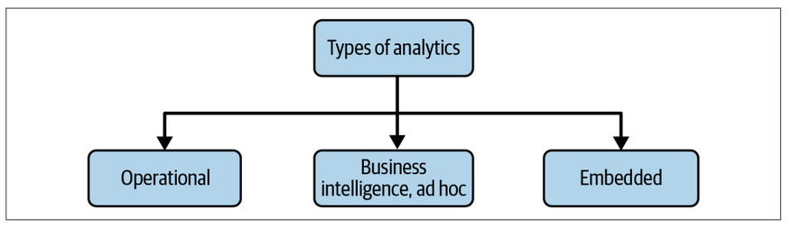

# Chapter 2 - The Data Engineering Lifecycle

## What is Data Engineering Lifecycle?

The ***data engineering lifecycle*** consists stages that turn raw data ingredients into a useful end product, ready for consumption by analyst, data scientists, ML engineers, and others. In this book, data engineering lifecycle is divided into five stages:

1. Generation
2. Storage
3. Ingestion
4. Transformation
5. Serving data

Data engineering is begun by getting data from the source systems and storing it. Next, we transform the data and then proceed to our central goal, serving the data to the end user. As a matter of fact, storage occurs throughout hte lifecycle as data flows from beginning to end—hence, the diagram shows the storage "stage" as a foundation that underpins other stages.

Normally, the middle stages—storage, ingestion, transformation—can get a bit jumbled. Various stages of the lifecycle may repeat themselves, occur out of order, overlap, or weave together in interesting and unexpected ways.

Acting as the base are ***undercurrents*** that cut across multiple stages of the data engineering lifecycle.

### The Data Lifecycle Versus the Data Engineering Lifecycle

The data engineering lifecycle is a subset of the whole data lifecycle. Whereas the full data lifecycle encompasses data across its entire lifespan, the data engineering lifecycle focuses on the stages a data engineer controls.

### Generation: Source Systems

A ***source systems*** is the origin of the data used in teh data engineering lifecycle. A data engineeri needs to have a working understanding of the way source systems work, the way they generate data, the frequency and velocity of the data, and the variety of data they generate.

There are many things to consider then assessing source systems, including how the system handles ingestion, state, and data generation. The following is a starting set of evaluation questions of source systems that data engineers must consider:

- What are the essential characteristics of the data source? is it an application? A swarm of IoT devices?

- How is the data persisted in the source system? is data persisted long term, or is it temporary and quickly deleted?

- At what rate is data generated? how many events per second? How many Gigabytes per hour?

- What level of consistency can data engineers expect from the output data? If your running a data-quality checks againts the output data, how often do data inconsistence occur—nulls where they aren’t expected, lousy formatting, etc.?

- How often do errors occur?

- Will the data contain duplicates?

- will some data values arrive late, possibly much later than other messages produced simultaneously?

- What is the schema of the ingested data? Will data engineers need to join cross several tables or even several systems to get a complete picture of the data?

- If schema changes (e.g. new column is added), how is this dealt with and communicated to downstream stakeholders?

- How frequently should data be pulled from the source system?

- For stateful system (e.g., a database tracking customer account information), is data provided as periodic snapshot or update events from change data capture ([CDC](https://www.qlik.com/us/change-data-capture/cdc-change-data-capture))? What's the logic for how changes are performed, and how are these tracked in the source database?

- Who/what is the data provider that will transmit the data for downstream consumption?

- Will reading from the data source impact the performance?

- Does the source system have upstream data dependencies? What are the characteristics of these upstream systems?

- Are data-quality checks in place to check for late of missing data?

Each source data has its unique volume and cadence of data generation. A data engineer should know how the source generates data, including relevant quirk, nuances and limitations.

One of the most challanging nuances of source data is the schema. The ***schema*** defines the hierarchical organization of data. The schema of data shipped from source systems is handled in various ways. Two popular options are schemaless and fixed schema.

***schemaless*** doesn't mean the absence of schema. Rather, it means that the application defines the schema as data is written. A more traditional model build on relational databse storage uses a ***fixed schema*** enforced in the database.

### Storage

Choosing a storage solution is a key to success in the rest of the data lifecycle, and it's also one of the most complicated stages of the data lifecycle for a variety of reasons:

1. Data architectures in the cloud often leverage several storage solutions
2. Few data storage solutions function purely as storage
3. storage frequently touches on other stages

In many ways, the way data is stored impacts how it is used in all of the stages of data engineering lifecycle.

Here are a few keys questions to ask when choosing a storage system:

- Is this storage soulition compatible with the architecture's required write and read speed?
- Will storage create a bottleneck for downstream processes?
- Do you understand how this storage technology works? Are you utilizing the storage system optimally or comimtting unnatural acts?
- Will this storage system handle anticipated future scale? You should consider all capacity limits on the storage system total available storage, read operation rate, write volume, etc.
- Will downstream users and processes be able to retrieve data in the required service-level agreement ([SLA](https://www.techtarget.com/searchitchannel/definition/service-level-agreement))?
- Are you capturing metadata about schema evolution, data flows, data lineage, and so forth? 
- Is this a pure storage solution (object storage), or does it support complex query patterns (e.g., a cloud data warehouse)?
- Is the storage system schema-agnostic (object storage)? flexible schema (Cassandra)? enforce schema (a cloud data warehouse)?
- How are you tracking master data, golden records data quality, and data lineage for data governance?
- How are you handling regulatory compliance and data sovereignty? e.g., can you store your data in certain geographical locations but not others?

#### Data access frequency

Data access frequency will determine the *temperature* of your data. Data that is most frequently accessed is called *hot data*. This type of data is commonly retrieved many times per day, or even several times per second which according to some use cases can be categorized as fast. *Lukewarm data* is the data that might be accessed every so often—say, every week or month.

*Cold data* is scarcely queried and and is appropiate for storing in an archival system. Cold data is often retained for compliance purposes or in case of catastrophic failure.

#### Selecting a storage system

Choosing a storage system depends on the use cases, data volumes, frequency of ingestion, and size of the data being ingested. There is no one-size-fits all universtal storage recommendation, each storage tech has its trade-offs.

### Ingestion

Based on the author's experiences, source systems and ingestion represent the most significant bottlenecks of data engineering lifecycle.

When preparing to architect or build a system, here are some primary questions about ingestion stage:

- What are the use cases for the data I'm ingesting? Can I reuse this data rather than createa multiple versions of the same dataset?

- Are the systems generating and ingesting this data reliably, and is the data available when I need it?

- What is the data destination after ingestion?

- How frequently will I need to access the data?

- In what volume will the data typically arrive?

- What format is the data in? Can my downstream storage and transformation systems handle this format?

- Is the source data in good shape for immediate downstream use? If so, for how long and what may cause it to be unsable?

- If the data is from a streaming source, does it need to be transformed before reaching its destination? Would an in-flight transformation be appropiate, where the data is transformed within the stream itself?

#### Batch vs streaming

fundamentally, all data we deal with is inherently streaming. *batch ingestion* is simply a specialized and convenient way of processing the stream of data in large chunks. On the other hand, *streaming ingestion* processes the data in a continous, real-time fashion. *real-time* (or near *real-time*) means that the data is available to a downstream system a short time after it is produced. batch was for a long time the default way to ingest data, however lately, continuous processing of data streams is much more accessible and increasingly popular. 

So, should you go streaming or batch? The following are some questions to be asked when determining whether streaming is an appropiate choice over batch ingestion:

- If I ingest the data in real time, can downstream storage systems handle the rate approach of data flow?

- Do i need millisecond real-time data ingestion? Or would a micro-batch approach work, accumulating and ingesting data, for instance, every minute?

- What are my use case for streaming ingestion? What specific benefit do I realize by implementing streaming? If I get data in real time, what actions can I take on that data that would be an improvement upon batch?

- Will my streaming-first approach cost more in terms of time, money, maintenance, downtime, and opportunity cost that simply doing batch?

- Are my streaming pipeline and system reliable and redundant if infrastructure fails?

- What tools are most appropiate for the use case? Should I use a managed service (Amazon Kinesis, Google Cloud Pub/Sub, Google Cloud Dataflow) or stand my own instances of Kafka, Flink, Spark, Pulsar, etc.? If I do the latter, who will manage it? what are the costs and trade-offs?

- If I'm deploying a ML model, what benefit do I have with online predictions and possibly contiuous training?

- Am I getting data from a live production instance? If so, what's the impact of my ingestion process on this source system?

#### Push versus pull

There are 2 main models of data ingestion:

- ***Push*** model: A source system writes data out to a target, whether a database, object store, or filesystem

- ***Pull*** model: Data is retrieved from the source system.

### Transformation

***Transforming*** is the process of changing data from its original form into something useful for downstream use cases.

These are some transformation which usually conducted:

- Basic: Map data into correct data types, putting records into standard format, and removing bad data
- Later stage: data schema transformation and normalization
- Other: large-scale aggregation, feature engineering

The following are some questions to be asked when considering data transformations within the data engineering lifecycle:

- What's the cost and return on investment (ROI) of the transformation? What is the assocaited business value?

- Is the transformation as simple and self-isolated as possible?

- What business rules do the transformations support?

You can transform data in batch or while streaming in flight.

Business logic is a major driver of data transformation, often in data modeling.

### Serving Data

Data has *value* when it's used for practical purposes. Data projects must be intentional across the lifecycle. What is the ultimate business purpose of the data so carefully collected, cleaned and stored?

Data serving meaning the uses of data, these are some popular uses of data"

#### Analytics

Analytics is the core of most data endevours. Here are some variations of analytics:

1. Business intelligence  
BI engineer/analyst collected data to describe a business' past and current state. BI requires using business logic to process raw data. As a company grows its data maturity, it will move from ad hoc data analysis to self-service analytics, allowing democratized data access to business users without needing IT to intervene.

2. Operational analytics
Operational analytics focuses on the fine-grained details of operations. Operational analytics could be a live view of inventory or real-time dashboarding of website or application health.

3. Embedded analytics
Embedded analytics is the integration of analytical capabilities and data visualizations into another software application. With Embedded analytics the request rate for reports, and the corresponding burden on analytics systems, goes up dramatically; access control is significantly more complicated and critical.
