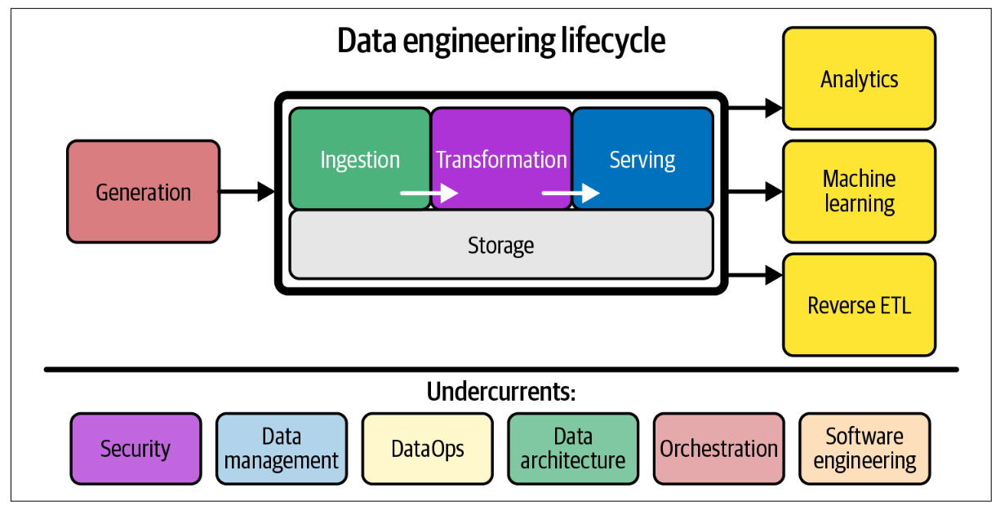
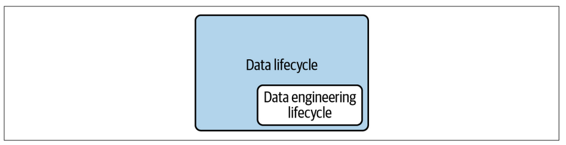

# Chapter 2 - The Data Engineering Lifecycle

## What is Data Engineering Lifecycle?

The ***data engineering lifecycle*** consists stages that turn raw data ingredients into a useful end product, ready for consumption by analyst, data scientists, ML engineers, and others. In this book, data engineering lifecycle is divided into five stages:

1. Generation
2. Storage
3. Ingestion
4. Transformation
5. Serving data

Data engineering is begun by getting data from the source systems and storing it. Next, we transform the data and then proceed to our central goal, serving the data to the end user. As a matter of fact, storage occurs throughout hte lifecycle as data flows from beginning to end—hence, the diagram shows the storage "stage" as a foundation that underpins other stages.

Normally, the middle stages—storage, ingestion, transformation—can get a bit jumbled. Various stages of the lifecycle may repeat themselves, occur out of order, overlap, or weave together in interesting and unexpected ways.

Acting as the base are ***undercurrents*** that cut across multiple stages of the data engineering lifecycle.

### The Data Lifecycle Versus the Data Engineering Lifecycle

The data engineering lifecycle is a subset of the whole data lifecycle. Whereas the full data lifecycle encompasses data across its entire lifespan, the data engineering lifecycle focuses on the stages a data engineer controls.

### Generation: Source Systems

A ***source systems*** is the origin of the data used in teh data engineering lifecycle. A data engineeri needs to have a working understanding of the way source systems work, the way they generate data, the frequency and velocity of the data, and the variety of data they generate.

There are many things to consider then assessing source systems, including how the system handles ingestion, state, and data generation. The following is a starting set of evaluation questions of source systems that data engineers must consider:

- What are the essential characteristics of the data source? is it an application? A swarm of IoT devices?

- How is the data persisted in the source system? is data persisted long term, or is it temporary and quickly deleted?

- At what rate is data generated? how many events per second? How many Gigabytes per hour?

- What level of consistency can data engineers expect from the output data? If your running a data-quality checks againts the output data, how often do data inconsistence occur—nulls where they aren’t expected, lousy formatting, etc.?

- How often do errors occur?

- Will the data contain duplicates?

- will some data values arrive late, possibly much later than other messages produced simultaneously?

- What is the schema of the ingested data? Will data engineers need to join cross several tables or even several systems to get a complete picture of the data?

- If schema changes (e.g. new column is added), how is this dealt with and communicated to downstream stakeholders?

- How frequently should data be pulled from the source system?

- For stateful system (e.g., a database tracking customer account information), is data provided as periodic snapshot or update events from change data capture ([CDC](https://www.qlik.com/us/change-data-capture/cdc-change-data-capture))? What's the logic for how changes are performed, and how are these tracked in the source database?

- Who/what is the data provider that will transmit the data for downstream consumption?

- Will reading from the data source impact the performance?

- Does the source system have upstream data dependencies? What are the characteristics of these upstream systems?

- Are data-quality checks in place to check for late of missing data?

Each source data has its unique volume and cadence of data generation. A data engineer should know how the source generates data, including relevant quirk, nuances and limitations.

One of the most challanging nuances of source data is the schema. The ***schema*** defines the hierarchical organization of data. The schema of data shipped from source systems is handled in various ways. Two popular options are schemaless and fixed schema.

***schemaless*** doesn't mean the absence of schema. Rather, it means that the application defines the schema as data is written. A more traditional model build on relational databse storage uses a ***fixed schema*** enforced in the database.

### Storage