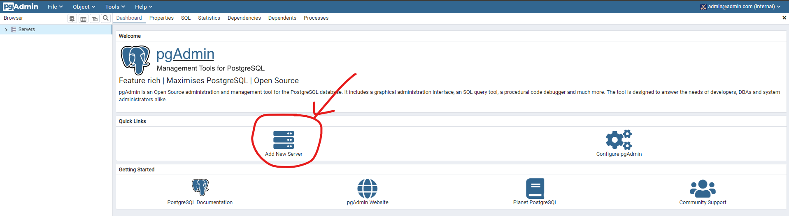
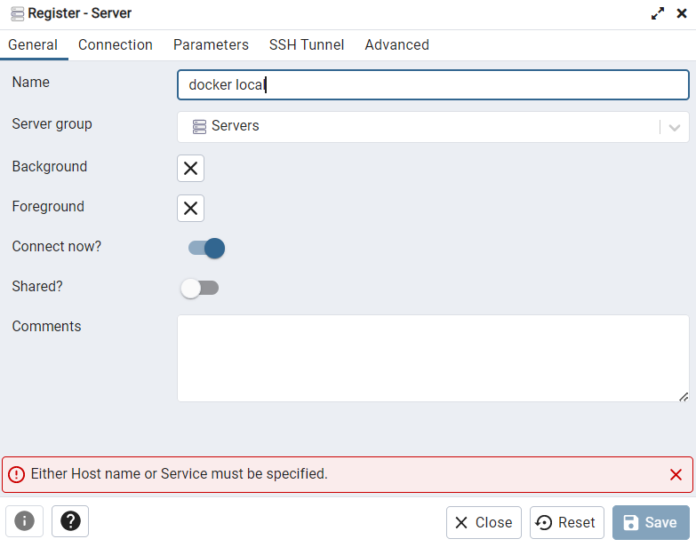
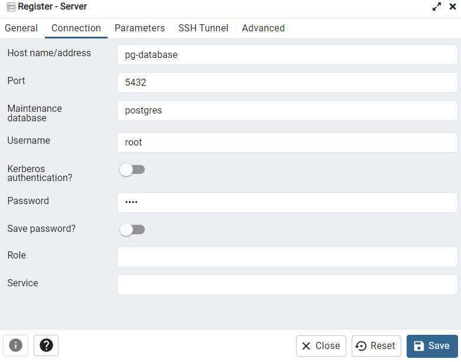

# WEEK 1: BASIC AND SETUP

### Table of Contents

[**1.1 Introduction to Data Engineering**](#11-introduction-to-data-engineering)
- [Architecture](#architecture)
- [Data Pipelines](#data-pipelines)

[**1.2 Docker and Postgres**](#12-docker-and-postgres)
- [Docker Basic Concepts](#docker-basic-concepts)
- [Creating A Simple "Data Pipeline" In Docker](#creating-a-simple-data-pipeline-in-docker)
- [Running Postgres In A Container](#running-postgres-in-a-container)
- [Ingesting Data To Postgres With Python](#ingesting-data-to-postgres-with-python)
- [Connecting pgAdmin and Postgres](#connecting-pgadmin-and-postgres)
- [Putting The Ingestion Script Into Docker](#putting-the-ingestion-script-into-docker)
- [Dockerizing The Script](#dockerizing-the-script)
- [Running Postgres and PgAdmin with Docker-compose](#running-postgres-and-pgadmin-with-docker-compose)
- [SQL Refresher](#sql-refresher)

[**1.3 Google Cloud Platform and Terraform**](#13-google-cloud-platform-and-terraform)
- [GCP Initial Setup](#gcp-initial-setup)
- [GCP Setup for Access](#gcp-setup-for-access)
- [Terraform Basics](#terraform-basics)
- [Creating GCP Infrastructure with Terraform](#creating-gcp-infrastructure-with-terraform)

[**1.4 Extras**](#14-extras)
- [Setting Up The Environment on Cloud VM](#setting-up-the-environment-on-cloud-vm)
- [Port mapping and networks in Docker](#port-mapping-and-networks-in-docker)


# **1.1 Introduction to Data Engineering**

***Data engineering*** is the design and development of systems of collecting, storing and analyzing data at scale.

## Architecture

Along the course, we will replicate the following architecture:


- [*NY TLC Data Website*](https://www.nyc.gov/site/tlc/about/tlc-trip-record-data.page): The dataset which will be used in this course
- *Google Cloud Platform (GCP)*: Cloud-based auto-scaling platform by Google
    - [*Google Cloud Storage (GCS)*](https://cloud.google.com/storage): A managed service for storing unstructured data (Data Lake)
    - [*BigQuery*](https://cloud.google.com/bigquery): Serverless and cost-effective enterprise data warehouse
- [*Terraform*](https://www.terraform.io/): An Infrastructure-as-Code (IaC) tool that lets you build, change, and version cloud and on-prem resources safely and efficiently
- [*Docker*](https://www.docker.com/): A platform designed to help developers build, share, and run modern applications (Containerization)
- *SQL*: Data Analysis & Exploration
- [*Prefect*](https://www.prefect.io/): Workflow orchestration tool for coordinating all data tools
- [*dbt*](https://docs.getdbt.com/docs/introduction): Command line tool that enables data analysts and engineers to transform data in their warehouses more effectively (Data transformation)
- [*Spark*](https://spark.apache.org/): Analytics engine for large-scale data processing (Distributed Processing). 
- [*Kafka*](https://kafka.apache.org/): Unified, high-throughput, low-latency platform for handling real-time data feeds (Streaming).

## Data Pipelines

A data pipeline is a service that receives data as input and outputs more data. For example, reading a CSV file, transforming the data somehow and storing it as a table in a PostgreSQL database.


# **1.2 Docker and Postgres**

## Docker Basic Concepts

**Docker** is a *containerization* software that allows us to isolate software in a similar way to virtual machines but in a much leaner way.

A **Docker image** is a snapshot of a container that we can define to run our software, or in this case our data pipelines. By exporting our Docker images to Cloud providers such as Amazon Web Services or Google Cloud Platform we can run our containers there.

Docker provides the following advantages:
- Reproducibility
- Local experimentation
- Integration tests (CI/CD)
- Running pipelines on the cloud (AWS Batch, Kubernetes jobs)
- Spark (for defining data pipelines)
- Serverless (AWS Lambda, Google functions)

Docker containers are ***stateless***: any changes done inside a container will **NOT** be saved when the container is killed and started again. This is an advantage because it allows us to restore any container to its initial state in a reproducible manner, but you will have to store data elsewhere if you need to do so; a common way to do so is with *volumes*.

## Creating A Simple "Data Pipeline" In Docker

We will create a simple "data pipeline" using python `pipeline.py` that receives an argument and print in.

```python

import sys
import pandas as pd # we don't need this but it's useful for the example

# print arguments
print(sys.argv)

# argument 0 is the name os the file
# argumment 1 contains the actual first argument we care about
day = sys.argv[1]

# print a sentence with the argument
print(f'job finished successfully for day = {day}')
```

We can run this script in CLI 
```bash
python pipeline.py <day>
```

It will print 2 lines:

```bash
['pipeline.py', '<day>']

job finished successfully for day = <day>
```
Let's containerize it by creating a Docker image. Create the following `Dockerfile` file:

```Dockerfile
# base Docker image that we will build on
FROM python:3.9.1

# set up our image by installing prerequisites; pandas in this case
RUN pip install pandas

# set up the working directory inside the container
WORKDIR /app
# copy the script to the container. 1st name is source file, 2nd is destination
COPY pipeline.py pipeline.py

# define what to do first when the container runs
# in this example, we will just run the script
ENTRYPOINT ["python", "pipeline.py"]
```

Let's build the image:

```bash
docker build -t tests:pandas .
```

- The image name will be `tests` and its tag will be `pandas`. if the tag isn't specified it will default `latest`.

We can check the our previous image in the docker by passing:

```bash
docker images -ls
```

Since the image is there, now we can run the container and pass an argument to it, so that our pipeline will receive it:

```bash
docker run -it test:pandas <day>
```

you will get the same output you did when you ran the pipeline script itself.

>Note: these instructions assume that `pipeline.py` and `Dockerfile` are in the same directory. The Docker commands should also be run from the same directory as these files.


## Running Postgres In A Container

You can run a containerized version of Postgres that doesn't require any installation steps. You only need to provide a few *environment* variables to it as well as a *volume* for storing data.

Create a foler anywhere you'd like for Postgres to store data in. We will use the example folder `data/ny_taxi_postgres_data`. Here's how to run the container:

```bash
docker run -it \
    -e POSTGRES_USER="root" \
    -e POSTGRES_PASSWORD="root" \
    -e POSTGRES_DB="ny_taxi" \
    -v $(pwd)/data/ny_taxi_postgres_data:/var/lib/postgresql/data \
    -p 5432:5432 \
   postgres:13
```


- The container needs 3 environment variables:

    - `POSTGRES_USER` is the username for logging into the database. We chose `root`.
    - `POSTGRES_PASSWORD` is the password for the database. We chose `root`

        > ***IMPORTANT: These values are only meant for testing. Please change them for any serious project.***
    - `POSTGRES_DB` is the name that we will give the database. We chose `ny_taxi`.

- `-v` points to the volume directory. The colon `:` separates the first part (path to the folder in the host computer) from the second part (path to the folder inside the container).
    - Path names must be absolute. If you're in a UNIX-like system, you can use `pwd` to print you local folder as a shortcut; this example should work with both `bash` and `zsh` ss
    - This command will only work if you run it from a directory which contains the `ny_taxi_postgres_data` subdirectory you created above.
- `-p` is for port mapping. We map the default Postgres port to the same port in the host (5432).
- The last argument is the image name and tag. We run the official postgres image on its version `13`.

> Note: `-it` is short for --interactive. When you docker run with this command, it takes you straight inside the container.

[Once the container is runing, we can log into our database with [pgcli](https://www.pgcli.com/) with the following command:

```bash
pgcli -h localhost -p 5432 -u root -d ny_taxi
```

- `-h` is the host. Since we're running locally we can use `localhost`.
- `-p` is the port.
- `-u` is the username.
- `-d` is the database name.
- The password is not provided; it will be requested after running the command.

## Ingesting Data To Postgres With Python

We will now use Jupyter Notebook to read a SCV file and export it into Postgres.

We will use data from the [NYC TLC Trip Record Data website](https://www.nyc.gov/site/tlc/about/tlc-trip-record-data.page). Specifically, we will use the [Yellow taxi trip records CSV file for January 2021](https://github.com/DataTalksClub/nyc-tlc-data/releases/tag/yellow). A dictionary to understand each field is available [here](https://www1.nyc.gov/assets/tlc/downloads/pdf/data_dictionary_trip_records_yellow.pdf).

> Note: knowledge of Jupyter Notebook, Python environment management and Pandas is assumed in these notes. Please check [this link](https://gist.github.com/ziritrion/9b80e47956adc0f20ecce209d494cd0a#pandas) for a Pandas cheatsheet and [this link](https://gist.github.com/ziritrion/8024025672ea92b8bdeb320d6015aa0d) for a Conda cheatsheet for Python environment management.

Check the completed `upload-data.ipynb` [here](https://github.com/acothaha/learning/blob/main/data_engineering/de_zoomcamp_2023/week_1_basics_n_setup/2_docker_sql/upload_data.ipynb) for a detailed guide. Feel free to copy the file to your work directory; in the same directory you will need to have the CSV file linked above and the `ny_taxi_postgres_data` subdirectory. 

## Connecting pgAdmin and Postgres

`pgcli` is useable but it's not really practical to utilize. [`pgAdmin`](https://www.pgadmin.org/download/) on the other hand, make it easier to access and manage our Postgres databases. it's possible to run pgAdmin as a container along with the postgres container, but both containers will have to be in the same *virtual network* so that they can connect to each other.

Let's create a virtual Docker network called `pg-network` to connect pgAdmin and our Postgres database:

```bash
docker network create pg-network
```
> network can be removed with command `docker network rm pg-network`. look at List all of the existing network with `docker network ls`

Now, we will run our Postgres container and adding the network name, so that it can be connected with pgAdmin container (we will pass `pg-database` as the container name):

```bash
docker run -it \
    -e POSTGRES_USER="root" \
    -e POSTGRES_PASSWORD="root" \
    -e POSTGRES_DB="ny_taxi" \
    -v $(pwd)/data/ny_taxi_postgres_data:/var/lib/postgresql/data \
    -p 5432:5432 \
    --network=pg-network \
    --name pg-database \
    postgres:13
```

Now, we will run the pgAdmin container on other terminal:

```bash
docker run -it \
    -e PGADMIN_DEFAULT_EMAIL="admin@admin.com" \
    -e PGADMIN_DEFAULT_PASSWORD="root" \
    -p 8080:80 \
    --network=pg-network \
    --name pgadmin \
    dpage/pgadmin4
```

- The pgAdmin container needs 2 environment variables
    - login mail: `admin@admin.com`
    - password: `root`
- pgAdmin is a web app and its default port is 80; we map it to 8080 in our localhost to avoid any possible conflicts.
- Just like with the Postgres container, we specify a network and a name (use the same network as the Postgres container)
- The actual image name is `dpage/pgadmin4`

Now, we can access pgAdmin using browser with `localhost:8080`. Use the email and password you were passing in the docker run to log in.



Under *General* give the Server a name and under *Connection* add the same host name, user and password you used when running the container.





Click on *Save*. You should now be connected to the database.

## Putting The Ingestion Script Into Docker

There is a convenient way to export `ipynb` file into `py`. Use this command:

```bash
jupyter nbconvert --to=script upload-data.ipynb
```

Do some clean up to the script. Rename it `ingest_data.py` then add a few modification:

- Using argparse to handle the following command line arguments:
    - Username
    - Password
    - Host
    - Port
    - Database name
    - Table name
    -   URL for the CSV file
- The engine we created for connecting to Postgres will be tweaked so that we pass the parameters and build the URL from them, like this:

```python
engine = create_engine(f'postgresql://{user}:{password}@{host}:{port}/{db}')
```

- We will also download the CSV using the provided URL argument.

You can check the completed `ingest_data.py` script in this [link](https://github.com/acothaha/learning/blob/main/data_engineering/de_zoomcamp_2023/week_1_basics_n_setup/2_docker_sql/ingest_data_yellow.py)

In order to test the script we will have to drop the table we previously created. In pgAdmin, in the sidebar navigate to *Servers* > *Docker localhost* > *Databases* > *ny_taxi* > *Schemas* > *public* > *Tables* > *yellow_taxi_data*, right click on *yellow_taxi_data* and select *Query tool*. type in the following command:

```SQL
DROP TABLE yellow_taxi_data;
```

We are now ready to test the script with the following command:

```bash
URL="https://github.com/DataTalksClub/nyc-tlc-data/releases/download/yellow/yellow_tripdata_2021-01.csv.gz"

python ingest_data.py \
    --user=root \
    --password=root \
    --host=localhost \
    --port=5432 \
    --db=ny_taxi \
    --table_name=yellow_taxi_trips \
    --url=${URL}
```

Back in pgAdmin, refresh the Tables and check that `yellow_taxi_trips` was created. You can also run a SQL query to check the contents:

```SQL
SELECT
    COUNT(1)
FROM
    yellow_taxi_trips;
```

- This query should return 1,369,765 rows.

## Dockerizing The Script

Let's modify the Dockerfile we created before to include our `ingest_data.py` script and create a new image:

```Dockerfile
FROM python:3.9.1

# We need to install wget to download the csv file
RUN apt-get install wget
# psycopg2 is a postgres db adapter for python: sqlalchemy needs it
RUN pip install pandas sqlalchemy psycopg2

WORKDIR /app
COPY ingest_data.py ingest_data.py 

ENTRYPOINT [ "python", "ingest_data.py" ]
```

build the image:

```bash
docker build -t taxi_ingest:v001 .
```

and run it:

```bash
URL="https://github.com/DataTalksClub/nyc-tlc-data/releases/download/yellow/yellow_tripdata_2021-01.csv.gz"

docker run -it \
    --network=pg-network \
    taxi_ingest:v001 \
        --user=root \
        --password=root \
        --host=pg-database \
        --port=5432 \
        --db=ny_taxi \
        --table_name=yellow_taxi_trips \
        --url=${URL}
```

- Providing network for Docker to find the Postgres container is necessary. It is placed before the name of the image
- Since Postgres is running on a seperate container, the host argument will have to point to the container name of Postgres

## Running Postgres and PgAdmin with Docker-compose

`docker-compose` allows to launch multiple containers using a single configuration file, so that we don't have to run multiple complex `docker run` commands separately.

Docker compose makes use of YAML files. create a docker-compose.yaml file, and write down this script to run Postgres and pgAdmin containers:

```YAML
services:
  pgdatabase:
    image: postgres:13
    environment:
      - POSTGRES_USER=root
      - POSTGRES_PASSWORD=root
      - POSTGRES_DB=ny_taxi
    volumes:
      - "~/datany_taxi_postgres_data:/var/lib/postgresql/data:rw"
    ports:
      - "5432:5432"
  pgadmin:
    image: dpage/pgadmin4
    environment:
      - PGADMIN_DEFAULT_EMAIL=admin@admin.com
      - PGADMIN_DEFAULT_PASSWORD=root
    volumes:
      - "~/data_pgadmin:/var/lib/pgadmin"
    ports:
      - "8080:80"
```
- There is no need to specify a network since `docker-compose` takes care of it; every single container (or "service", as the file states) will run within the same network and will be able to find each other according to their names (pgdatabase and pgadmin in above example)
- We've added a volume for pgAdmin to save its settings, so that you don't have to keep re-creating the connection to Postgres every time you rerun the container. Make sure you create a `data_pgadmin` directory in your work folder where you run `docker-compose` from
- All othe details from the `docker run` commands (environment variables, volumes, and ports) are mentioned accordingly in the file following YAML syntax

We can now run Docker compose by running the following command from the same directory where `docker-compose.yaml` is found. Make sure that all previous containers aren't running anymore:

```bash
docker-compose up
```
> NOTE: this command assumes that the `ny_taxi_postgres_data` used for mounting the volume is in the same directory as docker-compose.yaml

And if you want to run the container again in the background rather than in the foreground (freeing up your terminal), you can run them in detached mode:

```bash
docker-compose up -d
```

If you want to re-run the dockerized ingest script when you run Postgres and pgAdmin with `docker-compose`, you will have to find the name of the virtual network that Docker compose created for the containers. You can use the command `docker network ls` to find it and then change the `docker run` command for the dockerized script to include the network name and correct database name.

After you finish the ingestation, you can terminate the docker-compose with this command:

```bash
docker-compose down
```
## SQL Refresher

Below are a series of SQL query examples to remember how SQL works. For this example we'll asume that we're working with 2 tables named `trips` (list of all yellow taxi trips of NYC for January 2021) and `zones` (list of zone IDs for pickups and dropoffs).

```SQL
SELECT
    *
FROM
    trips
LIMIT 100;
```

- Selects all row in the `trips` table. Select only the first 100

```SQL
SELECT
    *
FROM
    trips t,
    zones zpu,
    zones zdo
WHERE
    t."PULocationID" = zpu."LocationID" AND
    t."DOLocationID" = zpo."LocationID" 
LIMIT 100;
```

- Selects all rows in the `trips` table. select only the first 100
- We give aliases to the `trips` and `zones` tables for easier access
- We replace the IDs inside `PULocationID` and `DOLocationID` with the actual zone IDs for pickups and dropoffs
- We use double quotes (`""`) for the column names because in Postgres we need to use them if the column names contains capital letters

```SQL
SELECT
    tpep_pickup_datetime,
    tpep_dropoff_datetime,
    total_amount,
    CONCAT(zpu."Borough", '/', zpu."Zone") AS "pickup_loc",
    CONCAT(zdo."Borough", '/', zdo."Zone") AS "dropoff_loc"
FROM
    trips t,
    zones zpu,
    zones zdo
WHERE
    t."PULocationID" = zpu."LocationID" AND
    t."DOLocationID" = zpo."LocationID" 
LIMIT 100;
```
- Same as previous but instead of the complete rows we only display specific columns.
- We make use of joins (implicit joins in this case) to display combined info as a single column.
    - The new "virtual" column pickup_loc contains the values of both Borough and Zone columns of the zones table, separated by a slash (/).
    - Same for dropoff_loc.
- More specifically this is an ***inner join***, because we only select the rows that overlap between the 2 tables.

```SQL
SELECT
    tpep_pickup_datetime,
    tpep_dropoff_datetime,
    total_amount,
    "PULocationID",
    "DOLocationID"
FROM
    trips t
WHERE
    "PULocationID" IS NULL
LIMIT 100;
```

- Selects rows from the `trips` table whose pick up location is **NULL** and displays specific columns.
- If you have not modified the original tables, this query should return an empty result.

```SQL
SELECT
    tpep_pickup_datetime,
    tpep_dropoff_datetime,
    total_amount,
    "PULocationID",
    "DOLocationID"
FROM
    trips t
WHERE
    "DOLocationID" NOT IN (
        SELECT "LocationID" FROM zones
    )

LIMIT 100;
```

- Selects rows fromn the `trips` table whose drop off location ID does not appear in the `zones` table.
- If you did not modify any rows in the original datasets, the query would return an empty result.

```SQL
DELETE FROM zones WHERE "LocationID" = 142;
```
- Deletes all rows in the `zones` table with `LocationID` of 142.
- If we were to run this query and then run the previous query, we would get a list of rows with `PULocationID` of 142.

```SQL
SELECT
    tpep_pickup_datetime,
    tpep_dropoff_datetime,
    total_amount,
    CONCAT(zpu."Borough", '/', zpu."Zone") AS "pickup_loc",
    CONCAT(zdo."Borough", '/', zdo."Zone") AS "dropoff_loc"
FROM
    trips t 
        LEFT JOIN zones zup
            ON t."PULocationID" = zpu."LocationID"
        LEFT JOIN zones zdo
            ON t."DOLocationID" = zpu."LocationID"
LIMIT 100;    
```
- Similar to the join query from before but we use a ***left join*** instead.
- ***Left joins*** shows all rows from the "left" part of the statement but only the rows from the "right" part that overlap with the "left" part, thus the name.
- This join is useful if we deleted one of the `LocationID` rows like before. The inner join would omit some rows from the `trips` table, but this query will show all rows. However, since one ID is missing, the "virtual" columns we defined to transform location ID's to actual names will appear with empty strings if the query cannot find the location ID.

```SQL
SELECT
    tpep_pickup_datetime,
    tpep_dropoff_datetime,
    DATE_TRUNC('DAY', tpep_pickup_datetime),
    total_amount
FROM
    trips t 
LIMIT 100;    
```
- Selects all rows from the `trips` table but displays specific columns.
- `DATE_TRUNC` is a function that trunctates a timestamp. When using `DAY` as a parameter, it removes any smaller values (hours, minutes, seconds) and displays them as `00:00:00` instead.

```SQL
SELECT
    tpep_pickup_datetime,
    tpep_dropoff_datetime,
    DATE(tpep_pickup_datetime) AS "day",
    total_amount
FROM
    trips t 
LIMIT 100;    
```
- Very similar to previous query, but instead it casts the `TIMESTAMP` type to `DATE`, so that the hours:minutes:seconds info is completely omitted rather than show as `00:00:00`. The columns will be displayed under the name `day`.

```SQL
SELECT
    DATE(tpep_pickup_datetime) AS "day",
    COUNT(1)
FROM
    trips t
GROUP BY
    "day"
ORDER BY "day" ASC;
```
- Counts the amount of records in the `trips` table grouped by day.
- We remove the limit of 100 records because we do not want to restrict the amount of info on screen.
- Grouping does not guarantee order, so we enforce that the rows will be displayed in ascending order from earliest to latest day.

``` SQL
SELECT
    DATE(tpep_pickup_datetime) AS "day",
    COUNT(1) AS "count",
    MAX(total_amount),
    MAX(passenger_count)
FROM
    trips t
GROUP BY
    "day"
ORDER BY "count" DESC;
```
- Similar to the previous query but orders the rows by count and displays them in descending order, so that the day with the highest amount of trips is shown first.
- We also show the maximum amount that a driver earned in a trip for that day and the maximum passenger count on a single trip for that day.

```SQL
SELECT
    DATE(tpep_pickup_datetime) AS "day",
    "DOLocationID",
    COUNT(1) AS "count",
    MAX(total_amount),
    MAX(passenger_count)
FROM
    trips t
GROUP BY
    1, 2
ORDER BY "count" DESC;
```
- Similar to previous but we also include the drop off location column and we group by it as well, so that each row contains the amount of trips for that location by day.
- Instead of having to repeat the same line in both the `SELECT` and `GROUP BY` parts, we can simply indicate the arguments we use after the `SELECT` keyword by order number.
    - SQL is 1-indexed. The first argument is 1, not 0.

```SQL
SELECT
    DATE(tpep_pickup_datetime) AS "day",
    "DOLocationID",
    COUNT(1) as "count",
    MAX(total_amount),
    MAX(passenger_count)
FROM
    trips t
GROUP BY
    1, 2
ORDER BY
    "day" ASC,
    "DOLocationID" ASC;
```
- Similar to previous query but we now order by ascending order both by day and then drop off location ID, both in ascending order.

As a final note, SQL commands can be categorized into the following categories:

- DDL: Data Definition Language.
    - Define the database schema (create, modify, destroy)
    - `CREATE`, `DROP`, `ALTER`, `TRUNCATE`, `COMMENT`, `RENAME`
- DQL: Data Query Language.
    - Perform queries on the data within schema objects. Get data from the database and impose order upon it.
    - `SELECT`
- DML: Data Manipulation Language.
    - Manipulates data present in the database.
    - `INSERT`, `UPDATE`, `DELETE`, `LOCK`...
- DCL: Data Control Language.
    - Rights, permissions and other controls of the database system.
    - Usually grouped with DML commands.
    - `GRANT`, `REVOKE`
- TCL: Transaction Control Language.
    - Transactions within the database.
    - Not a universally considered category.
    - `COMMIT`, `ROLLBACK`, `SAVEPOINT`, `SET TRANSACTION`

# **1.3 Google Cloud Platform and Terraform**

[Terraform](https://www.terraform.io/) is an  [Infrastructure as Code](https://en.wikipedia.org/wiki/Infrastructure_as_code)  (IaC) tool that allows us to facilitate infrastructure as code, hence making it possible to handle infrastructure an an additional software component and take advantage of tools such as version control. It also allows us to bypass the cloud vendor GUIs (Graphical User Interface).

In this opportunity, we will utilize [Google Cloud Platform](https://cloud.google.com/) (GCP) as our cloud services provider.

## GCP Initial Setup

GCP is organize around *projects*. You may create a project and access all available GCP resources and services from the projects dashboard.

We will now create a project and a *service account* then we will download the authentication keys to our computer. A *service account* is like a user account but for apps and workloads; you may authorize or limit what resources are available to your apps with service accounts.

Follow these steps along:

1. Create an account on GCP. You should receive $300 in credit when signing up on GCP for the first time with an account.
2. Setup a new project and write down the Project ID.
    - From the GCP Dashboard, click on the drop down menu next to the *Google Cloud Platform* title to show the project list and click on *New project*.
    - Give the project a name. You can use the autogenerated Project ID (this ID must be unique to all of GCP, not just your account). Leave the organization as *No organization*. Click on *Create*.
    - Back on the dashboard, make sure that your project is selected. Click on the previous drop down menu to select it otherwise.
3. Setup a service account for this project and download the JSON authentication key files.
    - *IAM & Admin* > *Service accounts* > *Create service account*
    - Provide a service account name. Leave all other fields with the default values. Click on *Create and continue*.
    - Grant the Viewer role (*Basic > Viewer*) to the service account and click on *Continue*
    - There is no need to grant users access to this service account at the moment. Click on *Done*.
    - With the service account created, click on the 3 dots below *Actions* and select *Manage keys*.
    - *Add key* > *Create new key*. Select *JSON* and *click Create*. The files will be downloaded to your computer. Save them to a folder and write down the path.
4. Download the [GCP SDK](https://cloud.google.com/sdk/docs/install-sdk) for local setup. Follow the instructions to install and connect to your account and project.
5. Set the environment variable to point to the auth keys.
    - The environment variable name is `GOOGLE_APPLICATION_CREDENTIALS`
    - The value for the variable is the path to the JSON authentication file you downloaded previously.
    - Check how to assign environment variables in your system and shell. In bash, the command should be: 
    ```bash
    export GOOGLE_APPLICATION_CREDENTIALS="<path/to/authkeys>.json"
    ```
    - Refresh the token and verify the authentication with the GCP SDK
    ```bash
    gcloud auth application-default login
    ```

You should now be ready to work with GCP!!

## GCP Setup for Access

In the following chapters we will setup a *Data Lake* on Google Cloud Storage and a *Data Warehouse* in BigQuery. We will explore these concepts in future lessons but a Data Lake is where we would usually store data and a Data Warehouse provides a more structured way to access this data.

We need to setup access first by assigning the Storage Admin, Sotrage Object Admin, BigQuery Admin and Viewer IAM roles to the Service Account, and then enable the `iam` and `iamcredentials` APIs for our project.

Follow these steps along:
1. Assign the following IAM Roles to the Service Account: Storage Admin, Storage Obejct Admin, BigQuery Admin and Viewer.
    - On the GCP project dashboard, go to *IAM & Admin* > *IAM*
    - Select the previously created Service Account and edit the permissions by clicking on the pencil shaped icon on the left.
    - Add the following roles and clock on *Save* afterwards:
        - `Storage Admin`: for creating and managing *buckets*
        - `Storage Objectt Admin`: for creating and managing objects within the buckets.
        - `BigQuery Admin`: for managin BigQuery resources and data.
        - `Viewer`: should be already present as a role

2. Enable APIs for the project (these are needed so that Terraform can interact with GCP)
    - https://console.cloud.google.com/apis/library/iam.googleapis.com
    - https://console.cloud.google.com/apis/library/iamcredentials.googleapis.com
3. Make sure that the `GOOGLE_APPLICATION_CREDENTIALS` environment variable is set.

## Terraform Basics

There are 2 important components of Terraform: The code files and Terraform commands.

The set of files used to describe infrastructure in Terraform is known as a Terraform ***configuration***. Terraform configuration files end up in `.tf` for files written in Terraform language or `tf.json` for JSON files. A terraform configuration must be in its own working directory; you cannot have 2 or more seperate configurations in the same folder.

Here's a basic `main.tf` file written in Terraform language with all of the necessary info to describe a basic infrastructure

```Java
terraform {
  required_providers {
    google = {
      source  = "hashicorp/google"
      version = "3.5.0"
    }
  }
}

provider "google" {
  credentials = file("<NAME>.json")

  project = "<PROJECT_ID>"
  region  = "us-central1"
  zone    = "us-central1-c"
}

resource "google_compute_network" "vpc_network" {
  name = "terraform-network"
}
```
- Terraform divides information into ***blocks***, which are defined within braces (`{}`), similar to Java or C++. However, unlike those languages, statements are not required to end with a semicolon (`;`) but used linebreaks instead.
- By convention, arguments with singe-line values in the same nesting level have their equal signs (`=`) aligne for easier reading.
- There are 3 main blocks: `terraform`, `provider` amd `resource`. There must only be a single `terraform` block but there may be multiple `provider` and resource blocks.
    - The `required_providers` sub-block specifies the providers required by the configuration. In this example there's only a single provider which we've called `google`.
        - a *provider* is a plugin that Terraform uses to create and manage resources.
        - Each provider need a source in order to install the right plugin. By default the Hashicorp repository is used, in a similar way to Docker images.
            - `hashicorp/google` is short for `registry.terraform.io/hashicorp/google`.
        - Optionallym a provider can have an enforced `version`. If this is not specified, the latest version will be used by default, which could introduce breaking changes in some rare cases.
    - We'll see other settings to use in this block later.
- The `provider` block configures a specific provider. Since we only have a single provider, there's only a single `provider` block for the `google` provider.
    - The content of a provider block are provider-specific. The contents in this example are meant for GCP but may differ for AWS or Azure.
    - Some of the variables seen in this example, such as `credentials` or `zone`, can be provided by other means which will be covered later.
- The resource blocks have 2 strings before the block: the resource ***type*** and the resource ***name***. Together they create the *resource ID* in the shape of `type.name.
    - about resource type:
        - The first prefix if the resource type maps to the name of the provider. For example, the resource type `google_compute_network` has the prefix `google` which means it maps to the provider `google`.
        - The resource types are defined in the Terraform documentation and refer to resources that cloud providers offer. In this example, `google_compute_network` [(Terraform documentation link)](https://registry.terraform.io/providers/hashicorp/google/latest/docs/resources/compute_network) refers to GCP's [Virtual Private Cloud service](https://cloud.google.com/vpc)
    - Resource names are the internal names that we use in our Terraform configuration to refer to each resource and have no impact on the actual infrastructure.
    - The contents of a resource block are specific to the resource type. [Check the Terraform docs](https://registry.terraform.io/browse/providers) to see a list of resource types by provider.
        - In this example, the `google_compute_network` resource type has a single mandatory argument called `name`, which is the name that the resource will have within GCP's infrastructure.
            - Do not confuse the *resource name* with the `name` argument!

besides these 3 blocks, there are additional available blocks:

- ***Input variables*** block types are useful for customizing aspects of other blocks without altering the other blocks' source code. They are often referred to as simply *variables*. They are passed at runtime.

    ```Java
    variable "region" {
        description = "Region for GCP resources. Choose as per your location: https://cloud.google.com/about/locations"
        default = "asia-east1"
        type = string
    }
    ```

    - Description:
        - An input variable block starts with the type `variable` followed by a name.
        - The block may contain a number of fields. In this example we use the fields `description`, `type` and `default`
            - `description` contains a simple descrription for documentation purposes.
            - `type` specifies the accepted value types for the variable.
            - if the `default` field is defined, the variable becomes optional because a default value is already provided by this field. Otherwise, a value muse be provided when running the Terraform configuration.
        - For additional fields in input variable block, check the [Terraform docs](https://developer.hashicorp.com/terraform/language/values/variables).
    - variables must be accessed with the keyword `var.` and then the name of the variable.
    - in our main.tf file above, we could access this variable inside the google provider block with this line:
    ```
    region = var.region
    ```

- ***Local values*** block behave more like constants.

    ```
    locals{
        region  = "asia-east1"
        zone    = "asia-east1-a"
    }
    ```
    - Description:
        - Local values may be grouped in one or more bloccs of type `locals`. 
        - Local values are simple to declare that input variables because they are only a key-value pair.
    - Local values must be accessed with the word `local` (*mind the lack of `s` at the end!*)
        ```
        region = local.region
        zone = local.zone
        ```
with a configuration set in place, you are now ready to create your infrastructure, There are a number of commands that must be followed:
- `terraform init`: Initialize your work directory by downloading the necessary providers/plugins.
- `terraform fmt` (optional): Formats your configuration files so that the format is consistent.
- `terraform validate` (optional): Returns a success message if the configuration is valid and no errors are apparent.
- `terraform plan`: Creates a preview of the changes to be applied againts a remote state, allowing you to review the changes before applying them.
- `terraform apply`: Applies the changes to the infrastructure.
- `terraform destroy`: Removes your stack from the infrastructure.

## Creating GCP Infrastructure with Terraform

WE will now create a new `main.tf` file as well as an auxiliary `variables.tf` file with all the blocks which we need for our project.

In `main.tf` we will configure the `terraform` block as follows:


```java
terraform {
  required_version = ">= 1.0"
  backend "local" {}  # Can change from "local" to "gcs" (for google) or "s3" (for aws), if you would like to preserve your tf-state online
  required_providers {
    google = {
      source  = "hashicorp/google"
    }
  }
}
```

- The required_version field states the minimum Terraform version to be used.
- The backend field state where we'd like to store the *state* of the infrastructure. `local` means that we will store it locally in our machine. Alternatively, you can change `local` to `gcs` (for google) or `s3` (for aws), if you would like to preserve your state online.

The provider will not make use of the `credentials` field because when we set ip GCP access, we already created a `GOOGLE_APPLICATION_CREDENTIALS` env/var which Terraform can read in order to get our authentication keys.

in the `variables.tf`, we will store variables that may change depending on your needs and location. the ones to note are:

-  `region` may vary depending on your geographical location; choose the on that close to you.
- `BQ_DATASET` has the name of the table for BigQuery. You may leave it as it is or change it to fit your needs.
- `project` is the Project ID of your project in GCP. Since the ID is unique, it is good practice to have Terraform in case the same code is applied in different projects.

You may access `main.tf` ([here](https://github.com/acothaha/learning/blob/main/data_engineering/de_zoomcamp_2023/week_1_basics_n_setup/1_terraform_gcp/terraform/main.tf)) and `variables.tf` ([here](https://github.com/acothaha/learning/blob/main/data_engineering/de_zoomcamp_2023/week_1_basics_n_setup/1_terraform_gcp/terraform/variables.tf)).

Now it's time to run the terraform commands:

```bash
terraform init
```
This will dowload the necessary plugins to connect to GCV and download them to `./.terraform`. Now let's plan the infrastructure:

```bash
terraform plan
```
Terraform will ask for your Project ID (if you didn't specify it in `variables.tf`). Type it and press enter to let Terraform access GCP and figure out what to do. The infrastructure plan will be printed on screen will all the planned changes marked with a `+` sign next to them.

Let's apply the changes:

```bash
terraform apply
```

You will need to confirm this step by typing `yes` when prompted. This will create all the necessary components in the infrastructure and return a `terraform.tfstate` with the current state of the infrastructure.

After you've successfully created the infrastructure, you may destroy it so that it doesn't consume credit unnecessarily:

```bash
terraform destroy
```

Once again, you will have to confirm this step by typing `yes` when prompted. This will remove your complete stack from the cloud, so only use it when you're 100% sure of it.

# **1.4 Extras**

## Setting Up The Environment on Cloud VM

If you cannot set up a local development environment, you may use part of the $300 credits of GCP in creating a Cloud VM and access to it via SSH to set up the environment there.

[Follow the instructions in this video](https://www.youtube.com/watch?v=ae-CV2KfoN0&list=PL3MmuxUbc_hJed7dXYoJw8DoCuVHhGEQb&index=12)

## Port mapping and networks in Docker

If you're having issues with Docker and networking (especially if you already have Postgres running locally in your host computer), a [videoguide is also available](https://www.youtube.com/watch?v=tOr4hTsHOzU).


    
