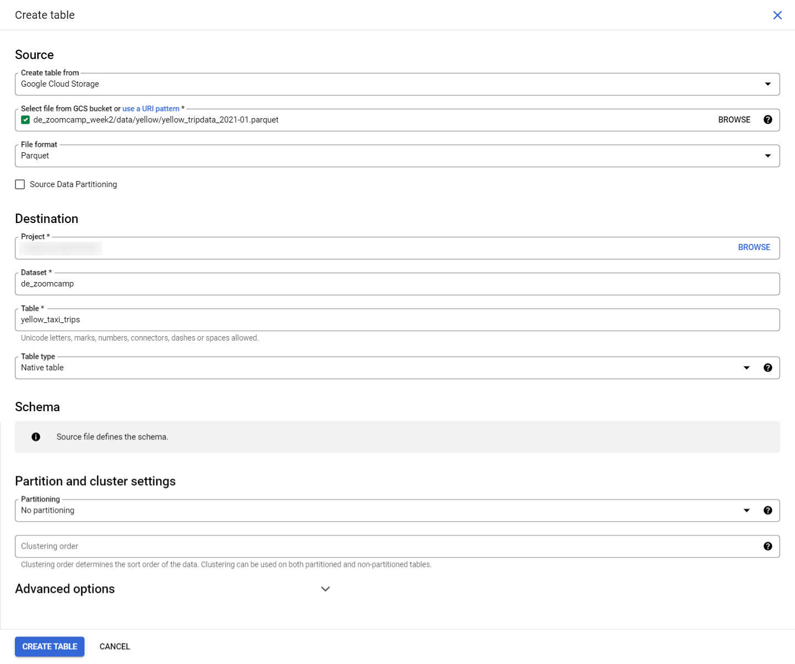
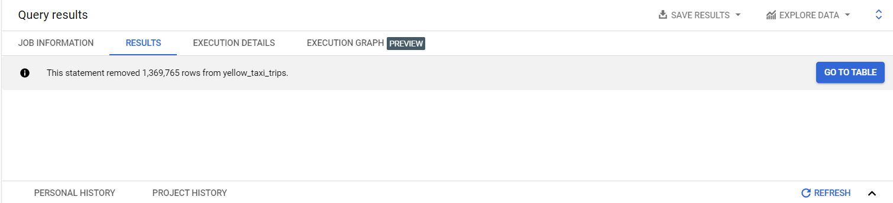
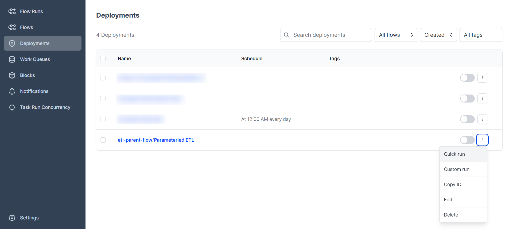

# WEEK 2: Workflow Orchestration

### Table of Contents

[**2.1 Data Lake (GCS)**](#21-data-lake-gcs)
- [What is Data Lake?](#what-is-data-lake)
- [Data Lake vs Data Warehouse](#data-lake-vs-data-warehouse)
- [ETL vs ELT](#etl-vs-elt)
- [Data Swamp - Data Lakes gone wrong](#data-swamp---data-lakes-gone-wrong)
- [Data Lake Provider](#data-lake-provider)

[**2.2 Introduction to Workflow Orchestration**](#22-introduction-to-workflow-orchestration)
- [What is Workflow Orchestration](#what-is-workflow-orchestration)
- [Workflow Process](#workflow-process)

[**2.3 Introduction to Prefect**](#23-introduction-to-prefect)
- [Core Concepts in Prefect](#core-concepts-in-prefect)
- [Python Decorators](#python-decorators)
- [Loading data into Postgres using Prefect](#loading-data-into-postgres-using-prefect)
- [Parameterization and Subflows](#parameterization-and-subflows)
- [Orion UI](#orion-ui)
- [Blocks](#blocks)

[**2.4 ETL with GCP & Prefect**](#24-etl-with-gcp--prefect)

[**2.5 From Google Cloud Storage to Big Query**](#25-from-google-cloud-storage-to-big-query)

[**2.6 Parametrizing Flow & Deployments**](#26-parametrizing-flow--deployments)
- [Using Prefect CLI and UI for deployments](#using-prefect-cli-and-ui-for-deployments)

[**2.7 Docker Storage with Infrastructure**](#27-docker-storage-with-infrastructure)
- [Creating ETL Docker Image](#creating-etl-docker-image)


[**2.8 Using Prefect Cloud**](#28-using-prefect-cloud)


# **2.1 Data Lake (GCS)**

## What is Data Lake?

A ***Data Lake*** is a central repository that hold *big data* from many sources.

The *data* in a Data Lake could either be structured, unstructured or a mix of both.

The main goal behid a Data Lake is being able to ingest data as quickly as possible and making it available to the other team members.

A data Lake should be:
- Secure
- Scalable
- Able to run on inexpensive hardware

## Data Lake vs Data Warehouse

A Data Lake is not to be confused with a Data Warehouse. There are several differences:

|       | Data Lake | Data Warehouse |
| ----------- | ----------- |----------- |
| Data Processing | The data is **raw** and has undergone minimal processing. The data is generally unstructured | The data is **refined**; its has been cleaned, pre-processed and structured for specific use cases |
| Schema | Written at the time of analysis (schema-on-read) | Often designed prior to the data warehouse implementation but also can be written at the time of analysis. (Schema-on-write or schema-on-read) |
| Size | **Large** and contains vast amounts of data, in the order of terabytes or even petabytes. Data is transformed when in use only and can be stored indefinitely | **Small** in comparison with Data Lake. Data is always pre-processed befire ingestion and may be purged/deleted periodically |
| Nature | Data is **Undefined** and can be used for a wide variety of purposes | Data is historic and **relational**, transcation systems for instance |
| Users | Business analysts (Using curated data), Data scientists, data developers, Data engineers, and data architects | Business Analysts, Data Scientists, Data Analysts, Business Intelligence Analyst, and data developers |
| Analytics | Machine Learning, Exploratory analytics, data discovery, streaming, operation analytics, big data and profiling | Batch reporting, BI, and Visualization |

Data Lakes came into existence because as companies started to realize the importance of data, they soon found out that they couldn't ingest data right away into their Data Warehouse but they didn't want to waste uncollected data when their devs hadn't finished developing the necessary relationships for a Data Warehouse, so the Data Lake born to collect any potentially useful data that could later be used in later steps from the very start of any new projects.

## ETL vs ELT

When ingesting data, Data Warehouses use the ***Export, Transform and Load*** (ETL) model whereas Data Lakes use ***Export, Load and Transform*** (ELT).

The main difference between them is the order of steps. In Data Warehouses, ETL ([Schema on Write](https://www.dell.com/en-us/blog/schema-read-vs-schema-write-started/#:~:text=Schema%20on%20write%20is%20defined,read%20data%20from%20the%20database.)) means the data is *transformed* (Pro-processed, etc) before arriving to its final destionation, whereas in Data Lakes, ELT ([Schema on Read](https://www.dell.com/en-us/blog/schema-read-vs-schema-write-started/#:~:text=Schema%20on%20write%20is%20defined,read%20data%20from%20the%20database.)) the data is directly stored without any transformations and any schema are derived when reading the data from the Data Lake.

## Data Swamp - Data Lakes gone wrong

Data Lakes are only useful if data can be easily processed from it. Techniques such as versioning and metadata are very helpful in helping manage a Data Lake. A Data Lake risks degenerating into a ***Data Swamp*** if no such measures are taken, which can lead to:

- No versioning of the data
- incompatible schemes for the same data
- No metadata associated
- Joins between different datasets are not possible

## Data Lake Provider

- [Google Cloud Storage](https://cloud.google.com/storage): A data lake solution offered by Google Cloud that provides scalable and flexible data storage and management
- [Amazon S3](https://aws.amazon.com/s3/): A scalable and highly available data lake solution offered by Amazon Web Services
- [Azure Blob Storage](https://azure.microsoft.com/en-us/products/storage/blobs/): A cloud-based data lake solution offered by Microsoft Azure
- [Hadoop HDFS](https://hadoop.apache.org/docs/r1.2.1/hdfs_user_guide.html): The original data lake solution that is part of the Apache Hadoop ecosystem
- [Snowflake Data Warehouse](https://www.snowflake.com/en/data-cloud/workloads/data-warehouse/): A cloud-based data warehousing solution that includes a data lake component

# **2.2 Introduction to Workflow Orchestration**

## What is Workflow Orchestration

***Workflow orchestration*** referes to coordination and management of various data processing task in a defined sequence to achieve a specific goal. in involves *scheduling*, *executing*, *monitoring*, and *managing* the interdependent tasks in a data pipeline to ensure smooth data flow and efficient use of resources. The aim of workflow orchestration is to *automate* and *streamline* the data processing process and making it easier to manage large and complex data processing operations.

Workflow orchestration was introduced in the context of data engineering as a solution to the growing complexity of data processing operations. As data processing operations became more complex, with an increasing number of tasks involved, it bacame increasingly difficult to manage and coordinate these tasks manually. Workflow orchestration provides a centralized and automated solution for coordinating these tasks, making it easier to manage and process large amount of data.

Data orchestration solutions can power many processes including but not limited to:

1. *Cleaning*, *organizing* and *publishing* data into a data warehouse
2. Computing business metrics
3. Applying rules to target and engage users through email campaigns
4. Maintaining data infrastructure like database scrapes
5. Running a `TensorFlow` task to train a machine learning tool

There are several tools available for workflow orchestration:

- [Apache Airflow](https://airflow.apache.org/): An open-source platform for programmatically authoring, scheduling, and monitoring workflows.

- [Luigi](https://github.com/spotify/luigi): An open-source Python module for building complex pipelines and workflows.

- [AWS Glue](https://aws.amazon.com/glue/): A fully managed extract, transform, and load (ETL) service offered by Amazon Web Services (AWS).

- [Prefect](https://www.prefect.io/): An open-source workflow orchestration tool that provides a simple and flexible interface for building and managing data pipelines.

- [Apache Nifi](https://nifi.apache.org/): An open-source data integration tool that provides a web-based interface for designing and managing data pipelines.

- [Google Cloud Composer](https://cloud.google.com/composer): A managed workflow orchestration service offered by Google Cloud Platform (GCP).

- [Microsoft Azure Data Factory](https://azure.microsoft.com/en-us/products/data-factory/): A cloud-based data integration and workflow orchestration service offered by Microsoft Azure.

These are just some of the many tools available for workflow orchestration in data engineering. The choice of tool depends on several factor, including the specific requirements of the data processing operations, the available resources and budget, and the preferred programming language and technology stack.

## Workflow Process

To gain a deeper understanding of workflow orchestration process, it is important to consider the following:

1. **Workflow definition**: Workflow orchestration involves defining the tasks involved in data processing, as well as the order in which they should be executed. Workflow definitions can be written using code or using a graphical user interface (GUI) provided by the tool.

2. **Task dependencies**: Tasks in a workflow can have dependencies on one another, meaning that one task must be completed before another can start. Workflow orchestration tools provide a way to define and manage these dependencies, ensuring that tasks are executed in the correct order

3. **Task execution**: Once the tasks and their dependencies have been defined, workflow orchestration tools can be used to execute workflows. This involves scheduling the tasks to run at specific times, and monitoring the progress of the tasks as they are executed.

4. **Error handling**: Workflow orchestration tools provide mechanisms for handling errors that may occur during the execution of tasks. This can include retrying failed tasks, skipping tasks that cannot be executed, or providing notifications when errors occur.

5. **Monitoring and reporting**: Workflow orchestration tools provide monitoring and reporting capabilities to help you keep track of the status of your workflows. This can include visualizations of workflow execution, logs of task execuation, and alerts when workflows fail

6. **Integration with other tools**: Workflow orchestration tools often integrate with other data processing and storage tools, such as databases and cloud storage services. This allows for seamless data flow between these tools, improving the efficiency of data processing operations.

# **2.3 Introduction to Prefect**

[`Prefect`](https://www.prefect.io/) is an open-source, modern, and easy-to-use workflow automation and management platform designed for data engineers and scientist. it provides a simple way to automate complex workflows and manage data pipelines, making it easier to run and track your tasks, visualize your workflows, and share the results. Prefect helps you build, run and monitor workflows in a scalable and reliable manner.

## Core Concepts in Prefect

Let's take a look at some of the core concepts in Prefect:

- `Flows`: A flow is [directed acycli graph](https://en.wikipedia.org/wiki/Directed_acyclic_graph) (DAG) that defines a series of tasks and the dependencies between them. In a flow, ***tasks*** represent individual steps in a process and the ***dependencies*** betwwen tasks are defined by the order of their execuation.

- `Tasks`: A task is the basic *unit of work* in Prefect. It encapsulates a single step in a process and can be run as a standalone unit or as part of a flow. Tasks can take inputs, generate outputs and have dependencies on other tasks.

- `Runners`: A runner is the component in Prefect that actually **executes the tasks**. There are several different runners available, including local runners for running tasks on your own machine and cloud runners for running tasks in a distributed manner.

- `Task Runs`: A task run is an instance of a task that has been executed. Each task run has a unique run ID and a status that indicates whether the task was successful of not.

- `Task Results`: Task results are the **outputs of tasks**. When a task is running, it generates a result that is stored in Prefect's database. The results of tasks can be used as inputs for subsequent tasks, allowing you to build complex, multi-step processes.

- `State`: Prefect tracks the **state of each task run**, including its inputs, outputs and intermediate results. This information is used to manage the flow, handle failures and allow for resuming flows from where they left off.

- `Triggers`: A trigger is a mechanism that starts a flow. Triggers can be configured to start a flow based on a schedule, on demand, or when certain conditions are met.

- `Scheduling`: Prefect provides scheduling capabilitis that allow you to run flows on a schedule, such as daily or weekly. You can also trigger flows to run in response to events, such as the completion of other task.

- `Caching`: Prefect provides **caching capabilites** that allow you to save the results of tasks so that they can be reused in subsequent runs. This can significantly improve the performance of your flows, especially for task that take a long time to run.

- `Automation`: Prefect provides a powerful automation engine that allows you to manage and run your flows in production, with features like automatic failure handling, monitoring and logging.

- `Integrations`: Prefect Integrates with a wide range of data sources and tools, including databases, cloud platforms, and data science tools such Jupyter Notebooks and Apache Airflow.

- `Monitoring`: Prefect provides monitoring capabilities that allow you to monitor the progress and health of your flow. You can view the status of tasks and flows, view logs and results and receive notifications when flows fail or complete.

## Python Decorators

In Python, a ***decorator*** is a special kind of function or class that is used to modify the behaviour of another function or class. A decorator takes in a function or class as an argument and returns a *modified version* of that function or class.

Decorators are typically defined using the `@` syntax in Python and are applied to a function or class by placing the decorator immediately before the function or class definition

In Prefect, you can use decorators to add additional functionality to your tasks. These are some common arguments for each decorator:

- [`@task`](https://docs.prefect.io/api-ref/prefect/tasks/)
    - `name` (str): The name of the task. This is used for display purposes and for identifying the task in the flow
    - `automated` (bool): Indicating whether the task should be executed automatically or not
    - `log_prints` (bool): Control whether printed statements within the task should be logged. (default=False)
    - `retries` (int): The number of times a task should be retried if it fails.
    - `retry_delay`: The amount of time to wait before retrying a task if it fails.
    - `cache_key_fn`: Specifies a custom function for generating the cache key for a task.
    - `cache_expiration`: amount of time indicating how long cached states for this task should be restorable
- [@flow](https://docs.prefect.io/api-ref/prefect/flows/)
    - `name`: name for the flow
    - `retries`: number of times to retry on flow run failure
    - `retry_delay_seconds`: number of seconds to wait before retrying the flow after failure

## Loading data into Postgres using Prefect

We will start with creating a **new conda environment** so that we can install all the relevant libraries withour affecting the base environment. run this command on your terminal of choice, in this one I use `GitBash`

```bash
conda create -n zoomcamp python=3.9
```

Then activate the environment by running

```bash
conda activate zoomcamp
```

Next, we create a `requirements.txt` file which contains all the relevant libraries which will be used for this project then save it in your working directory

```bash
pandas==1.5.2
prefect==2.7.7
prefect-sqlalchemy==0.2.2
prefect-gcp[cloud_storage]==0.2.4
protobuf==4.21.11
pyarrow==10.0.1
pandas-gbq==0.18.1
psycopg2-binary==2.9.5
sqlalchemy==1.4.46
```
In order to install all of the libraries in the `txt` file, we need to run

```bash
pip install -r requirements.txt
```

Now, we can transform the `ingest_data.py` script we created in Week 1 into tasks and flows.

1. load the necessary libraries

```Python
import pandas as pd
import numpy as np
from sqlalchemy import create_engine
from time import time, sleep
from prefect import flow, task
from prefect.tasks import task_input_hash
from prefect_sqlalchemy import SqlAlchemyConnector
from datetime import timedelta
```

2. using `@task` to define a task then we wreate an extract function which will help us extract data from the given url, where the url is an argument in the function.

```python
@task(log_prints=True, retries=3, cache_key_fn=task_input_hash, cache_expiration=timedelta(days=1))
def extract_data(url: str) -> pd.DataFrame:
    if url.endswith('.csv.gz'):
        csv_name = 'output.csv.gz'
    else:
        csv_name = 'output.csv'

    os.system(f"wget {url} -O {csv_name}")

    df = pd.read_csv(csv_name)
    
    df['tpep_dropoff_datetime'] = pd.to_datetime(df['tpep_dropoff_datetime'])
    df['tpep_pickup_datetime'] = pd.to_datetime(df['tpep_pickup_datetime'])

    return df
```

3. Next we create a transform function which will help us transform the data

```python
@task(log_prints=True)
def transform_data(df: pd.DataFrame) -> pd.DataFrame:

    print(f'pre: missing passenger count {df["passenger_count"].isin([0]).sum()}')
    df = df.loc[df['passenger_count'] != 0]
    print(f'post: missing passenger count {df["passenger_count"].isin([0]).sum()}')

    return df
```

4. Next we create a load function which will help us load the data

```python
@task(log prints=True, retries=3)
def load_data(user, password, host, port, db, table_name, df):

    engine = create_engine(f'postgresql://{user}:{password}@{host}:{port}/{db}')
    df.head(0).to_sql(name=table_name, con=engine, if_exists='replace')
    df.to_sql(name=table_name, con=engine, if_exists='append')

    print("Finished ingesting data into the postgres database")
```

5. Finally, we create a main function which will help us run all of these functions

```python
@flow(name="Ingest Data")
def main_flow(table_name: str = "green_taxi_trips"):
    user = "root"
    password = "root"
    host = "localhost"
    port = "5432"
    db = "ny_taxi"
    table_name = "green_taxi_trips"
    csv_url = "https://github.com/DataTalksClub/nyc-tlc-data/releases/download/green/green_tripdata_2019-01.csv.gz" 

    raw_data = extract_data(csv_url)
    data = transform_data(raw_data)
    load_data(user, password, host, port, db, table_name, data)

if __name__ == '__main__':
    main_flow(table_name = "green_trips")
```

After finishing the script transformation, we can run the script

```bash
python ingest_data_flow.py
```
> Note: ***Don't forget to run your Posgres databases!!*** (Use docker-compose is fine)

After the ingestation process is complete, you can check whether the data was loaded using `pgAdmin`.

## Parameterization and Subflows
`Parameterization` is the process of defining a flow that can be executed with different input parameters. It allows you to run the same flow multiple times with different inputs, making it easier to manage and reuse your workflows.

`Subflows` refer to the ability to define a flow as a reusable component that can be used as a task within another flow. Subflows can be used to encapsulate complexe workflows or to define reusable components that can be reused across multiple flows.

Let's update our `ingest_data_flow.py` to make it more parameterized.

1. Add a new flow to print the number of rows from our table

```python
@flow(name='row_counter_subflow', logprints=True)
def row_counter(df: pd.DataFrame):
    print(f'Number of rows: {df.shape[0]}')
```

2. Then we add the subflow to our main flow

```python
@flow(name="Ingest Data")
def main_flow(table_name: str = "green_taxi_trips"):
    user = "root"
    password = "root"
    host = "localhost"
    port = "5432"
    db = "ny_taxi"
    table_name = "green_taxi_trips"
    csv_url = "https://github.com/DataTalksClub/nyc-tlc-data/releases/download/green/green_tripdata_2019-01.csv.gz" 

    raw_data = extract_data(csv_url)
    data = transform_data(raw_data)
    row_counter(data) # adding a new subflow
    load_data(user, password, host, port, db, table_name, data)

if __name__ == '__main__':
    main_flow(table_name = "green_trips")
```

## Orion UI
`Orion UI` is a user interface for Prefect, a popular open-source workflow management system for data engineering, data science, and machine learning. The Orion UI provides a *graphical interface* for managing and visualizing Prefect flows, tasks, and runs.

To start Orion UI, we need to start with setting the Prefect API URL in the Prefect configuration by running

```bash
prefect config set PREFECT_API_URL=http://127.0.0.1:4200/api
```
By setting the Prefect API URL to http://127.0.0.1:4200/api, you are telling Prefect to use a local instance of the Prefect API running at http://127.0.0.1:4200/api.


and in order to start the UI, we can run 

```bash
prefect orion start
```


## Blocks

`Blocks` enable you to store configuration and provide an interface for interacting with external systems. With Blocks, you are securely store credentials for authentication with services like GCP, AWS, Github, Slack or any other system you'd like to orchestrate with Prefect

You can create, edit, and manage blocks in the Prefect UI and Prefect Cloud. On a `Prefect Orion` API server, blocks are created in the server's database. On `Prefect Cloud`, blocks are created on a workspace.

In our `ingest_data_flow.py`, instead of hard-coding all of the input credentials (url, user, password, etc). We can create a block which can store the credentials and can be called directly.

We can do it the following way:

1. Go to *Blocks* -> add new block -> select *SQLAlchemy Connector* and fill all of the fields


After you create the block, you should see something like this:


After you created the block, we can directly use it in our code spesifically in the `@task` **load_data** in the following way

```python
from prefect_sqlalchemy import SqlAlchemyConnector

@task(log_prints=True, retries=3)
def ingest_data(table_name, df):
    
    connection_block = SqlAlchemyConnector.load("de-zoomcamp-pgconnector")
    
    with connection_block.get_connection(begin=False) as engine:

        df.head(0).to_sql(name=table_name, con=engine, if_exists='replace')
        df.to_sql(name=table_name, con=engine, if_exists='append')

    print("Finished ingesting data into the postgres database")
```
# **2.4 ETL with GCP & Prefect**

Let's start with writing an ETL script for saving data locally and uploading it to GCP (The script is [etl_web_to_gcs.py](https://github.com/acothaha/learning/blob/main/data_engineering/de_zoomcamp_2023/week_2_workflow_orchestration/flows/02_gcp/etl_web_to_gcs.py))

Open *Prefect Orion UI* and create a `GCS bucket` block


If GCS Bucket in not available, go to terminal and run

```bash
prefect block register -m prefect_gcp
```

Configure the GCS Bucket with the **GCP Bucket ID** of yours. If you haven't created the bucket, you can go see the [Week 1: Basic and Setup](https://github.com/acothaha/learning/blob/main/data_engineering/de_zoomcamp_2023/notes/Week%201:%20Basic%20and%20Setup.md#creating-gcp-infrastructure-with-terraform). On top of that, if no GCP credentials Block has been created yet, we need to craete one by clicking `add +`.


Create a `GCP Credentials block`, you can inform the path to your JSON credential file or the content of JSON itself.


After we create the GCP Credentials block, we will be redirected to the GCS Bucket block tab. Select the Credentials block that has just been created and click on `Create`


Afterwards, we will see how we can utilize the GCS Bucket block inside our Python script. Since the `etl_web_to_gcs.py` is already finished, we will just run it.

```bash
python etl_web_to_gcs.py
```

Then you can check the uploaded data in GCP

# **2.5 From Google Cloud Storage to Big Query**

In this part, we will implement an ETL script to extract data from `GCS` then transform and load it into `BigQuery` (The script is [etl_gcs_to_bq.py](https://github.com/acothaha/learning/blob/main/data_engineering/de_zoomcamp_2023/week_2_workflow_orchestration/flows/02_gcp/etl_gcs_to_bq.py))

First, we need to create a table in BigQuery to store our data from GCS


Next, fill the form and click `Create`



Since we create the table using our dataset stored in GCS as a template, BigQuery has already populated our dataset. To test our script, let's delete all data. First, click on the table we have just created and click on "Query".


and input this query:

```SQL
DELETE FROM `[your_project].[your_dataset].yellow_taxi_trips` WHERE TRUE
```

After running the query, you will get this in the `result` tab



Now it's the time to populate the table in BigQuery from data in GCS, run the ETL script

```bash
python etl_gcs_to_bq.py
```

Now we can check whether the data has been updated or not by running this query.

```SQL
SELECT * FROM `[your_project].[your_dataset].yellow_taxi_trips` LIMIT 100
```

# **2.6 Parametrizing Flow & Deployments**

## Using Prefect CLI and UI for deployments

***Prefect Deployment*** refers to the process of deploying a Prefect workflow to a production environment so that it can be run on a schedule or triggered by *external events*. There are several ways to deploy a Prefect workflow, depending on the specific requirements and constraints of your use case.

We will start with creating a new script to have multiple runs of flows with different `parameters` that affect the outcome, we will reuse `etl_web_to_gcs.py` and do some tweaking so it will load multiple data into GCS (The script is [parameterized_flow.py](https://github.com/acothaha/learning/blob/main/data_engineering/de_zoomcamp_2023/week_2_workflow_orchestration/flows/03_deployment/parameterized_flow.py))

You can try to run it first

```bash
python parameterized_flow.py
```

After it finish running, you can check the result in GCS


Now, we can use the following commad to create a deployment package

```bash
prefect deployment build ./parameterized_flow.py:etl_parent_flow -n "Parameterized ETL"
```

Above command is used to build a Prefect workflow deployment. The build takes a *Python file* and a *workflow* as arguments. In this case, the file is the one that we created earlier `parameterized_flow.py` and the workflow object is `etl_parent_flow`. The `-n` or `--name` flag is used to specify a name for the deployment, in this case, `"Parameterized ETL"`

The output will be a YAML file containing the workflow's deployment metadata.

In the metadata YAML file (`etl_parent_flow-deployment.yaml`), we can add the parameters that we want to run in the line `parameters: {}`

```YAML
parameters : { "color": "yellow", "months": [1, 2, 3], "year": 2021 }
```

Then, we can run the following command to apply the deployment
```bash
prefect deployment apply etl_parent_flow-deployment.yaml
```
We can see the deployment in the Prefect Orion UI, and you can try to do a *quick run*


As can be seen above, there are 2 types of `run`:

- `Quick Run` : Simpler way to run a workflow, providing only a limited set of options
- `Custom Run` : Allows you to manually specify the input parameters and environment variables for a run, and provides greater control over the execution of the workflow.

But before we run the workflow, We must be familiar with the concept of `Core`, `Work Queues` and `Agents`.

- `Prefect Core` : The ***backend component*** of Prefect. Prefect Core providers the building blocks for *defining*, *scheduling*, *executing* and *monitoring* data workflows. It provides APIs for creating and manipulating workflows, tasks and flows.

- `Work Queue` : The data structure that holds tasks that are ready to be executed. Acts as a buffer between the `Prefect Core` and the `Agents`, allowing the Core to manage tasks while the agents execute them.

- `Agent` : A piece of software that pulls tasks from the `Work Queue` and executes them.

After knowing those concepts, we need to be familiar with the general timeline of how Prefect workflow is executed:

1. `Workflow Definition` : The first step is to define the workflow using the Prefect API. The workflow consists of a `directed acylic graph` (DAG) of tasks and the relationships between them.

2. `Task Assignment` : Once the workflow is defined. `Prefect Core` assigns tasks to the `work queue`. This is done based on the relationships between the tasks and the state of each task.

3. `Task Pulling`: `Agents` pull tasks from the `Work Queue` and execute them. When an `agent` pulls a task, it marks the task as "*running*" in the `Prefect Core`.

4. `Task Execution` : The `agent` executes the task by running the code associated with it. The agent reports the result of the task execution back to the `Prefect Core`.

5. `Task Completion` : If the task execution is successful, the `agent` marks the task as "*successful*" in the `Prefect Core`. If the task execution fauls, the `agent` marks the task as "*failed*"

6. `Task Flow` : The result of each task execuation is used to determine the next task in the workflow. the `Prefect Core` updates the state of the tasks based on the results and assigns the next task to the `work queue`.

7. `Repeat` : The process repeats until all tasks in the workflow are complete

Now we are ready to run our deployment. We start with click on `Quick Run`:




After we see a pop out saying that our flow is *scheduled to start now*, go to `Work Queues` and choose the **default** Work Queues:


Now, we can start the agent using this command:

```bash
prefect agent start --work-queue "default"
```

If it runs fine, you will see the flow is `Completed`


# **2.7 Docker Storage with Infrastructure**

Now, we will try to leverage *Docker* to deploy our ETL flows

## Creating ETL Docker Image

First you need to login to your ***Docker Hub***. If you dont have a docker account, create one.

Then, Create a *Dockerfile* to contain the ETL flow that you have created:

```Dockerfile
FROM prefecthq/prefect:2.7.7-python3.9

COPY docker-requirements.txt . 

# --trusted-host will tell docker to trust the site
# --no-cache-dir avoiding bloating image with cached files
RUN pip install -r docker-requirements.txt --trusted-host pypi.python.org --no-cache-dir

COPY flows /opt/prefect/flows

RUN mkdir -p /opt/prefect/data/yellow
```

Create the the image:

```bash
docker image build -t [YOUR_NAME]/prefect:zoom .
```


After you finish creating the image, you need to sign in to your Docker Hub:

```bash
docker login -u {username}
```

Now, it's the time to push your image to Docker Hub

```bash
docker image push [YOUR_NAME]/prefect:zoom
```

You can check whether the image has been pushed in your Docker Hub account


Moving on, now we will craete a `Docker Container` Block in Orion UI. Edit the below fields accordingly:
- `Block Name`: zoom
- `Type` (Optional) > The type of infrastructure: docker-container
- `Image` (Optional) > Tag of a Docker image to use: [YOUR_NAME]/prefect:zoom
- `ImagePullPolicy` (Optional): ALWAYS
- `Auto Remove` (Optional): ON


Then click on `Create` button. After creating the block, we will create a python script to deploy our ETL flow in Docker `docker_deploy.py`

```Python
from prefect.deployments import Deployment
from prefect.infrastructure.docker import DockerContainer
from parameterized_flow import etl_parent_flow

docker_block = DockerContainer.load("zoomcamp")

docker_dep = Deployment.build_from_flow(
    flow=etl_parent_flow,
    name='docker-flow',
    infrastructure=docker_block
)

if __name__ == '__main__':
    docker_dep.apply()
    print('Deployment Succeed')
```

After that, we can execute the script:

```bash
python docker_deploy.py
```

Check your Orion UI, to see if the deployment is there


Use this command to check which profile is currently being used. At the moment, since we haven't created any profile, it will point to **default**

```bash
prefect profile ls
```

 Next thing is we need to set the API URL for the Prefect CLI.

```bash
 prefect config set PREFECT_API_URL="http://127.0.0.1:4200/api"
```
The ***API URL*** is the endpoint for Prefect API, which is the interface for managing flows, tasks and runs. The API URL is set to http://127.0.0.1:4200/api, which means it is pointing to the *localhost* on port `4200`. This configuration is used by the Prefect CLO to communicate with the Prefect API when you run commands such as prefect flow run or prefect flow get.

If the `Prefect_API_URL` is not set, then Prefect will default to the ***cloud API*** endpoint which is https://api.prefect.io/v1/. If you are running Prefect locally, you need to set `Prefect_API_URL` to the local API endpoint to ensure that the Prefect client communicates with your local instance of Prefect server. In our context, it allows our docker container to interface with the orion server.

Start an `agent` with this command

```bash
prefect agent start -q default
```

And run the docker flow we have created from CLI by running

```
prefect deployment run etl-parent-flow/docker-flow
```

This should complete the workflow as you can see below and load the data into GCS


# **2.8 Using Prefect Cloud**

Prefect provide a cloud service called ***Prefect Cloud*** that we can use for free with certain limitation. In order to utilize the service, we need to do this:

1. [Sign in or register](https://docs.prefect.io/latest/cloud/cloud-quickstart/#sign-in-or-register) a ***Prefect Cloud*** account.

2. [ Create a workspace](https://docs.prefect.io/latest/cloud/cloud-quickstart/#create-a-workspace) for your account.

3. [Install Prefect](https://docs.prefect.io/latest/cloud/cloud-quickstart/#install-prefect) in your local environment.

4. [Log into Prefect Cloud](https://docs.prefect.io/latest/cloud/cloud-quickstart/#log-into-prefect-cloud-from-a-terminal) from a local terminal session.

    We can run this command to log into our ***Prefect Cloud*** account

    ```bash
    prefect cloud login
    ```

    And it will return how would us like to authenticate

    ```
    ? How would you like to authenticate? [Use arrows to move; enter to select]
      Log in with a web browser
    > Paste an API key
    ```

    - If you choose to log in with a web browser, it will redirect you to your browser to conduct the aunthetication
    - If you choose to use an API key, you need to retrieve one first in your Prefect Cloud account.

5. [Run a flow](https://docs.prefect.io/latest/cloud/cloud-quickstart/#run-a-flow-with-prefect-cloud) locally and view flow run execution in Prefect Cloud.


