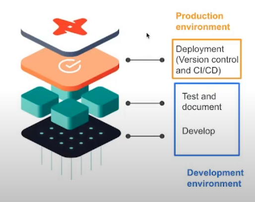
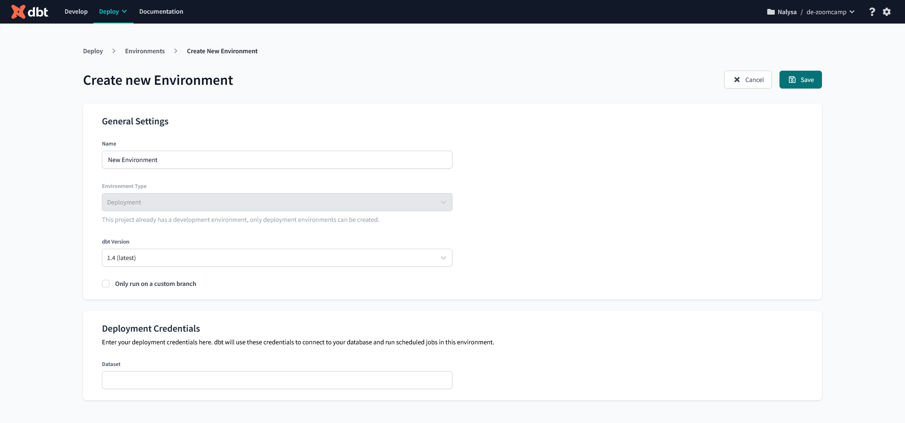
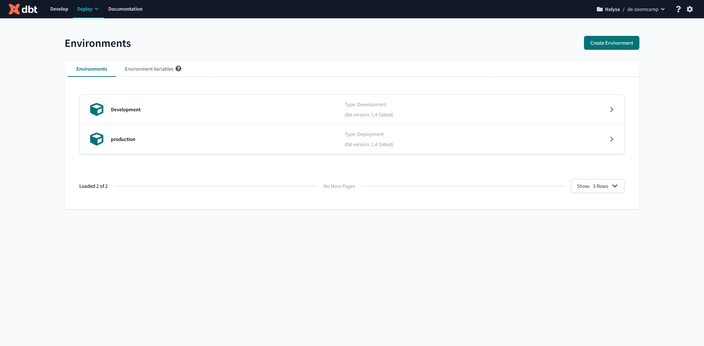
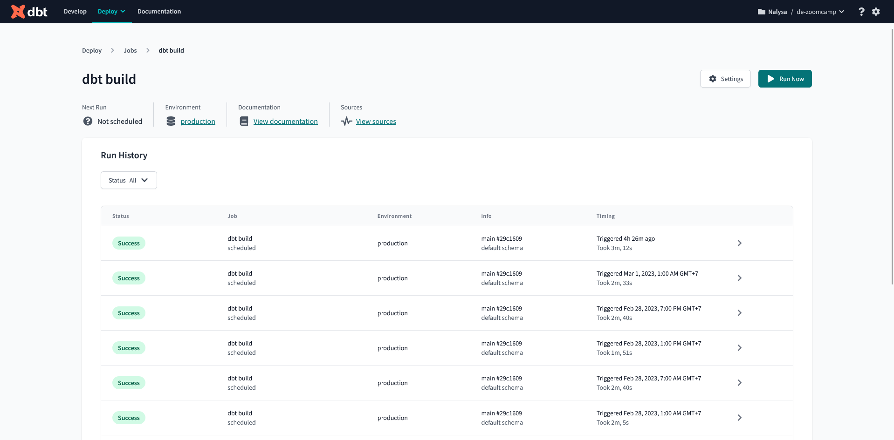
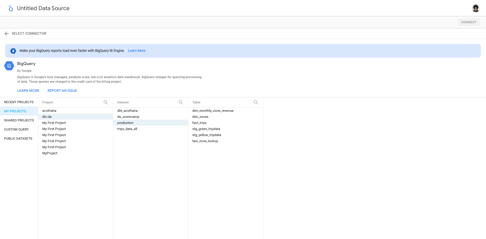
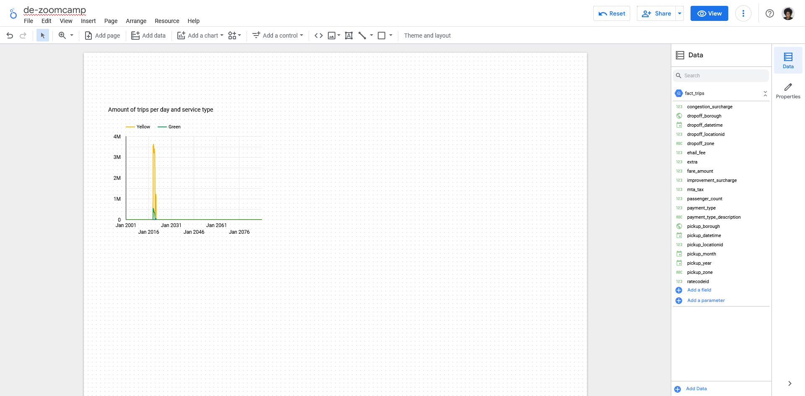
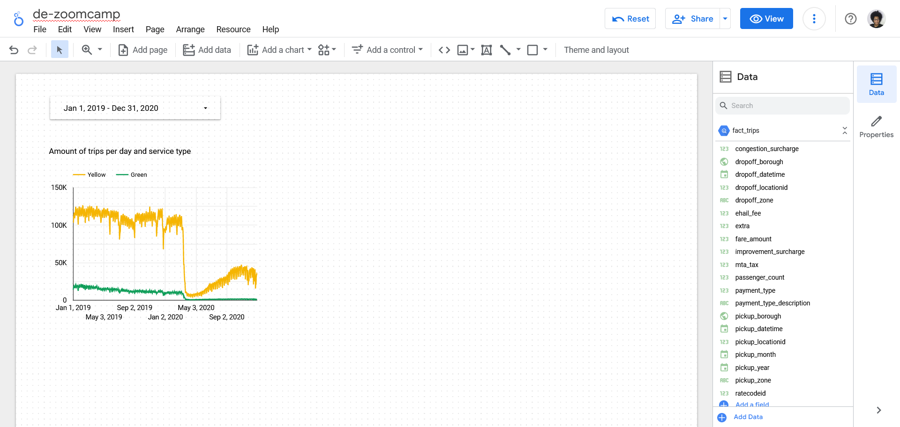
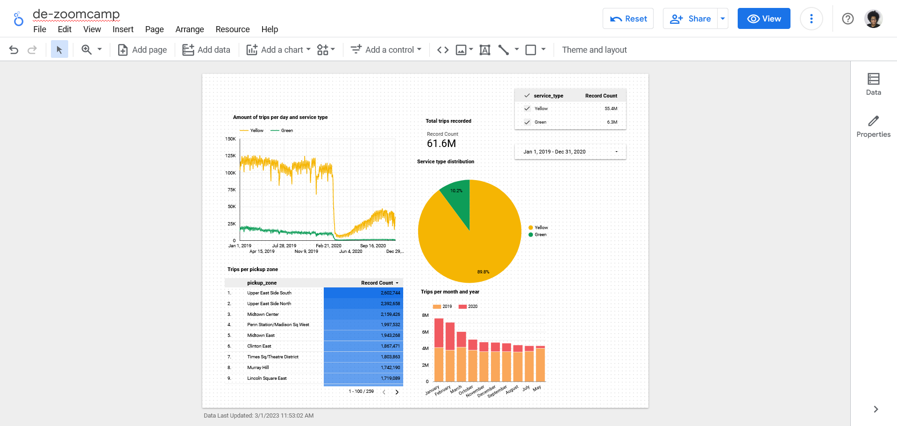

# WEEK 4: ANALYTICS ENGINEERS

### Table of Contents

[**4.1 Introduction to analytics engineering**](#41-introduction-to-analytics-engineering)
- [What is Analytics Engineering?](#what-is-analytics-engineering)
- [ETL vs ELT](#etl-vs-elt)
- [Data Modeling Concepts](#data-modeling-concepts)

[**4.2 Introduction to dbt**](#42-introduction-to-dbt)
- [What is dbt?](#what-is-dbt)
- [How to use dbt](#how-to-use-dbt)

[**4.3 Setting up dbt**](#43-setting-up-dbt)
- [dbt Cloud](#dbt-cloud)
- [dbt Core](#dbt-core)

[**4.4 developing with dbt**](#44-developing-with-dbt)
- [Anatomy of a dbt model](#anatomy-of-a-dbt-model)
- [The FROM clause](#the-from-clause)
- [Defining a sourca and creating a model](#defining-a-sourca-and-creating-a-model)
- [Macros](#macros)
- [Packages](#packages)
- [Variables](#variables)
- [Referencing older models in new models](#referencing-older-models-in-new-models)

[**4.5 Testing and documenting dbt models**](#45-testing-and-documenting-dbt-models)
- [Testing](#testing)
- [Documentation](#documentation)

[**4.6 Deployment of a dbt project**](#46-deployment-of-a-dbt-project)
- [Deployment basics](#deployment-basics)
- [Continuous Integration](#continuous-integration)
- [Deployment using dbt Cloud](#deployment-using-dbt-cloud)

[**4.7 Data visualization**](#47-data-visualization)
- [Looker studio](#looker-studio)

# **4.1 Introduction to analytics engineering**

## What is Analytics Engineering?

As the *data domain* has developed over time, new tools have been introduced and changed the dynamics of data-related work:

1. Massively parallel processing (MPP) databases

    - Lower the cost of storage

    - e.g. BigQuery, Snowflake, Redshift, ect
2. Data-pipelines-as-a-service

    - Simplify the ETL process

    - Fivetran, Stitch, etc
3. SQL-first / [Version control systems](https://lakefs.io/blog/data-version-control/)
    - e.g Dolt, neptune, Git LFS
4. [Self service analytics](https://www.gartner.com/en/information-technology/glossary/self-service-analytics#:~:text=Self%2DService%20Analytics%20is%20a,own%2C%20with%20nominal%20IT%20support.)
    - e.g. PowerBI, Tableau, Looker
5. [Data Governance](https://cloud.google.com/learn/what-is-data-governance)

The introduction of all of these tools changed the way the data teams work as well as the way that stakeholders consume the data, creating a gap in roles of data team. Traditionally:

- ***Data Engineer***: Prepares and maintains the infrastructure of data the team needs

- ***Data Analyst***: Utilize data to answer questions and solve problems
- ***Data Scientist***: Predicts the future based on past patterns and covers the what-ifs rather than what the day-to-day

However, with the introduction of these tools, both data scientist and analysts find themself writing code even thought they are not software engineers and writing code isn't their top priority. Data engineers are good software engineers but they don't possessthe training on how the data is going to be used by the business users.


***Analytics Engineer*** is the role that tries to fill the gap: it introduces the food software engineering practices to the effort of data scientists and analysts. The analytics engineer may be exposed to the following tools:

1. Data loading (Kafka, Nifi, etc)

2. Data storing (Data Warehouse)
3. Data modeling (dbt, Dataform, etc)
4. Data Presentation (BI tools - Looker, PowerBI, Tableau, etc)


## ETL vs ELT


We have covered this topic [here](https://github.com/acothaha/learning/blob/main/data_engineering/de_zoomcamp_2023/notes/Week%202:%20Workflow%20Orchestration.md#etl-vs-elt)

## Data Modeling Concepts

### [Ralph Kimball's Dimensional Modeling](https://www.wikiwand.com/en/Dimensional_modeling#:~:text=Dimensional%20modeling%20(DM)%20is%20part,use%20in%20data%20warehouse%20design.)

Ralph Kimball's Dimensional Modeling is an approach to Data Warehouse design which focuses on 2 main points:

1. Deliver data which is *understandable* to the business users.

2. Deliver *fast* quest performance.

Other goals such as reducing redundant data (prioritized by other approaches such as [3NF](https://www.wikiwand.com/en/Third_normal_form#:~:text=Third%20normal%20form%20(3NF)%20is,integrity%2C%20and%20simplify%20data%20management.) by Bill Inmon) are secondary to these goals. Dimensional Modeling alsi differs from other approaches to Data Warehouse design such as [Data Vaults](https://www.wikiwand.com/en/Data_vault_modeling)

Dimensional Modeling is based around 2 important concepts:
- ***Face Table***

    - *Facts* = *Measures*

    - Typically numeric values which can be aggregated, such as measurements or metrics
        - e.g. sales, orders, etc
    - Corresponds to a [*business process*](https://www.wikiwand.com/en/Business_process)
    - Can be considered as "**verbs**"

- ***Dimension Table***

    - *Dimension* = *Context*
    - Groups of hierarchies and descriptors that define the facts

        - e.g. customer, product, etc

    - Corresponds to a *business entity*
    - Can be considered as "**nouns**"
- Dimensional Modeling is built on [***star schema***](https://www.wikiwand.com/en/Star_schema) with fact tables surrounded by dimensions tables.

A good way to understand the *architecture* oof Dimensional Modeling is by drawing an analogy between dimensional modeling and a restaurant:

- *Stage area* -> Food storage area

- *Processing area* -> Kitchen
- *Presentation area* -> Dining room


# **4.2 Introduction to dbt**

## What is dbt?

***dbt*** stand for ***data build tool***. it's a transformation tool which allows us to transform and process *raw* data in our Data Warehouse to *transformed* data which can be later be used by Business Intelligence tools and any other consumers.

dbt also allows us to introduce good software engineering practices by defining a *deployment workflow*:

A ***model*** us a .sql file with `SELECT` statement; No DDL or DML is used. dbt will compile the file and run it in our database

## How to use dbt

dbt has 2 main components: *dbt core* and *dbt cloud*

- ***dbt Core***: open-source project that allows the data transformation

    - Builds and runs a dbt project (.sql and .yaml files)

    - Includes SQLQ compilation magic, macros and database adapters
    - Includes a CLI interface to run dbt commands locally
    - open-source and free to use

- ***dbt Cloud***: SaaS application to develop and manage dbt projects

    - Web-based IDE to develop, run and test a dbt projects

    - Jobs orchestration
    - Logging and alerting
    - INtergrated documentation
    - Free for individuals (one developer set)

For integration with BigQuery, we will use the dbt Cloud IDE, so a local installation of dbt Core is not required. For developing locally rather than using the Cloud IDE, dbt Core is required. Using dbt with a local Posgres adtabase can be done with dbt Core, which can be installed locally and connected to Postgresand run models through CLI.


# **4.3 Setting up dbt**

Before we start, we need to create 2 new empty BigQuery dataset in our project: a *development* dataset and a *production* dataset. We can name it whatever we want.

## dbt Cloud

In order to utilize dbt Cloud, we will need to create an user account. we are going to go to the [dbt homepage](https://www.getdbt.com/) and signup.

During the signup process, we will be asked to create a starter project and connect to a database. We will connect dbt to BiqQuery using [BigQuery OAuth](https://docs.getdbt.com/docs/collaborate/manage-access/set-up-bigquery-oauth). More detailed instructions on how to generate the credentials and connect both services can be found in this [link](https://github.com/DataTalksClub/data-engineering-zoomcamp/blob/main/week_4_analytics_engineering/dbt_cloud_setup.md). When asked, we connect the project to our *development* dataset.

Make sure we have set up a GitHub repo before hand. We will add repository into dbt with cloning our GitHub repo by copying the SSH key from our repo. Then, we need a deploy key, head to our GitHub repo and go to the settings tab. Under security we will find the menu *deploy keys*. Click on *Add key* and paste the deploy key provided by dbt cloud. Make sure to tick on *Allow write access*.

In the IDE windows, press the green *initialize* button to create the project files. Inside `dbt_project.yml`, change the project name both in the `name` field as well as right below the `models` block. We may comment or delete the `example` block at the end.

## dbt Core

Installing dbt Core locally can be done with the following steps in the [official docs](https://docs.getdbt.com/docs/get-started/installation). More instructions are also available in this [link](https://github.com/DataTalksClub/data-engineering-zoomcamp/tree/main/week_4_analytics_engineering/docker_setup)

Starting a sbt project with dbt core involves creating a `profiles.yml` file manually before running `dbt init`. Check this [video source](https://www.youtube.com/watch?v=1HmL63e-vRs&list=PL3MmuxUbc_hJed7dXYoJw8DoCuVHhGEQb&index=37) for more information.

# **4.4 developing with dbt**

## Anatomy of a dbt model

dbt model are mostly written in SQL but they also make use of the [Jinja templating language](https://jinja.palletsprojects.com/en/3.0.x/) for templates.

Here's an example of a dbt model:

```SQL
{{
    config(materialized='table')
}}

SELECT *
FROM staging.source_table
WHERE record_state = 'ACTIVE'
```

- In the Jinja statement defined within the `{{ }}` block we call the [`config()`](https://docs.getdbt.com/reference/dbt-jinja-functions/config) function

    - More info about Jinja macros for dbt in this [link](https://docs.getdbt.com/docs/build/jinja-macros)

- We commonly use the `config()` function at the beginningof a model to define a [***materialization***](https://docs.getdbt.com/docs/build/materializations) ***strategy***: a strategy for persisting dbt models in warehouse.
    - `table`   : The model will be built as a table on each run.

    - `view`    : Would rebuild the model on each run as a SQL view.
    - `incremental` : Essentially a `table` strategy but it allows us to add or update records incrementally rather than rebuilding the complete table each run.
    - `ephemeral` : Creates a [*Common Table Expression*](https://www.essentialsql.com/introduction-common-table-expressions-ctes/) (CTE).

dbt will compile this code into the following SQL query:

```SQL
CREATE TABLE my_schema.my_model AS (
    SELECT *
    FROM staging.source_table
    WHERE record_state = 'ACTIVE'
)
```

After the code is compiled, dbt will run the compiled code in the Data Warehouse.

Additional model properties are stored in YAML files. Traditionally, these files were named `schema.yml` but later version of dbt do not enfore this as it could lead to confusion.

## The FROM clause

The `FROM` cluase within `SELECT`statement defines the *sources* of data to be used

The following sources are available to dbt models:

- ***Sources*** : The data loaded within our Data Warehouse.

    - We can access this data with the *source()* function
    
    - The ***sources*** key in our YAML file contains the defaults of the databases that the ***source()*** function can access and translate into proper SQL-valid names
        - Additionally, we can define *source freshness* to each source that we can check whether a source is "fresh" or "stale", which can be useful to check whether our data pipelines are working properly
        
    - More info about sources in this [link](https://docs.getdbt.com/docs/build/sources)

- ***Seeds*** : CSV files which can be stored in our repo under the `seeds` folder.
    - The repo gives us version controlling along with all of its benefits.

    - Seed are best suited to static data which changes rarely.
    - Seed usage:
        1. Add a CSV file to your `seeds` folder.
        
        2. Run the [`dbt seed`](https://docs.getdbt.com/reference/commands/seed) command to create a table in our Data Warehouse
            - If you update the contect of a seed, running `dbt seed` will append the updated values to the table rather than subtituting them. Instead, run `dbt seed --full-refresh` and the old table will be dropped then a new one will be created.

        3. Refer to the seed in your model with `ref()` function.

    - Moreunfo about seed in this [link](https://docs.getdbt.com/docs/build/seeds) 

Here's an example of how you would declare a source in a `.yml` file:

```YAML

sources:
    - name: staging
      database: esoteric-code-377203  # For bigquery
      schema: trips_data_all

      # loaded_at_field: record_loaded_at
      tables:
        - name: green_tripdata
        - name: yellow_tripdata
          freshness:
            error_after: {count: 6, period: hour}
```

And here's how you would reference a source in a `FROM` clause:

```SQL
FROM {{ source('staging', 'yellow_tripdata') }}
```
- The first argument of the `source()` function is the source name, and the second is the table name

In the of case seeds, assuming you've got a [`taxi_zone_lookup.csv`](https://github.com/DataTalksClub/data-engineering-zoomcamp/blob/main/week_4_analytics_engineering/taxi_rides_ny/data/taxi_zone_lookup.csv) file in your `seed` folder which contains `LocationID`, `borough`, `zone` and `service_zone`:

```SQL
SELECT 
    LocationID,
    borough,
    zone,
    replace(service_zone, 'Boro', 'Green') AS service_zone
FROM {{ ref(`taxi_zone_lookup`) }}
```

The `ref()` function references underlying tables and views in the Data Warehouse. When compiled, it will build the dependencies and resolve the correct schema for us. So, if Bigquery contains a schema/dataset called `dbt_dev` inside the `my_project` database which we are using for development and it contains a table called `stg_green_tripdata`, then the following code  ...

```SQL
WITH green_data AS (
    SELECT *,
        'Green' AS service_type
    FROM {{ ref('stg_green_tripdata') }}
)
```

... will be compiled as:

```SQL
WITH green_data AS (
    SELECT *,
        'Green' AS service_type
    FROM "my_project"."dbt_dev"."stg_green_tripdata"
)
```

- The `ref()` function translates our references table into the full reference, using the `database.schema.table` structure.
- If we were to run this code in our production environment, dbt would automatically resolve the reference to make it point to our production schema.

## Defining a sourca and creating a model

We will now create our first model. We are going to begin by creating 2 folders ynder our `models` folder:

- `staging` -> Contain the raw model

- `core` -> Contain the models that we will exposes at the end to the BI 
tools, stakeholders, etc.

Under `staging` we will add 2 new files: `schema.yml` and `stg_green_tripdata.sql`

```yml
# schema.yml

version: 2

sources:
    - name: staging
      database: your_project
      schema: trips_data_all

      tables:
          - name: green_tripdata
          - name: yellow_tripdata
```

- We define our ***sources*** in the `schema.yml` model properties file.

- We are defining the 2 tables for yellow and green taxi data as our sources.

```SQL
-- stg_green_tripdata.sql

{{ config(materialized='view') }}

SELECT * FROM {{ source('staging', 'green_tripdata') }}
```
- Query above will create a ***view*** in the `staging` dataset/schema in our database.

- We make use of `source()` function to access the green taxi data table, which is defined inside the `schema.yml` file.

The advantage of having the properties in a seperate file is that we can easily modify the `schema.yml` file to change the database details and write to different databases without having to modify our `stg_green_tripdata.sql` file.

You may now run the model with the `dbt run` command, either locally or from dbt cloud.

## Macros

***Macros*** are pieces if code in Jinja that can be reused, similar to functions in other languages.

dbt already includes a series of macros like `config()`, `source()` and `ref()`, but custom macros can also be defined.

Macros allow us to add features to SQL that aren't otherwise available, such as:
- Use control structures such as `if` statements or `for` loops

- Use environment variables in our dbt project for production
- Operate on the results of one query to generate another query
- Abstract snippets of SQL into reusable macros

Macros are defined in seperate `.sql` file which are typically stored in a `macros` directory.

There are 3 kinds of Jinja *delimiters*:

- `` for ***statements*** (control block, macro definitions)

- `{{ ... }}` for ***expression*** (literals, math, comparission, logic, macro calls...)
- `{# ... #}` for comments

Here's a macro definition example:

```SQL
{# This macro returns the description of the payment_type #}



    case {{ payment_type }}
        when 1 then 'Credit card'
        when 2 then 'Cash'
        when 3 then 'No charge'
        when 4 then 'Dispute'
        when 5 then 'Unknown'
        when 6 then 'Voided trip'
    end


```

- The `macro` keyword states that the line is a macro definition. it includes the name of the macro as well as the parameters.

- The code of the macro itself goes between 2 statement delimiters. The second statement delimiter contains an `endmacro` keyword.
- In the code, we can access the macro parameters using expression delimiters.
- The macro returns the ***code*** we've defined rather than a specific value.

Here is how we use the macro:

```SQL
SELECT
    {{ get_payment_type_description('payment-type') }} as payment_type_description,
    congestion_surcharge::double precision -- only take an exact fixed-point number
FROM {{ source('staging', 'green_tripdata') }}
```

- We pass a `payment-type` variable which may be an integer from 1 to 6

And this is what it would compile:

```SQL
select
    case payment_type
        when 1 then 'Credit card'
        when 2 then 'Cash'
        when 3 then 'No charge'
        when 4 then 'Dispute'
        when 5 then 'Unknown'
        when 6 then 'Voided trip'
    end as payment_type_description,
    congestion_surcharge::double precision
from {{ source('staging','green_tripdata') }}
where vendorid is not null
```

- The macro is replaced by the code contained within the macro definition as well as ant variables that we may have passed to the macro parameters.

## Packages
Macros can be exported to ***packages***, similarly to how classes and functions can be exported to libraries in other languages. Packages contain standalone dbt projects with models and macros that tackle a specific problem area.

When you add a package to your project, the package's models and macros become part of your project. A list of useful packages can be found in the [dbt package hub](https://hub.getdbt.com/)

To use a package, you must first create a `packages.yml` file in the root of your work directory. Here's an example:
```yml
packages:
  - package: dbt-labs/dbt_utils
    version: 0.8.0
```
After declaring your packages, you need to install them by running the `dbt deps` command either locally or on dbt Cloud.

We may access macros inside a package in a similar way to how Python access class methods:
```SQL
SELECT
    {{ dbt_utils.surrogate_key(['vendorid', 'lpep_pickup_datetime']) }} as tripid,
    cast(vendorid as integer) as vendorid,
```

- The `surrogate_key()` macro generates a hashed [surrogate key](https://www.geeksforgeeks.org/surrogate-key-in-dbms/) with the specified fields in the arguments.

## Variables
Like most other programming languages, ***variables*** can be defined and used across our project.
Variables can be defined in 2 different ways:

- Under the vars keyword inside `dbt_project.yml`
    ```yml
    vars:
        payment_type_values: [1, 2, 3, 4, 5, 6]
    ```

- As arguments when building or running the project, using `--var var_name: value`
    ```bash
    dbt build --m <your-model.sql> --var 'is_test_run: false'
    ```

Variables can be used with the `var()` macro, for instance:

```SQL


    LIMIT 100


```

- In this example, the default value for `is_test_run` is `true`; in the absence of a variable definition either on the `dbt_project.yml` file or when running the project, then `is_test_run` would be `true`.

- Since we passed the value `false` when running `dbt build`, then the `if` statement would evaluate to `false` and the code within would not run.

## Referencing older models in new models

> Note: We will need the [taxi Zone Lookup Table seed](https://github.com/acothaha/dbt_ny_taxi_rides_zoomcamp/tree/main/seeds), the [staging schema](https://github.com/acothaha/dbt_ny_taxi_rides_zoomcamp/tree/main/models/staging) and the [macro files](https://github.com/acothaha/dbt_ny_taxi_rides_zoomcamp/tree/main/macros) for this section

The models we've created in the *staging area* are for normalizing the fields of both green and yellow taxis. With normalized field names we can now join the 2 together in more complex ways.

the `ref()` marci us ysed fir referencing any underlying tables and views that we've created, so we can reference seeds as well as models using this macro:

```SQL
{{ config(materialized='table') }}

select
    locationid,
    borough,
    zone,
    replace(service_zone, 'Boro', 'Green') as service_zone
from {{ ref('taxi_zone_lookup') }}
```
- This model reference the `taxi_zone_lookup` table craeted from the taxi zone lookup CSV seed.
```SQL
with green_data AS (
    SELECT *,
        'Green' AS service_type
    FROM {{ ref('stg_green_tripdata') }}
)
```

- This snippet references the stg_green_tripdata model that we've created before. Since a model outputs a table/view, we can use it in the `FROM` clause of any query.

You may check out these more complex "Core" models in this [link](https://github.com/acothaha/dbt_ny_taxi_rides_zoomcamp/tree/main/models/core)

> Note: running `dbt run` will run all models but NOT the seeds. The `dbt build` can be used instead to run all seeds and models as well as tests, which will be covered later. Additionally, running `dbt run --select my_model` will only run the model itself, but running `dbt run --select +my_model` will run the model as well as all of its dependencies.

# **4.5 Testing and documenting dbt models**

Testing and documenting are not required steps to successfully run models, but they are expected in any professional setting.

## Testing

Tests in dbt are ***assumptions*** that we make about our data.

In dbt, tests are essentially a `SELECT` query that will run the amount of records that fail because they do not follow the assumption defined by the test at the beginning.

Tests are defined on a column in the model YAML files (like the `schema.yml` file). dbt provides a few predefined tests to check column values, such as:

- `unique`

- `not_null`
- `accepted_values`
- `relationships`

Other that those above, custom tests can also be created as queries. Here is an example of test:

```yml
- name: stg_yellow_tripdata
    description: > 
      Trips made by New York City's iconic yellow taxis.  
    columns:
        - name: tripid
            description: Primary key for this table, generated with a concatenation of vendorid+pickup_datetime
            tests:
                - unique:
                    severity: warn
                - not_null:
                    severity: warn
        - name: Payment_type
            description: >
                A numeric code signifying how the passenger paid for the trip.
            tests:
                - accepted_values:
                    values: "{{ var('payment_type_values') }}"  # [1,2,3,4,5]
                    severity: warn
                    quote: false
        - name: Pickup_locationid
            description: locationid where the meter was engaged.
            tests:
                - relationships:
                    to: ref('taxi_zone_lookup')
                    field: locationid
                    severity: warn
            
```
- The tests are defined for a column in a specific table for a specific model
- The are 2 tests in this YAML file: `unique` and `not_null`. Both are predefined by dbt.

- `unique` checks whether all the values in the `tripid` column are unique
- `not_null` checks whether all the values in the `tripid` column are not null
- Both tests will return a warning in the command line interface if they detect an error

Here's what the not_null will compile to in SQL query form:

```SQL
select *
from "my_project"."dbt_dev"."stg_yellow_tripdata"
where tripid is null
```

We may run tests with the `dbt test` command or one of the following commands:

```bash
dbt test                               # Run tests on data in deployed models.
dbt test --select stg_green_tripdata   # Run tests on data in specified model.
dbt test --select stg_green_tripdata+  # Run tests on data in specified model and its children.
dbt test --select +stg_green_tripdata  # Run tests on data in specified model and its ancestors.
dbt build  # Run the seeds, run the tests and run the models.
```

## Documentation

dbt also provides a way to generate documentation for your dbt project and render it as a website.

You may have noticed in the previous code block that a `description:` can be added to the YAML field. dbt will make use of these fields to gather info.

the dbt generated docs will include the following:

- Information about the project:

    - Model code (both from the .sql files and compiled code)

    - Model dependencies
    - Sources
    - Auto Generated DAGs from the `ref()` and `source()` macros
    - Description from the .yml files and tests
- Information about the Data Warehouse (`information_schema`):
    - Column names and data types

    - Tables stats like size and rows

dbt docs can be generated on the cloud or locally with `dbt docs generate`, and can be hosted in dbt cloud as well or in any other webserver with `dbt docs serve`

# **4.6 Deployment of a dbt project**

## Deployment basics

From what we have mentioned in the beginning of this note, the goal of dbt is to introduce good software engineering practices by defining a ***deployment workflow***




***Deployment*** is a the process of running the models that have been created in our development environment in the ***production environment***. Seperating the development and production environment allows us to continue building and testing models without affecting the models in production.

Normally, a production environment will have a different schema in our Data Warehouse and ideally a different user.

The ***deployment workflow*** defines the steps used to create a model from scratch amd bring it to production. Here is a deployment workflow example:

1. Develop in a user branch.

2. Open a Pull Request to merge into the main branch
3. Merge the user branch to the main branch
4. Run the new models in the production environment using the main branch
5. Schedule the models

dbt projects are usually deployed in the form of ***jobs***:

- a ***job*** is a collection of *commands* such as `build` and `test`. A job may contain one or more commands.

- Jobs can be triggered manually or on schedule.
    - dbt Cloud has a scheduler which can run jobs for us, but other tools such as Airflow or cron can be used as well
- Each job will keep a log of the runs over time, and each run will keep the logs of each command.
- A job may alosi be used to generate documentation, which may be viewed under the run information.
- If the `dbt source freshness` command was run, the results can also be viewed at the end of the job.

## Continuous Integration

Another good software engineering practice that dbt enables is ***Continoues Integration*** (CI): The practice that regularly merging development branches into a central repository, after which automated builds and tests are run. The goal of CI is to reduce adding bugs to the productino code and maintain a more stable project.

CI is built on jobs: a CI job will do things such as build, test, etc. We can define CI jobs which can then be triggered under certain circumtances to enable CI.

dbt makes use of GitHub/GitLab's Pull Request to enable CI via [webhooks](https://www.wikiwand.com/en/Webhook). When a PR is ready to be merged, a webhook is received in dbt Cloud that will enqueue a new run of a CI job. This run will usually go against a temporary schema that has been created explicitly for the PR. If the job finishes successfully, the PR can be merged into the main branch, but if it fails the merge will not happen.

CI jobs can also be scheduled with the dbt Cloud scheduler, Airflow, cron and a number of additional tools.

## Deployment using dbt Cloud

IN dbt Cloud, you might have noticed that after the first commit, the `main` branch becomes read-only and forces us to create a new branch if we want to keep developing. dbt Cloud does this to enforce us to open PRs for CI purposes rather than allowing merging to `main` straight away.

In order to properly establish a deployment workflow, we must define ***environments*** within dbt Cloud. 
- Go to *Environment* (*Deploy* > *Environment*)  and click on *Create Environment* button

- Create a new environment this this information
    - **Name**: Production
    - **dbt** Version: 1.4 (latest)
    - **Dataset**: production (make sure that the production dataset/schema exists in your BigQuery project)

<table>
<tr><td>

</td><td>

</td></tr>
</table>

- Go to *Jobs* (*Deploy* > *Jobs*) and click on *Create New Job* button
- Create a new job with this information:

    - **Job Name**: dbt build
    - **Environment**: Production
    - **dbt Version**: Inherited from Production (1.4 (latest))
    - **Target Name**: default
    - **Threads**: 4
    - **Run Timeout**: 0
    - **Generate docs on run**: Selected
    - **Commands**:
        - `dbt seed`
        - `dbt run --var 'is_test_run: false'`
        - `dbt test --var 'is_test_run: false'`
    - **Triggers**:
        - **Run on schedule**: Selected
        - Every day
        - Every 6 hours (starting at modnight UTC)

> Under *Continous Integration (CI)* tab, we can select **Run on Pull Request** if we desire to.

Now we will be shown the job's run history screen which contains a *Run now* button that allows us to trigger the job manually. Try to run it now.

After the run is finished, we will see a *View Documentation* button at the top; clicking on it will open a new browser window/tab with generated docs.




Under *Account settings* > *Projects*, we may edit the project order to modify the *Documentation* field under *Artifacts*; we could see the job we created which generates the docs. After saving the changes and reloading the dbt Cloud website, we should now have a *Documentation* section on the top bar.

# **4.7 Data visualization**

## Looker studio

[Looker Studio](https://lookerstudio.google.com/u/0/), formerly Google Data Studio, is an online tool for converting data into ***reports*** and ***dashboards***.

A ***Report*** is essentially an empty canvas which can be filled with can be filled with different widgets. The widgets that display data are called ***Charts***; widgets that modify the behavior of other charts are called ***Controls***. There are additional widgets for text, images and other elements to help improve the looks and readability of the report.

First, we will create a ***Data Source***. Looker supports multiple sources including BigQuery. After authorizing Looker to access BigQuery, we will be able to select our project and datasets. we will follow this steps:
- Make sure you are in the correct Google account.
- Create a ***Data sources***.
- Select BigQuery.
- Authorize Looker Studio to connect to your BigQuery projects.
- Select the project id `your_project_id`.
- Select dataset `production`.
- Select table `fact_trips`.
- Click on **CONNECT** button.

<table>
<tr><td>

</td><td>

</td></tr>
</table>

After creating the data source, a new window will open with the dimensions (table columns), the type of each dimension and the default aggregation for each dimension. we may change the default aggregation as youwe see fit for each dimension.

We will now create a new report by clicking on the *Create report* button at the top of the Data Source window. A new window will open which will allow us to design our own custom report. An example table is already provided but you may delete it because we will be creating our own from scratch.

Add the first widget to the report. We want to show the amount of trips per day, so we'll choose a *Time Series Chart*. Looker will pick up the most likely dimensions for the chart, which for `fact_trips` happens to be `pickup_datetime`, but we need to add an additional dimension for breaking down the data, so we will drag and drop `service_type` into the widget sidebar, which should update with 2 lines, one for yellow taxi and another one for green taxi data. You may also move and resize the chart.



We may notice that the vast moajority of trips are concentrated in a small interval; this is due to the dirty data which has bogus values for `pickup_datetime`. We can filter out these bogus values by adding a *Date Range Control*, which we can drag and drop anywhere in the report. After adding the filter we set the start date to January 1st 2019 and the end date to December 31st December.



Clicking on a chart will open the chart's sidebar with 2 tabs: the *Data* tab contains all the specifics of the the data to be displayed and the *Style* tab allows us to change the appearance of the chart.

You may also add a text widget as a title for the chart.

We will now add a *Scorecard With Compact Numbers* with the total record count in `fact_trips`, a *Pie Chart* displaying the `service_type` dimension using the record count metric and a *Table With Heatmap* using `pickup_zone` as its dimension.

We will also add a Stacked Column Bar showing trips per month. Since we do not have that particular dimension, what we can do instead is to create a new field that will allow us to filter by month:

1. in the Available Fields sidebar, click on *Add a field* at the bottom
2. Name the new field `pickup_month`
3. In the *Formula* field, type `MONTH(pickup_datetime)`
4. Click on *Save* and the on *Done*
5. back in the main page, drag the new `pickup_month` field from the *Available fields* sidebar to the *Dimension* field in the *Data* sidebar. Get rid of all breakdown dimensions

Our bar chart will now display trips per month but we still want to dicriminate by year:

1. Add a new field and name it `pickup_year`
2. Type in the formula `YEAR(pickup_datatime)`
3. Click on *Save* and the on *Done*
4. Add the `pickup_year` field as a breakdown dimension for the bar chart
5. Change the *Sort* dimension to `pickup_month` and make it ascending.

Finally, we will add a *Drop-Down List Control* and drag the `service_type` dimension to *Control* field. The drop-down control will now allow us to choose yellow, green or both taxi types. We will also rename the report to whatever name do you desire.



Click on the *View* button at the top to check how the shared report will look to the stakeholders. Sharing the report works similarly to Google Drive document sharing.