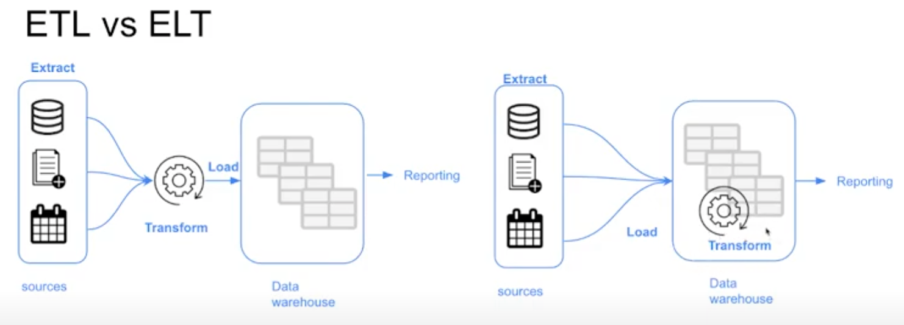

# WEEK 4: ANALYTICS ENGINEERS
---

### Table of Contents

[**1.1 Introduction to Data Engineering**](#11-introduction-to-data-engineering)
- [Architecture](#architecture)
- [Data Pipelines](#data-pipelines)

# **4.1 Introduction to analytics engineering**

## What is Analytics Engineering?

As the *data domain* has developed over time, new tools have been introduced and changed the dynamics of data-related work:

1. Massively parallel processing (MPP) databases
    - Lower the cost of storage
    - e.g. BigQuery, Snowflake, Redshift, ect
2. Data-pipelines-as-a-service
    - Simplify the ETL process
    - Fivetran, Stitch, etc
3. SQL-first / [Version control systems](https://lakefs.io/blog/data-version-control/)
    - e.g Dolt, neptune, Git LFS
4. [Self service analytics](https://www.gartner.com/en/information-technology/glossary/self-service-analytics#:~:text=Self%2DService%20Analytics%20is%20a,own%2C%20with%20nominal%20IT%20support.)
    - e.g. PowerBI, Tableau, Looker
5. [Data Governance](https://cloud.google.com/learn/what-is-data-governance)

The introduction of all of these tools changed the way the data teams work as well as the way that stakeholders consume the data, creating a gap in roles of data team. Tradionally:

- ***Data Engineer***: Prepares and maintains the infrastructure of data the team needs
- ***Data Analyst***: Utilize data to answer questions and solve problems
- ***Data Scientist***: Predicts the future based on past patterns and covers the what-ifs rather than what the day-to-day

However, with the introduction of these tools, both data scientist and analysts find themself writing code even thought they are not software engineers and writing code isn't their top priority. Data engineers are good software engineers but they don't possessthe training on how the data is going to be used by the business users.


***Analytics Engineer*** is the role that tries to fill the gap: it introduces the food software engineering practices to the effort of data scientists and analysts. The analytics engineer may be exposed to the following tools:

1. Data loading (Kafka, Nifi, etc)
2. Data storing (Data Warehouse)
3. Data modeling (dbt, Dataform, etc)
4. Data Presentation (BI tools - Looker, PowerBI, Tableau, etc)


## ETL vs ELT



We have covered this topic [here](https://github.com/acothaha/learning/blob/main/data_engineering/de_zoomcamp_2023/notes/Week%202:%20Workflow%20Orchestration.md#etl-vs-elt)

## Data Modeling Concepts

### [Ralph Kimball's Dimensional Modeling](https://www.wikiwand.com/en/Dimensional_modeling#:~:text=Dimensional%20modeling%20(DM)%20is%20part,use%20in%20data%20warehouse%20design.)

Ralph Kimball's Dimensional Modeling is an approach to Data Warehouse design which focuses on 2 main points:

1. Deliver data which is *understandable* to the business users.
2. Deliver *fast* quest performance.

Other goals such as reducing redundant data (prioritized by other approaches such as [3NF](https://www.wikiwand.com/en/Third_normal_form#:~:text=Third%20normal%20form%20(3NF)%20is,integrity%2C%20and%20simplify%20data%20management.) by Bill Inmon) are secondary to these goals. Dimensional Modeling alsi differs from other approaches to Data Warehouse design such as [Data Vaults](https://www.wikiwand.com/en/Data_vault_modeling)

Dimensional Modeling is based around 2 important concepts:
- ***Face Table***
    - *Facts* = *Measures*
    - Typically numeric values which can be aggregated, such as measurements or metrics
        - e.g. sales, orders, etc
    - Corresponds to a [*business process*](https://www.wikiwand.com/en/Business_process)
    - Can be considered as "**verbs**"
- ***Dimension Table***
    - *Dimension* = *Context*
    - Groups of hierarchies and descriptors that define the facts
        - e.g. customer, product, etc
    - Corresponds to a *business entity*
    - Can be considered as "**nouns**"
- Dimensional Modeling is built on [***star schema***](https://www.wikiwand.com/en/Star_schema) with fact tables surrounded by dimensions tables.

A good way to understand the *architecture* oof Dimensional Modeling is by drawing an analogy between dimensional modeling and a restaurant:

- *Stage area* -> Food storage area
- *Processing area* -> Kitchen
- *Presentation area* -> Dining room


# **4.2 Introduction to dbt**

## What is dbt?

***dbt*** stand for ***data build tool***. it's a transformation tool which allows us to transform and process *raw* data in our Data Warehouse to *transformed* data which can be later be used by Business Intelligence tools and any other consumers.

dbt also allows us to introduce good software engineering practices by defining a *deployment workflow*:

A ***model*** us a .sql file with `SELECT` statement; No DDL or DML is used. dbt will compile the file and run it in our database

## How to use dbt

dbt has 2 main components: *dbt core* and *dbt cloud*

- ***dbt Core***: open-source project that allows the data transformation
    - Builds and runs a dbt project (.sql and .yaml files)
    - Includes SQLQ compilation magic, macros and database adapters
    - Includes a CLI interface to run dbt commands locally
    - open-source and free to use

- ***dbt Cloud***: SaaS application to develop and manage dbt projects
    - Web-based IDE to develop, run and test a dbt projects
    - Jobs orchestration
    - Logging and alerting
    - INtergrated documentation
    - Free for individuals (one developer set)

For integration with BigQuery, we will use the dbt Cloud IDE, so a local installation of dbt Core is not required. For developing locally rather than using the Cloud IDE, dbt Core is required. Using dbt with a local Posgres adtabase can be done with dbt Core, which can be installed locally and connected to Postgresand run models through CLI.


# **4.3 Setting up dbt**

Before we start, we need to create 2 new empty BigQuery dataset in our project: a *development* dataset and a *production* dataset. We can name it whatever we want.

## dbt Cloud

In order to utilize dbt Cloud, we will need to create an user account. we are going to go to the [dbt homepage](https://www.getdbt.com/) and signup.

During the signup process, we will be asked to create a starter project and connect to a database. We will connect dbt to BiqQuery using [BigQuery OAuth](https://docs.getdbt.com/docs/collaborate/manage-access/set-up-bigquery-oauth). More detailed instructions on how to generate the credentials and connect both services can be found in this [link](https://github.com/DataTalksClub/data-engineering-zoomcamp/blob/main/week_4_analytics_engineering/dbt_cloud_setup.md). When asked, we connect the project to our *development* dataset.

Make sure we have set up a GitHub repo before hand. We will add repository into dbt with cloning our GitHub repo by copying the SSH key from our repo. Then, we need a deploy key, head to our GitHub repo and go to the settings tab. Under security we will find the menu *deploy keys*. Click on *Add key* and paste the deploy key provided by dbt cloud. Make sure to tick on *Allow write access*.

In the IDE windows, press the green *initialize* button to create the project files. Inside `dbt_project.yml`, change the project name both in the `name` field as well as right below the `models` block. We may comment or delete the `example` block at the end.

## dbt Core

Installing dbt Core locally can be done with the following steps in the [official docs](https://docs.getdbt.com/docs/get-started/installation). More instructions are also available in this [link](https://github.com/DataTalksClub/data-engineering-zoomcamp/tree/main/week_4_analytics_engineering/docker_setup)

Starting a sbt project with dbt core involves creating a `profiles.yml` file manually before running `dbt init`. Check this [video source](https://www.youtube.com/watch?v=1HmL63e-vRs&list=PL3MmuxUbc_hJed7dXYoJw8DoCuVHhGEQb&index=37) for more information.

# **4.4 developing with dbt**

## Anatomy of a dbt model

dbt model are mostly written in SQL but they also make use of the [Jinja templating language](https://jinja.palletsprojects.com/en/3.0.x/) for templates.

Here's an example of a dbt model:

```SQL
{{
    config(materialized='table')
}}

SELECT *
FROM staging.source_table
WHERE record_state = 'ACTIVE'
```

- In the Jinja statement defined within the `{{ }}` block we call the [`config()`](https://docs.getdbt.com/reference/dbt-jinja-functions/config) function
    - More info about Jinja macros for dbt in this [link](https://docs.getdbt.com/docs/build/jinja-macros)
- We commonly use the `config()` function at the beginningof a model to define a [***materialization***](https://docs.getdbt.com/docs/build/materializations) ***strategy***: a strategy for persisting dbt models in warehouse.
    - `table`   : The model will be built as a table on each run.
    - `view`    : Would rebuild the model on each run as a SQL view.
    - `incremental` : Essentially a `table` strategy but it allows us to add or update records incrementally rather than rebuilding the complete table each run.
    - `ephemeral` : Creates a [*Common Table Expression*](https://www.essentialsql.com/introduction-common-table-expressions-ctes/) (CTE).

dbt will compile this code into the following SQL query:

```SQL
CREATE TABLE my_schema.my_model AS (
    SELECT *
    FROM staging.source_table
    WHERE record_state = 'ACTIVE'
)
```

After the code is compiled, dbt will run the compiled code in the Data Warehouse.

Additional model properties are stored in YAML files. Traditionally, these files were named `schema.yml` but later version of dbt do not enfore this as it could lead to confusion.

## The FROM clause

The `FROM` cluase within `SELECT`statement defines the *sources* of data to be used

The following sources are available to dbt models:

- ***Sources*** : The data loaded within our Data Warehouse.
    - We can access this data with the *source()* function
    - The ***sources*** key in our YAML file contains the defaults of the databases that the ***source()*** function can access and translate into proper SQL-valid names
        - Additionally, we can define *source freshness* to each source that we can check whether a source is "fresh" or "stale", which can be useful to check whether our data pipelines are working properly
    - More info about sources in this [link](https://docs.getdbt.com/docs/build/sources)
- ***Seeds*** : CSV files which can be stored in our repo under the `seeds` folder.
    - The repo gives us version controlling along with all of its benefits.
    - Seed are best suited to static data which changes rarely.
    - Seed usage:
        1. Add a CSV file to your `seeds` folder.
        2. Run the [`dbt seed`](https://docs.getdbt.com/reference/commands/seed) command to create a table in our Data Warehouse
            - If you update the contect of a seed, running `dbt seed` will append the updated values to the table rather than subtituting them. Instead, run `dbt seed --full-refresh` and the old table will be dropped then a new one will be created.
        3. Refer to the seed in your model with `ref()` function.
    - Moreunfo about seed in this [link](https://docs.getdbt.com/docs/build/seeds) 

Here's an example of how you would declare a source in a `.yml` file:

```YAML

sources:
    - name: staging
      database: esoteric-code-377203  # For bigquery
      schema: trips_data_all

      # loaded_at_field: record_loaded_at
      tables:
        - name: green_tripdata
        - name: yellow_tripdata
          freshness:
            error_after: {count: 6, period: hour}
```

And here's how you would reference a source in a `FROM` clause:

```SQL
FROM {{ source('staging', 'yellow_tripdata') }}
```
- The first argument of the `source()` function is the source name, and the second is the table name

In the of case seeds, assuming you've got a [`taxi_zone_lookup.csv`](https://github.com/DataTalksClub/data-engineering-zoomcamp/blob/main/week_4_analytics_engineering/taxi_rides_ny/data/taxi_zone_lookup.csv) file in your `seed` folder which contains `LocationID`, `borough`, `zone` and `service_zone`:

```SQL
SELECT 
    LocationID,
    borough,
    zone,
    replace(service_zone, 'Boro', 'Green') AS service_zone
FROM {{ ref(`taxi_zone_lookup`) }}
```

The `ref()` function references underlying tables and views in the Data Warehouse. When compiled, it will build the dependencies and resolve the correct schema for us. So, if Bigquery contains a schema/dataset called `dbt_dev` inside the `my_project` database which we are using for development and it contains a table called `stg_green_tripdata`, then the following code  ...

```SQL
WITH green_data AS (
    SELECT *,
        'Green' AS service_type
    FROM {{ ref('stg_green_tripdata') }}
)
```

... will be compiled as:

```SQL
WITH green_data AS (
    SELECT *,
        'Green' AS service_type
    FROM "my_project"."dbt_dev"."stg_green_tripdata"
)
```

- The `ref()` function translates our references table into the full reference, using the `database.schema.table` structure.
- If we were to run this code in our production environment, dbt would automatically resolve the reference to make it point to our production schema.

## Defining a sourca and creating a model

We will now create our first model. We are going to begin by creating 2 folders ynder our `models` folder:

- `staging` -> Contain the raw model
- `core` -> Contain the models that we will exposes at the end to the BI tools, stakeholders, etc.

Under `staging` we will add 2 new files: `schema.yml` and `stg_green_tripdata.sql`

```yml
# schema.yml

version: 2

sources:
    - name: staging
      database: your_project
      schema: trips_data_all

      tables:
          - name: green_tripdata
          - name: yellow_tripdata
```

- We define our ***sources*** in the `schema.yml` model properties file.
- We are defining the 2 tables for yellow and green taxi data as our sources.

```SQL
-- stg_green_tripdata.sql

{{ config(materialized='view') }}

SELECT * FROM {{ source('staging', 'green_tripdata') }}
```
- Query above will create a ***view*** in the `staging` dataset/schema in our database.
- We make use of `source()` function to access the green taxi data table, which is defined inside the `schema.yml` file.

The advantage of having the properties in a seperate file is that we can easily modify the `schema.yml` file to change the database details and write to different databases without having to modify our `stg_green_tripdata.sql` file.

You may now run the model with the `dbt run` command, either locally or from dbt cloud.

## Macros

***Macros*** are pieces if code in Jinja that can be reused, similar to functions in other languages.

dbt already includes a series of macros like `config()`, `source()` and `ref()`, but custom macros can also be defined.

Macros allow us to add features to SQL that aren't otherwise available, such as:
- Use control structures such as `if` statements or `for` loops
- Use environment variables in our dbt project for production
- Operate on the results of one query to generate another query
- Abstract snippets of SQL into reusable macros

Macros are defined in seperate `.sql` file which are typically stored in a `macros` directory.

There are 3 kinds of Jinja *delimiters*:

- `` for ***statements*** (control block, macro definitions)
- `{{ ... }}` for ***expression*** (literals, math, comparission, logic, macro calls...)
- `{# ... #}` for comments

Here's a macro definition example:

```SQL
{# This macro returns the description of the payment_type #}



    case {{ payment_type }}
        when 1 then 'Credit card'
        when 2 then 'Cash'
        when 3 then 'No charge'
        when 4 then 'Dispute'
        when 5 then 'Unknown'
        when 6 then 'Voided trip'
    end


```
