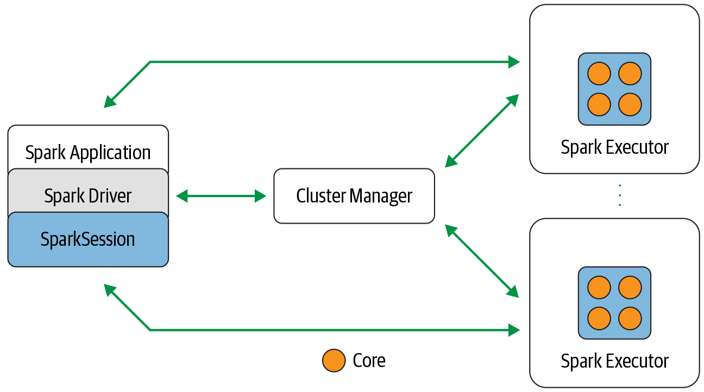

# WEEK 5: BATCH PROCESSING

### Table of Contents

# **5.1 Introduction to Batch Processing**

## Batch vs Streaming

There are 2 ways of processing data:
- ***Batch Processing***: Processing *chunks* of data at *regular interval*.
    - e.g. Processing taxi trips each month.

      


- ***Streaming***: Processing data *on the fly*.
    - e.g. Processing a taxi trip as soon as it's generated.

      

## Type of batch jobs

A ***batch job*** is a ***job*** (a unit of work) that will process data in batches.

Batch jobs may be *scheduled* in many ways:

- Weekly
- Daily (Very common)
- Hourly (Very common)
- X times per hours
- Every 5 minutes
- etc.

Batch jobs may also be carried out using different technologies:

- Python scripts
    - Python scripts can be run anywhere (Kubernetes, AWS batch, ...)
- SQL (dbt)
- Spark
- Flink
- etc.

## Orchestration batch jobs

Batch jobs are commonly orchestrated with tools such as airflow/prefect

A common workflow workflow for batch jobs may be as follows:


## Pros and cons of batch jobs


- Advantages:
    - Easy to manage. There are multiple tools to manage them.
    - Re-executable. Jobs can be easily retried if they fail.
    - Scalable. Scripts can be executed in more capable machines; Spark can be run in bigger clusters, etc.
- Disadvantages:
    - Delay. Each task of the workflow in the previous section may take a few minutes; assuming the whole workflow takes 20 minutes, we would need to wait those 20 minutes until the data is ready for work.

However, the advantages of batch jobs often compensate for its shortcomings (flaws), and as a result most companies that deal with data tend to work with batch jobs most of the time (~90%).

# **5.2 Introduction to Spark**
## What is Spark?


[Apache Spark](https://spark.apache.org/) is an open-source ***multi-language*** unified analytics **engine** for large-scale data processing.


Spark is a distributed data processing **engine** with its components working collaboratively on a cluster of machines. At a high level in the spark architecture, a Spark application consists of a *driver* program that is responsible for orchestrating parallel operations on the ***Spark cluster***. Ther *driver* accesses the distributed components in the cluster—the **spark executors** and **cluster manager**—through a ***SparkSession***



It provides high-level APIs in Java, Scala, Python ([PySpark](https://spark.apache.org/docs/latest/api/python/)), R and an optimized engine that supports general execution graphs. It also supports a rich set of higher-level tools including:

- [Spark SQL](https://spark.apache.org/docs/latest/sql-programming-guide.html) for SQL and structured data processing,
- [pandas API](https://spark.apache.org/docs/latest/api/python/getting_started/quickstart_ps.html) on Spark for pandas workloads,
- [MLlib](https://spark.apache.org/docs/latest/ml-guide.html) for machine learning,
- [GraphX](https://spark.apache.org/docs/latest/graphx-programming-guide.html) for graph processing,
- [Structured Streaming](https://spark.apache.org/docs/latest/structured-streaming-programming-guide.html) for incremental computation and stream processing

See [Spark overview](https://spark.apache.org/docs/latest/index.html) for more.

## Why do we need Spark?

Spark is used for transforming data in Data Lake.

There are tools such as Hive, Presto or Athena (an AWS managed Presto) that allow us to express jobs as SQL queries. However, there are times where we need to apply more complex manipulation which are very difficult or even impossible to express with SQL (such as ML models); in those instances, Spark is the tool to use.


A typical workflow may combine both tools. Here's an example of a workflow involving Machine Learning:


In this scenario, most of the preprocessing would be happening in Athena, so for everything that can be expressed with SQL, it's always a good idea to do so, but for everything else, there's Spark.

# **5.3 Installing Spark**

Follow these instructions to install Spark.

- [Windows](https://github.com/DataTalksClub/data-engineering-zoomcamp/blob/main/week_5_batch_processing/setup/windows.md)
- [Linux](https://github.com/DataTalksClub/data-engineering-zoomcamp/blob/main/week_5_batch_processing/setup/linux.md)
- [MacOS](https://github.com/DataTalksClub/data-engineering-zoomcamp/blob/main/week_5_batch_processing/setup/macos.md)

and follow [this](https://github.com/DataTalksClub/data-engineering-zoomcamp/blob/main/week_5_batch_processing/setup/pyspark.md) to run PySpark in Jupyter

## Installation on Linux

**1. Install Java**

Download OpenJDK 11 or Oracle JDK 11. It’s important that the version is 11 because Spark requires 8 or 11.

Here, we will use OpenJDK. This [page](https://jdk.java.net/archive/) is an archive of previously released builds of the OpenJDK.

To install Java, run the following commands.

```bash
# Create directory.
> mkdir spark
> cd spark

# Download and unpack OpenJDK.
> wget https://download.java.net/java/GA/jdk11/9/GPL/openjdk-11.0.2_linux-x64_bin.tar.gz
> tar xzfv openjdk-11.0.2_linux-x64_bin.tar.gz
> ls
jdk-11.0.2
> pwd
/home/aco/spark

# Setup Java.
> export JAVA_HOME="${HOME}/spark/jdk-11.0.2"
> export PATH="${JAVA_HOME}/bin:${PATH}"
> java --version
openjdk 11.0.2 2019-01-15
OpenJDK Runtime Environment 18.9 (build 11.0.2+9)
OpenJDK 64-Bit Server VM 18.9 (build 11.0.2+9, mixed mode)

# Remove the archive.
> rm openjdk-11.0.2_linux-x64_bin.tar.gz
```
**2. Install Spark**

Go to this [page](https://spark.apache.org/downloads.html) to download Apache Spark.

We will use **Spark 3.3.2 (Feb 17 2023)** version and package type **Pre-built for Apache Hadoop 3.3 and later**.

To install Spark, run the following commands:

```bash
# Download and unpack Spark 3.3.1.
> wget https://dlcdn.apache.org/spark/spark-3.3.2/spark-3.3.2-bin-hadoop3.tgz
> tar xzfv spark-3.3.2-bin-hadoop3.tgz

# Setup Spark.
> export SPARK_HOME="${HOME}/spark/spark-3.3.2-bin-hadoop3"
> export PATH="${SPARK_HOME}/bin:${PATH}"

# Remove the archive.
> rm spark-3.3.2-bin-hadoop3.tgz
```

We should see this


To close Spark Shell, you press `Ctrl+D` or type in `:quit` or `:q`

**3. Add PATH to `.bashrc` file**

Add these lines to the bottom of the `.bashrc` file. Use `nano .bashrc`

```bash
export JAVA_HOME="${HOME}/spark/jdk-11.0.2"
export PATH="${JAVA_HOME}/bin:${PATH}"

export SPARK_HOME="${HOME}/spark/spark-3.3.2-bin-hadoop3"
export PATH="${SPARK_HOME}/bin:${PATH}"
```

Press `Ctrl+O` to save the file and `Ctrl+X` to exit.

Then run the following commands

```bash
> source .bashrc

# Quit the server.
> logout

# Connect to Ubuntu server.
> ssh de-zoomcamp
> which java
/home/boisalai/spark/jdk-11.0.2/bin/java
> which pyspark
/home/boisalai/spark/spark-3.3.2-bin-hadoop3/bin/pyspark
```

**4. Using PySpark**

To run PySpark, we first need to add it to `PYTHONPATH`.

`PYTHONPATH` is a special environment variable that provides guidance to the Python interpreter about where to find various libraries and applications. See [Understanding the Python Path Environment Variable in Python](https://www.simplilearn.com/tutorials/python-tutorial/python-path) for more information.

Starting with adding these instructions to the bottom of cloud VM `~/.bashrc` file with `nano ~/.bashrc`

```bash
export PYTHONPATH="${SPARK_HOME}/python/:$PYTHONPATH"
export PYTHONPATH="${SPARK_HOME}/python/lib/py4j-0.10.9.5-src.zip:$PYTHONPATH"
```

Make sure that the version under `$SPARK_HOME/python/lib/` matches the filename of `py4j` or you will encounter `ModuleNotFoundError: No module named 'py4j'` while executing `import pyspark`

Press `Ctrl+O` to save the file and `Ctrl+X` to exit.

Then, run this command: `source ~/.bashrc.`

# **5.4 First look at Spark/PySpark**

## Creating a Spark Session

WE can use Spark with Python code by means of PySpark. We will be using Jupyter Notebooks for this session.

We first need to import PySpark to our code:

```python
import pyspark
from pyspark.sql import SparkSession
```

Now, we need to intantiate a ***Spark Session***, an object that we use to interact with Spark.

```python
spark = SparkSession.builder \
        .master("local[*]") \
        .appName('test') \
        .getOrCreate()
```

- `SparkSession` is the class of the object that we instantiate. `builder` is the builder method.
- `master()` setes the Spark *master URL* to connect to. The `local` string means that Spark will run on a local cluster. `[*]` means that Spark will run with as many CPU cores as possible.
- `appName` defines the name of the application/session. This will be shown in the Spark UI.
- `getOrCreate` will create the session or recover the object if it was previously created.

Once we've instantiated a session, we can access the Spark UI by browsing to `localhost:4040`. The UI will display all current jobs. Since we've just created the instance, there should be no jobs currently running.

## Reading CSV files

Similarly to Pandas, Spark can read CSV files into ***dataframes***, a tabular data structure. Unlike Pandas, Spark can handle much bigger datasets but it's unable to infer the datatypes of each columns.

> Note: Spark dataframes use custom data types; we cannot use regular Python data types.

For this example, we will use the [High Volume For-Hire Vehicle Trip Records for January 2021](https://github.com/DataTalksClub/nyc-tlc-data/releases/download/fhvhv/fhvhv_tripdata_2021-01.csv.gz) available from the [NYC TLC Trip Record Data website](https://github.com/DataTalksClub/nyc-tlc-data/releases/tag/fhvhv). The file should be about 124MB in size.

To download the file run this commands

```bash
# Download the file
> wget "https://github.com/DataTalksClub/nyc-tlc-data/releases/download/fhvhv/fhvhv_tripdata_2021-01.csv.gz"

# unzip the file
> gzip -d "fhvhv_tripdata_2021-01.csv.gz"

# Check number of lines in the CSV
> wc -l "fhvhv_tripdata_2021-01.csv"
11908469 fhvhv_tripdata_2021-01.csv
```


Let's read the file and create a dataframe:

```python
df = spark.read \
    .option("header", "true") \
    .csv('fhvhv_tripdata_2021-01.csv')
```

- `read()` reads the file.
- `option()` contains options for the `read()` method. In this case, we're specifying that the first line of the CSV file contains the columns names.
- `csv()` is for reading CSV files.

you can see the contents of the dataframe with `df.show()` or `df.head()`. You can also check the current schema with `df.schema()` or `df.printSchema()`; you will notice that all values are strings.

We can use a trick with Pandas to infer the datatypes:
1. Create a smaller CSV file with the first 1000 records or so.
2. Import Pandas and create a Pandas dataframe. This dataframe will have inferred datatypes.
3. Create a Spark dataframe from the Pandas dataframe and check its schema.

    ```python
    spark.createDataFrame(my_pandas_datafram).schema
    ```

4. Based on the output of the previous method, import `types` from `pyspark.sql` and create `StructType` containing a list of the datatypes.

    ```python
    from pyspark.sql import types
    schema = types.Structype([...])
    ```
    - `types` contains all of the available data types for Spark dataframes.

5. Create a new Spark dataframe and include the schema as an option.
    ```python
    df = spark.read \
        .option("header", "true") \
        .schema(schema) \
        .csv('fhvhv_tripdata_2021-01.csv')
    ```

You may find an example of Jupyter Notebook file using this trick [here](https://github.com/acothaha/learning/blob/main/data_engineering/de_zoomcamp_2023/week_5_batch_processing/notebooks/04_pyspark.ipynb)

## Partitions

A ***Spark cluster*** is composed of multiple ***executors***. Each executor can process data independently in order to parallelize and speed up work.

In the previous example we read a single large CSV file. A file can only be read by a single executor, which means that the code we've written so far isn't parallelized and thus will only be run by a single executor rather than many at the same time.

In order to solve this issue, we can *split a file into multiple parts* so that each executor can take care of the part and have all executors working simultaneously. These splits are called partitions.

We will now read the CSV file, partition the dataframe and parquetize it. This will create multiple files in parquet format.

> converting to parquet is an **expensive** operation which may take several minutes.

```python
# Create 24 partitions in our dataframe
df = df.repartition(24)
# parquetize and write to fhvhv/2021/01/ folder
df.write.parquet('fhvhv/2021/01/')
```

We may check the Spark UI at any time and see the progress of the current job, which is divided into stage which contains tasks. The tasks in a stage will not start until all task on the previous stage are finished.

When creating a dataframe, Spark creates as many partitions as CPU cores available by default, and each partition creates a task. Hence, assuming that the dataframe was initially partitioned into 6 partitions, the `write.parquet()` method will have 2 stages: the first with 6 tasks and the second one with 24 tasks.

Besides the 24 parquet files, you should also see a `_SUCCESS` file which should be empty. This file is created when the job is finished successfully.

Trying to write the files again will output an error because Spark will not write to a non-empty folder. You can force an overwrite with the `mode` argument:

```python
df.write.parquet('fhvhv/2021/01/', mode='overwrite')
```

The opposite of partitioning (joining multiple partitions into a single partition) is called ***coalescing***.

