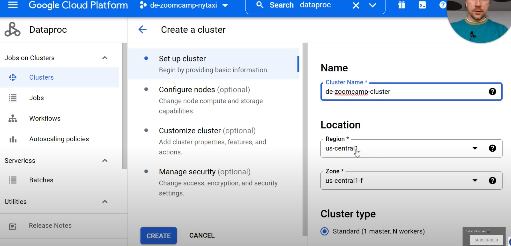

# WEEK 5: BATCH PROCESSING

### Table of Contents

# **5.1 Introduction to Batch Processing**

## Batch vs Streaming

There are 2 ways of processing data:
- ***Batch Processing***: Processing *chunks* of data at *regular interval*.
    - e.g. Processing taxi trips each month.

      


- ***Streaming***: Processing data *on the fly*.
    - e.g. Processing a taxi trip as soon as it's generated.

      

## Type of batch jobs

A ***batch job*** is a ***job*** (a unit of work) that will process data in batches.

Batch jobs may be *scheduled* in many ways:

- Weekly
- Daily (Very common)
- Hourly (Very common)
- X times per hours
- Every 5 minutes
- etc.

Batch jobs may also be carried out using different technologies:

- Python scripts
    - Python scripts can be run anywhere (Kubernetes, AWS batch, ...)
- SQL (dbt)
- Spark
- Flink
- etc.

## Orchestration batch jobs

Batch jobs are commonly orchestrated with tools such as airflow/prefect

A common workflow workflow for batch jobs may be as follows:


## Pros and cons of batch jobs


- Advantages:
    - Easy to manage. There are multiple tools to manage them.
    - Re-executable. Jobs can be easily retried if they fail.
    - Scalable. Scripts can be executed in more capable machines; Spark can be run in bigger clusters, etc.
- Disadvantages:
    - Delay. Each task of the workflow in the previous section may take a few minutes; assuming the whole workflow takes 20 minutes, we would need to wait those 20 minutes until the data is ready for work.

However, the advantages of batch jobs often compensate for its shortcomings (flaws), and as a result most companies that deal with data tend to work with batch jobs most of the time (~90%).

# **5.2 Introduction to Spark**
## What is Spark?


[Apache Spark](https://spark.apache.org/) is an open-source ***multi-language*** unified analytics **engine** for large-scale data processing.


Spark is a distributed data processing **engine** with its components working collaboratively on a cluster of machines. At a high level in the spark architecture, a Spark application consists of a *driver* program that is responsible for orchestrating parallel operations on the ***Spark cluster***. Ther *driver* accesses the distributed components in the cluster—the **spark executors** and **cluster manager**—through a ***SparkSession***


It provides high-level APIs in Java, Scala, Python ([PySpark](https://spark.apache.org/docs/latest/api/python/)), R and an optimized engine that supports general execution graphs. It also supports a rich set of higher-level tools including:

- [Spark SQL](https://spark.apache.org/docs/latest/sql-programming-guide.html) for SQL and structured data processing,
- [pandas API](https://spark.apache.org/docs/latest/api/python/getting_started/quickstart_ps.html) on Spark for pandas workloads,
- [MLlib](https://spark.apache.org/docs/latest/ml-guide.html) for machine learning,
- [GraphX](https://spark.apache.org/docs/latest/graphx-programming-guide.html) for graph processing,
- [Structured Streaming](https://spark.apache.org/docs/latest/structured-streaming-programming-guide.html) for incremental computation and stream processing

See [Spark overview](https://spark.apache.org/docs/latest/index.html) for more.

## Why do we need Spark?

Spark is used for transforming data in Data Lake.

There are tools such as Hive, Presto or Athena (an AWS managed Presto) that allow us to express jobs as SQL queries. However, there are times where we need to apply more complex manipulation which are very difficult or even impossible to express with SQL (such as ML models); in those instances, Spark is the tool to use.


A typical workflow may combine both tools. Here's an example of a workflow involving Machine Learning:


In this scenario, most of the preprocessing would be happening in Athena, so for everything that can be expressed with SQL, it's always a good idea to do so, but for everything else, there's Spark.

# **5.3 Installing Spark**

Follow these instructions to install Spark.

- [Windows](https://github.com/DataTalksClub/data-engineering-zoomcamp/blob/main/week_5_batch_processing/setup/windows.md)
- [Linux](https://github.com/DataTalksClub/data-engineering-zoomcamp/blob/main/week_5_batch_processing/setup/linux.md)
- [MacOS](https://github.com/DataTalksClub/data-engineering-zoomcamp/blob/main/week_5_batch_processing/setup/macos.md)

and follow [this](https://github.com/DataTalksClub/data-engineering-zoomcamp/blob/main/week_5_batch_processing/setup/pyspark.md) to run PySpark in Jupyter

## Installation on Linux

**1. Install Java**

Download OpenJDK 11 or Oracle JDK 11. It’s important that the version is 11 because Spark requires 8 or 11.

Here, we will use OpenJDK. This [page](https://jdk.java.net/archive/) is an archive of previously released builds of the OpenJDK.

To install Java, run the following commands.

```bash
# Create directory.
> mkdir spark
> cd spark

# Download and unpack OpenJDK.
> wget https://download.java.net/java/GA/jdk11/9/GPL/openjdk-11.0.2_linux-x64_bin.tar.gz
> tar xzfv openjdk-11.0.2_linux-x64_bin.tar.gz
> ls
jdk-11.0.2
> pwd
/home/aco/spark

# Setup Java.
> export JAVA_HOME="${HOME}/spark/jdk-11.0.2"
> export PATH="${JAVA_HOME}/bin:${PATH}"
> java --version
openjdk 11.0.2 2019-01-15
OpenJDK Runtime Environment 18.9 (build 11.0.2+9)
OpenJDK 64-Bit Server VM 18.9 (build 11.0.2+9, mixed mode)

# Remove the archive.
> rm openjdk-11.0.2_linux-x64_bin.tar.gz
```
**2. Install Spark**

Go to this [page](https://spark.apache.org/downloads.html) to download Apache Spark.

We will use **Spark 3.3.2 (Feb 17 2023)** version and package type **Pre-built for Apache Hadoop 3.3 and later**.

To install Spark, run the following commands:

```bash
# Download and unpack Spark 3.3.1.
> wget https://dlcdn.apache.org/spark/spark-3.3.2/spark-3.3.2-bin-hadoop3.tgz
> tar xzfv spark-3.3.2-bin-hadoop3.tgz

# Setup Spark.
> export SPARK_HOME="${HOME}/spark/spark-3.3.2-bin-hadoop3"
> export PATH="${SPARK_HOME}/bin:${PATH}"

# Remove the archive.
> rm spark-3.3.2-bin-hadoop3.tgz
```

We should see this


To close Spark Shell, you press `Ctrl+D` or type in `:quit` or `:q`

**3. Add PATH to `.bashrc` file**

Add these lines to the bottom of the `.bashrc` file. Use `nano .bashrc`

```bash
export JAVA_HOME="${HOME}/spark/jdk-11.0.2"
export PATH="${JAVA_HOME}/bin:${PATH}"

export SPARK_HOME="${HOME}/spark/spark-3.3.2-bin-hadoop3"
export PATH="${SPARK_HOME}/bin:${PATH}"
```

Press `Ctrl+O` to save the file and `Ctrl+X` to exit.

Then run the following commands

```bash
> source .bashrc

# Quit the server.
> logout

# Connect to Ubuntu server.
> ssh de-zoomcamp
> which java
/home/boisalai/spark/jdk-11.0.2/bin/java
> which pyspark
/home/boisalai/spark/spark-3.3.2-bin-hadoop3/bin/pyspark
```

**4. Using PySpark**

To run PySpark, we first need to add it to `PYTHONPATH`.

`PYTHONPATH` is a special environment variable that provides guidance to the Python interpreter about where to find various libraries and applications. See [Understanding the Python Path Environment Variable in Python](https://www.simplilearn.com/tutorials/python-tutorial/python-path) for more information.

Starting with adding these instructions to the bottom of cloud VM `~/.bashrc` file with `nano ~/.bashrc`

```bash
export PYTHONPATH="${SPARK_HOME}/python/:$PYTHONPATH"
export PYTHONPATH="${SPARK_HOME}/python/lib/py4j-0.10.9.5-src.zip:$PYTHONPATH"
```

Make sure that the version under `$SPARK_HOME/python/lib/` matches the filename of `py4j` or you will encounter `ModuleNotFoundError: No module named 'py4j'` while executing `import pyspark`

Press `Ctrl+O` to save the file and `Ctrl+X` to exit.

Then, run this command: `source ~/.bashrc.`

# **5.4 First look at Spark/PySpark**

## Creating a Spark Session

WE can use Spark with Python code by means of PySpark. We will be using Jupyter Notebooks for this session.

We first need to import PySpark to our code:

```python
import pyspark
from pyspark.sql import SparkSession
```

Now, we need to intantiate a ***Spark Session***, an object that we use to interact with Spark.

```python
spark = SparkSession.builder \
        .master("local[*]") \
        .appName('test') \
        .getOrCreate()
```

- `SparkSession` is the class of the object that we instantiate. `builder` is the builder method.
- `master()` setes the Spark *master URL* to connect to. The `local` string means that Spark will run on a local cluster. `[*]` means that Spark will run with as many CPU cores as possible.
- `appName` defines the name of the application/session. This will be shown in the Spark UI.
- `getOrCreate` will create the session or recover the object if it was previously created.

Once we've instantiated a session, we can access the Spark UI by browsing to `localhost:4040`. The UI will display all current jobs. Since we've just created the instance, there should be no jobs currently running.

## Reading CSV files

Similarly to Pandas, Spark can read CSV files into ***dataframes***, a tabular data structure. Unlike Pandas, Spark can handle much bigger datasets but it's unable to infer the datatypes of each columns.

> Note: Spark dataframes use custom data types; we cannot use regular Python data types.

For this example, we will use the [High Volume For-Hire Vehicle Trip Records for January 2021](https://github.com/DataTalksClub/nyc-tlc-data/releases/download/fhvhv/fhvhv_tripdata_2021-01.csv.gz) available from the [NYC TLC Trip Record Data website](https://github.com/DataTalksClub/nyc-tlc-data/releases/tag/fhvhv). The file should be about 124MB in size.

To download the file run this commands

```bash
# Download the file
> wget "https://github.com/DataTalksClub/nyc-tlc-data/releases/download/fhvhv/fhvhv_tripdata_2021-01.csv.gz"

# unzip the file
> gzip -d "fhvhv_tripdata_2021-01.csv.gz"

# Check number of lines in the CSV
> wc -l "fhvhv_tripdata_2021-01.csv"
11908469 fhvhv_tripdata_2021-01.csv
```


Let's read the file and create a dataframe:

```python
df = spark.read \
    .option("header", "true") \
    .csv('fhvhv_tripdata_2021-01.csv')
```

- `read()` reads the file.
- `option()` contains options for the `read()` method. In this case, we're specifying that the first line of the CSV file contains the columns names.
- `csv()` is for reading CSV files.

you can see the contents of the dataframe with `df.show()` or `df.head()`. You can also check the current schema with `df.schema()` or `df.printSchema()`; you will notice that all values are strings.

We can use a trick with Pandas to infer the datatypes:
1. Create a smaller CSV file with the first 1000 records or so.
2. Import Pandas and create a Pandas dataframe. This dataframe will have inferred datatypes.
3. Create a Spark dataframe from the Pandas dataframe and check its schema.

    ```python
    spark.createDataFrame(my_pandas_datafram).schema
    ```

4. Based on the output of the previous method, import `types` from `pyspark.sql` and create `StructType` containing a list of the datatypes.

    ```python
    from pyspark.sql import types
    schema = types.Structype([...])
    ```
    - `types` contains all of the available data types for Spark dataframes.

5. Create a new Spark dataframe and include the schema as an option.
    ```python
    df = spark.read \
        .option("header", "true") \
        .schema(schema) \
        .csv('fhvhv_tripdata_2021-01.csv')
    ```

You may find an example of Jupyter Notebook file using this trick [here](https://github.com/acothaha/learning/blob/main/data_engineering/de_zoomcamp_2023/week_5_batch_processing/notebooks/04_pyspark.ipynb)

## Partitions

A ***Spark cluster*** is composed of multiple ***executors***. Each executor can process data independently in order to parallelize and speed up work.

In the previous example we read a single large CSV file. A file can only be read by a single executor, which means that the code we've written so far isn't parallelized and thus will only be run by a single executor rather than many at the same time.

In order to solve this issue, we can *split a file into multiple parts* so that each executor can take care of the part and have all executors working simultaneously. These splits are called partitions.

We will now read the CSV file, partition the dataframe and parquetize it. This will create multiple files in parquet format.

> converting to parquet is an **expensive** operation which may take several minutes.

```python
# Create 24 partitions in our dataframe
df = df.repartition(24)
# parquetize and write to fhvhv/2021/01/ folder
df.write.parquet('fhvhv/2021/01/')
```

We may check the Spark UI at any time and see the progress of the current job, which is divided into stage which contains tasks. The tasks in a stage will not start until all task on the previous stage are finished.

When creating a dataframe, Spark creates as many partitions as CPU cores available by default, and each partition creates a task. Hence, assuming that the dataframe was initially partitioned into 6 partitions, the `write.parquet()` method will have 2 stages: the first with 6 tasks and the second one with 24 tasks.

Besides the 24 parquet files, you should also see a `_SUCCESS` file which should be empty. This file is created when the job is finished successfully.

Trying to write the files again will output an error because Spark will not write to a non-empty folder. You can force an overwrite with the `mode` argument:

```python
df.write.parquet('fhvhv/2021/01/', mode='overwrite')
```

The opposite of partitioning (joining multiple partitions into a single partition) is called ***coalescing***.

## Spark dataframes

We can create a dataframe from the parquet files we create in the previous section.

```python
df = spark.read.parquet('fhvhv/2021/01/')
```

Unlike CSV files, parquet files contain the schema of the dataset, so there is no need to specify a schema like we previously did when reading the CSV files. you can check the schema like this:

```python
df.printSchema()
```

(One of the reasons why parquet files are relatively smaller than CSV files is because they store the data according to the datatypes, so integer values will take less space than long or string values)

There are many Pandas-like operations that we can do on spark dataframe, such as:

- Column selection - returns a dataframe with only the selected columns

    ```python
    new_df = df.select('pickup_datetime', 'dropoff_datetime', 'PULocationID', 'DOLocationID')
    ```

 - Filtering by values - return a dataframe whose records match the condition stated in the filter

    ```python
    new_df = df.select('pickup_datetime', 'dropoff_datetime', 'PULocationID', 'DOLocationID').filter(df['hvfhs_license_num'] == 'HV0003')

- And many more. The official Spark documentation website contains a quick guide for dataframes ([here](https://spark.apache.org/docs/latest/api/python/getting_started/quickstart_df.html))

## Actions vs Transformations

Some Spark methods are "**Lazy**", meaning that they are not executed right away. We can test this with the last instructions we run in the previous section: after running them, the Spark UI will not show any new jobs. On the other hand, running `df.show()` will be executed right away and display the contents of the dataframe; the Spark UI will also show a new job.

These lazy commands are called ***transformations*** and the eager commands are called ***actions***. Computations only happen when actions are triggered.

```python
df.select(...).filter(...).show()
```


Both `select()` and `filter()` are ***transformations***, but `show()` is an ***action***. The whole instructions gets evaluated only when the `show()` action is triggered.

list of ***transformations*** (lazy):

- Selecting columns
- Filtering
- Joins
- Group by
- Partitiions
- ...

List of ***actions*** (eager):
- Show, take, head
- Write, read
- ...

## Functions and User Defined Functins (UDFs)
 
Besides the SQL and Pandas-like commands we've discussed so far, Spark provides additional built-in functions that allow for more complex data manipulation. By convention, these functions are imported as follows:

```python
from pyspark.sql import functions as F 
```

Here is an example of built-in function usage:

```python
df \
    .withColumn('pickup_date', F.to_date(df.pickup_datetime)) \
    .withColumn('dropoff_date', F.to_date(df.dropoff_datetime)) \
    .select('pickup_date', 'dropoff_date', 'PULocationID', 'DOLocationID') \
    .show()
```
- `withColumn()` is a ***transformation*** that adds a new column to the dataframe.

    > ***IMPORTANT***: adding a new column with the same name as a previously existing column will overwrite the existing column!
-  `select()` is another ***transformation*** that select the stated columns.
- `F.to_date()` is a built-in Spark function that converts a timestamp to date format (year, month and day only, no hour and minute)

A list of built-in functions is available [here](https://spark.apache.org/docs/latest/api/sql/index.html)

Besides these built-in functions, Spark allows us to create ***User Defined Functions*** (UDFs) with custom behaviour for those instances where creating SQL queries for that behaviour becomes difficult both to manage and test.

UDFs are regular functions which are then passed as parameters to a special builder. Let's create one:

```python
# A crazy function that changes values when they're divisible by 7 or 3
def crazy_stuff(base_num):
    num = int(base_num[1:])
    if num % 7 == 0:
        return f's/{num:03x}'
    elif num % 3 == 0:
        return f'a/{num:03x}'
    else:
        return f'e/{num:03x}'

# Creating the actual UDF
crazy_stuff_udf = F.udf(crazy_stuff, returnType=types.StringType())
```

- `F.udf()` takes a function (`crazy_stuff()` in this example) as parameter as well as a return type for the function (a string in our example).
- While `crazy_stuff()` is obviuosly non-sensical, UDFs are handy for things such as ML and other complex operations for which SQL isn't suitable or desirable. Python code is also easier to test than SQL.

We can then use our UDF in ***transformations*** just like built-in functions:

```python
df \
    .withColumn('pickup_date', F.to_date(df.pickup_datetime)) \
    .withColumn('dropoff_date', F.to_date(df.dropoff_datetime)) \
    .withColumn('base_id', crazy_stuff_udf(df.dispatching_base_num)) \
    .select('base_id', 'pickup_date', 'dropoff_date', 'PULocationID', 'DOLocationID') \
    .show()
```

# **5.5 Spark SQL**

We already mentioned at the beginning that there are other tools for expressing batch jobs as SQL queries. However, Spark can also run SQL queires, which can come in handy if you already have Spark cluster and setting up an additional tool for sporadic use isn't desireable.

## Combining the 2 datasets

> ***NOTE***: this block makes use of the yellow and green taxi datasets for 2020 and 2021 as parquetized local files. It can be downloaded and parquetized the files directly; [check out this extran lesson](https://github.com/ziritrion/dataeng-zoomcamp/blob/main/notes/extra1_preparing_data.md) (from ziritrion) to see how

Let's now load all of the yellow and green taxi data for 2020 and 2021 to Spark dataframes.

Assuming the parquet files for the dataset are stored on a `data/pq/color/year/month` folder structure:

```python
df_green = spark.read.parquet('data/pq/green/*/*')
df_green = df_green \
    .withColumnRenamed('lpep_pickup_datetime', 'pickup_datetime') \
    .withColumnRenamed('lpep_dropoff_datetime', 'dropoff_datetime')

df_yellow = spark.read.parquet('data/pq/yellow/*/*')
df_yellow = df_yellow \
    .withColumnRenamed('tpep_pickup_datetime', 'pickup_datetime') \
    .withColumnRenamed('tpep_dropoff_datetime', 'dropoff_datetime')
```
- Because the pickup and dropoff column names don't match between 2 datasets, we use the `withColumnRenamed`action to make them have matching name.

We will replicate the [`dim_monthly_zone_revenue.sql`](https://github.com/acothaha/dbt_ny_taxi_rides_zoomcamp/blob/main/models/core/dim_monthly_zone_revenue.sql) model from lesson 4 in Spark. This model makes use of `trips_data`, a combined table of yellow and green taxis, so we will create a combined dataframe with the commong columns to both datasets.

We need to find our which are the common columns. We could do this:

```python
set(df_green.columns) & set(df_yellow.columns)
```

However, this command will not respect the column order. We can do this instead to respect the order:

```python
common_colums = []

yellow_columns = set(df_yellow.columns)

for col in df_green.columns:
    if col in yellow_columns:
        common_colums.append(col)
```

Before we combine the datasets, we need to figure out how we will keep track of the taxi type for each record (the `service_type` field in `dim_monthly_zone_revenue.sql`). We will ad the service_type column to each dataframe.

```python
from pyspark.sql import functions as F

df_green_sel = df_green \
    .select(common_colums) \
    .withColumn('service_type', F.lit('green'))

df_yellow_sel = df_yellow \
    .select(common_colums) \
    .withColumn('service_type', F.lit('yellow'))
```
- `F.lit` adds a *literal* or constant to a dataframe. We use it here to fill the `service_type` column with a constant value, which is its corresponding taxi type.

Finally, let's combine both datasets:
```python
df_trips_data = df_green_sel.unionAll(df_yellow_sel)
```
We can also count the amount of records per taxi type:
```python
df_trips_data.groupBy(`service_type`).count.show()
```

## Querying a dataset with Temporary Tables

We can make SQL queries with Spark with `spark.sqll("SELECT * FROM ???")`. SQL expects a table for retrieving records, but a dataframe is not a table, so we need to ***register*** the dataframe as a table first:

```python
df_trips_data.createOrReplaceTempView('trips_data')
```
- This method creates a ***temporary table*** with the name `trips_data`

With our registered table, we can now perform regular SQL operations:

```python
spark.sql("""
SELECT
    service_type,
    count(1)
FROM
    trips_data
GROUP BY 
    service_type
""").show()
```

- This query outputs the same as `df_trips_data.groupBy('service_type').count().show()`
- Note that the SQL query is wrapped with 3 double quotes (`"`)

The query output can be manipulated as a dataframe, which means that we can perform any queries on our table and manipulate the results with Python as we see fit.

We can now slightly modify the [`dim_monthly_zone_revenue.sql`](https://github.com/acothaha/dbt_ny_taxi_rides_zoomcamp/blob/main/models/core/dim_monthly_zone_revenue.sql), and run it as a query with Spark and store the output in a dataframe:

```python
df_result = spark.sql("""
SELECT 
    -- Reveneue grouping 
    PULocationID AS revenue_zone,
    date_trunc('month', pickup_datetime) AS revenue_month, 
    service_type, 

    -- Revenue calculation 
    SUM(fare_amount) AS revenue_monthly_fare,
    SUM(extra) AS revenue_monthly_extra,
    SUM(mta_tax) AS revenue_monthly_mta_tax,
    SUM(tip_amount) AS revenue_monthly_tip_amount,
    SUM(tolls_amount) AS revenue_monthly_tolls_amount,
    SUM(improvement_surcharge) AS revenue_monthly_improvement_surcharge,
    SUM(total_amount) AS revenue_monthly_total_amount,
    SUM(congestion_surcharge) AS revenue_monthly_congestion_surcharge,

    -- Additional calculations
    AVG(passenger_count) AS avg_montly_passenger_count,
    AVG(trip_distance) AS avg_montly_trip_distance
FROM
    trips_data
GROUP BY
    1, 2, 3
""")
```

- We removed the `with` statement from the original query because it operates on an external table that Spark does not have access to.
- We removed the `count(tripid) as total_monthly_trips`, line in *additional calculations* because in alse depends on that external table.
- We change the grouping from field names to references in order to avoid mistake.

SQL queries are ***transformations***, so we need an action to perform them such as `df_result.show()`.

once we're happy with the output, we can also store it as a parquet file just like any other dataframe. We could run this:

```python
df_result.write.parquet('data/report/revenue/')
```

However, with our current dataset, this will create more that 200 parquet files of very small size, which isn't very desirable.

In order to reducre the amount of files, we need to reduce the amount of partitions of the dataset, which is done with the `coalesce()` method:

```python
df_result.coalesce(1).write.parquet('data/report/revenue/', mode='overwrite')
```

This reduces the amount of partitions to just 1

# **5.6 Spark internals**

## Spark Cluster

Until now, we've used a ***local cluster*** to run our Spark code, but Spark cluster often contain multiple computers that behace(act) as executors.

Spark clusters are managed by a ***master***, which behaves similarly to an entry point of a kubernetes cluster. A ***driver*** (an Airflow DAG, a computer running a local script, etc) that wants to execute a Spark job will send the job to the master, which in turn will divide the work among the cluster's executors. If any executor fails and becomes offline for any reason, the master will reassign the task to another executor.


Each executor will fetch a ***dataframe partition*** stored in a ***Data Lake*** (usually S3, GCS or similar cloud provider), do something with it and then store it somewhere, which could be the same Data Lake or somewhere else. If there are more partitions that executors, executors will keep fetching partitions until every single one has been processed.

This is in contrast to [Hadoop](https://hadoop.apache.org/), another data analytics engine, whose executors locally store the data they process. Partitions in Hadoop are duplicated across several executors for redudancy, in case an executor fails for whatever reason (Hadoop is meant for clusters made of commodity hardware computers). However, data locality has become less important as storage and data transfer costs have dramatically decreased and nowadays it's feasible to seperate storage from computation, so Hadoop has fallen out of fashion.

## GROUP BY in Spark

Let's do the following query:

```python
df_green_revenue = spark.sql("""
SELECT 
    date_trunc('hour', lpep_pickup_datetime) AS hour, 
    PULocationID AS zone,

    SUM(total_amount) AS amount,
    COUNT(1) AS number_records
FROM
    green
WHERE
    lpep_pickup_datetime >= '2020-01-01 00:00:00'
GROUP BY
    1, 2  
""")
```

This query will output the total revenue and amount of trips per hour per zone. We need to froup by hour and zones in order to do this.

Since the data is split along partitions, it's likely that we will need to group data which is in separate partitions, but executor only deal with individual partitions. Spark solves this issue by seperating the grouping in 2 stages:

1. IN the first stage, each executor groups the results in the partition they're working on and outputs the results to a temporary partition. These temporary partitions are the ***intermediate results***.


2. This second stage ***shuffles*** the data: Spark will put all records with the **same keys** (in this case, the `GROUP BY` keys which are hour and zone) in the **same partitition**. The algorithm to do this is called ***external merge sort***. Once the shuffling has finished, we can once again apply the `GROUP BY` to these new partitions and **reduce** the records to the **final output**.

    > ***NOTE*** : The shuffled partitions may contain more than one key, but all records belonging to a key should end up in the same partition.


Running the query should display the following [DAG](https://www.astronomer.io/blog/what-exactly-is-a-dag/) (Directed Acyclic Graph) in the Spark UI:


- The `Exchange` task refers to shuffling

If we were to add sorting to the query (adding a `ORDER BY 1, 2` at the end), Spark would perform a very similar operation to `GROUP BY` after grouping the data. The resulting DAG would look liked this:


By default, Spark will repartition the dataframe to 200 partitions after shuffling data. FOre the kind of data we're dealing with in this example, this could be counterproductive because of the small size of each partition/file, but for larger datasets this is fine.

Shuffling is an **expensive operation**, so it's in our best interest to reduce the amount of data to shuffle when querying.

> Keep in mind that repartitioning also involves shuffling data.


## JOIN in Spark

Joining tables in Spark implemented a similar way to `GROUP BY` and `ORDER BY`, but there are 2 distinct cases; joining 2 large tables and joining a large table and a small table.

### **Joining 2 large tables**

Let's assume that we've created a `df_yellow_revenue` dataframe in the same manner as the `df_green_revenue`that we created in the previous section. WE want to join both tables, so we will create a temporary dataframes with changed column names so that we can tell apart data from each original table:

```python
df_green_revenue_tmp = df_green_revenue \
    .withColumnRenamed('amount', 'green_amount') \
    .withColumnRenamed('number_records', 'green_number_records')

df_yellow_revenue_tmp = df_yellow_revenue \
    .withColumnRenamed('amount', 'yellow_amount') \
    .withColumnRenamed('number_records', 'yellow_number_records')
```

- Both of these queries are ***transformations***; Spark doesn't actually do anything when we run them.

We will now perform an [outer join](https://dataschool.com/how-to-teach-people-sql/sql-join-types-explained-visually/) so that we can display the amount of trips and the revenue per hour per zone for green and yellow taxis at the same time regardless of whether the hour/zone combo had one type of taxi trips or the other;;

```python
df_join = df_green_revenue_tmp.join(df_yellow_revenue_tmp, on=['hour', 'zone'], how='outer')
```

- `on=` receives a list of columns which we will join the tables with. This will result in a ***primary composite key*** for the resulting table.
- `how=` specifies the type of `JOIN` to execute.

When we run either `show()` and `write()` on thos query, Spark will have to create both the temporary dataframes and the joint final dataframe. The DAG will look like this:


Stage 1 and 2 belong to the craeting of `df_green_revenue_tmp` and `df_yellow_revenue_tmp`.

for stage 3, given all records for yellow taxis `Y1, Y2, ..., Yn` and for green taxis `G1, G2, ..., Gn` and knowing that the resulting composite key is `key K = (hour H, zone Z)`, we can express the resulting complex records as `(Kn, Yn)` for yellow records and `(Kn, Gn)` for green record. Spark will first ***shuffle*** the data like it did for grouping (using the ***external merge sort algorithm***) and then it will ***reduce*** the records by joiningo yellow and green data for matching keys to show the final output.


- Because we're doing an ***outer join***, keys which only have yellow taxi or green taxi records will be shown with empty field for the missing data, whereas keys with both types of records will show both yellow and green taxi data.
    - If we did an ***inner join*** instead, the records such as `(K1, Y1, Ø)` and `(K4, Ø, G3)` would be excluded form the final result.


### **Joining a large table and a small table**

> ***NOTE*** : This section assumes that you have run the code in the [test Jupyter Notebook](https://github.com/acothaha/learning/blob/main/data_engineering/de_zoomcamp_2023/week_5_batch_processing/notebooks/03_test.ipynb) from the installing spark section and therefore have created a `zones` dataframe.

Let's now use the `zones` lookup table to match each zone ID to its corresponding name.

```
df_zones = spark.read.parquet('zones/')

df_result = df_join.join(df_zones, df_join.zone == df_zones.LocationID)

df_result.drop('LocationID', 'zone').write.parquet('tmp/revenue-zones')
```

- the default join type in Spark SQL is the ***inner join***.
- Because we ranamed the `LocationID` in the joint table to `zone`, we can't simply specify the columns to join and we need to provide a condition as criteria.
- We use the `drop()` method to get rid of the extra columns we don't need anymore, because we only want ti keep the zone names and both `LocationID` and `zone` are duplicate columns with numeral ID's only.
- We also use `write()` instead of `show()` because `show()` might now process all of the data.

the `zones` table is actually very small and joining both table with merge sort is unnecessary. What Spark does instead is ***broadcasting***: Spark sends a copy of the complete table to all of the executors and each executor then joins each partition of the big table in memory by performing a lookup on the local broadcasted table.


Shuffling isn't needed because each executor already has all of the necessary info to perform the join on each partition, this speeding up the join operation by orders of magnitude.

# **5.7 resilient Distributed Datasets (RDDs)**

## RDDs: Map and Reduce

### **What are RDDs? How do they ralate to dataframes?**

***Resilient Distributed Datasets*** (RDDs) are the main abstraction provided by Spark and consist of collection of elements partitioned across the nodes of cluster.

Dataframes are actually built on top of RDDs and contain schema as well, which plain RDDs do not.

### **From Dataframe to RDD**

Spark dataframes contain a `rdd` field which contains the raw RDD of the dataframe. The RDD's object used for the dataframe are called ***rows***.
Let's take a look once again at the SQL query we saw in the GROUP BY section:

```SQL
SELECT 
    date_trunc('hour', lpep_pickup_datetime) AS hour, 
    PULocationID AS zone,

    SUM(total_amount) AS amount,
    COUNT(1) AS number_records
FROM
    green
WHERE
    lpep_pickup_datetime >= '2020-01-01 00:00:00'
GROUP BY
    1, 2
```

we can re-implement this query with RDD's instead:
1. We can re-implement the `SELECT` section by choosing the 3 fields from the RDD's rows.
    ```python
    rdd = df_green \
    .select('lpep_pickup_datetime', 'PULocationID', 'total_amount') \
    .rdd
    ```

2. We can implement the `WHERE` section by using the `filter()` and `take()` methods:

    ```python
    from datetime import datetime

    start = datetime(year=2020, month=1, day=1)

    def filter_outliers(row):
        return row.lpep_pickup_datetime >= start

    rdd.filter(filter_outliers).take(1)
    ```

    - `filter()` returns a new RDD containing only the elements that satisfy a *predicate*, which in our case is a function that we pass as a parameter.
    - `take()` takes as many elements from the RDD as stated

The `GROUP BY` is more complex and makes use of special methods.

### **Operations on RDDs: `map`, `filter`, `reduceByKey`**

1. WE need to generate *intermediate results* in a very similar way to the original SQL query, so we will need to create the *composite key* `(hour, zone)`and a `composite values` `(amount, count)`, which are the 2 halves of each record that the executors will generate. Once we have function that generated the record, we will use the `map()` method, which takes an RDD, transforms it with a function (our key-value function) and returns a new RDD.

    ```python
    def prepare_for_grouping(row): 
        hour = row.lpep_pickup_datetime.replace(minute=0, second=0, microsecond=0)
        zone = row.PULocationID
        key = (hour, zone)
        
        amount = row.total_amount
        count = 1
        value = (amount, count)

        return (key, value)


    rdd \
        .filter(filter_outliers) \
        .map(prepare_for_grouping)
    ```

2. Now, we need to use the `reduceByKey()` method, which will take all record with the same key and put them together in a single record by transforming all the different values according to some rules which we can define with a custom function. Since we want to count the total amount adn the total number of records, we just need to add the values:

    ```python
    # we get 2 value tuples from 2 separate records as input
    def calculate_revenue(left_value, right_value):
        # tuple unpacking
        left_amount, left_count = left_value
        right_amount, right_count = right_value
        
        output_amount = left_amount + right_amount
        output_count = left_count + right_count
        
        return (output_amount, output_count)

    rdd \
        .filter(filter_outliers) \
        .map(prepare_for_grouping) \
        .reduceByKey(calculate_revenue)
    ```
    - At the beginning, the output from the first calculation of two **rows** with the same key value will be used for the next calculation with the next ***row***.

3. The output we have is already usable but not very nice, so we map the output again in order to *unwrap* it.

    ```python
    from collections import namedtuple
    RevenueRow = namedtuple('RevenueRow', ['hour', 'zone', 'revenue', 'count'])
    def unwrap(row):
        return RevenueRow(
            hour=row[0][0], 
            zone=row[0][1],
            revenue=row[1][0],
            count=row[1][1]
        )

    rdd \
        .filter(filter_outliers) \
        .map(prepare_for_grouping) \
        .reduceByKey(calculate_revenue) \
        .map(unwrap)
    ```
    - Using `namedtuple` isn't necessary but it will help in the next step.

### **From RDD to Dataframe**

Finally, we can take the resulting RDD and convert it to a dataframe with `toDF()`. We will need to generate a schema first because we lost it when converting RDDs:

```python
from pyspark.sql import types

result_schema = types.StructType([
    types.StructField('hour', types.TimestampType(), True),
    types.StructField('zone', types.IntegerType(), True),
    types.StructField('revenue', types.DoubleType(), True),
    types.StructField('count', types.IntegerType(), True)
])

df_result = rdd \
    .filter(filter_outliers) \
    .map(prepare_for_grouping) \
    .reduceByKey(calculate_revenue) \
    .map(unwrap) \
    .toDF(result_schema) 
```
- WE can use `toDF()` without any schema as an input parameter, but Spark will have to figure out the schema by itself which may take a substantial amount of time. Using `namedtuple` in the previous step allows Spark to infer the column names but Spark will still need to figure out the data types; by passing a schema as a parameter we skip this step and get the output much faster.

As you can see, manipulating RDDs to perform SQL-like queries is complex and time-consuming. Ever since Spark added support for dataframes and SQL, manipulating RDDs in this fashion has become obsolete (outdated), but since dataframes are built on top of RDDs, knowing how they work can help us understand how to make a better use of Spark.

## Spark RDD mapPartitions

The `mapPartitions()` function behaves similarly to `map()` in how it receives an RDD as input and transforms it into another RDD with a function that we define, but it transforms partitions rather than elements. In other words: `map()` create a new RDD by transforming every single element, whereas `mapPartitions()` transforms every partition to create a new RDD.

`mapPartitions()` is convenient method for dealing with large datasets because it allows us to seperate it into chunks that we can process more easily, which is handy for workflows such as Machine Learning.

### **Using mapPartitions() for ML**

Let's demonstrate this workflow with an example. Let's assume we want to predict taxi travel length with the green taxi dataset. We will use `VendorID`, `lpep_pickup_datetime`, `PULocationID`, `DOLocationID` and `trip_distance` as out features. We will now create an RDD with these columns:

```python
columns = ['VendorID', 'lpep_pickup_datetime', 'PULocationID', 'DOLocationID', 'trip_distance']

duration_rdd = df_green \
    .select(columns) \
    .rdd
```

Let's now create the method that `mapPartitions()` will use to transform the partitions. This method will essentially call our prediction model on the partition that we're transforming:

```python
import pandas as pd

def model_predict(df):
    # fancy ML code goes here
    (...)
    # predictions is a Pandas dataframe with the field predicted_duration in it
    return predictions

def apply_model_in_batch(rows):
    df = pd.DataFrame(rows, columns=columns)
    predictions = model_predict(df)
    df['predicted_duration'] = predictions

    for row in df.itertuples():
        yield row
```
- We're assuming that our model works with Pandas dataframe, so we need to import the library
- We are converting the input partition into a dataframe for the model
    - RDD's do not contain column info, so we use the `columns` param to name the columns because our model may need them.
    - Pandas will crash if the dataframe is too large for memory! We're assuming that this is not the case here, but you may have to take this into account when dealing with large partitions. You can use the [itertools package](https://docs.python.org/3/library/itertools.html) for slicing the the partitions before converting them to dataframes
- Our model will return another Pandas dataframe with a `predicted_duration` column containing the model predictions.
- `df.itertuples()` is an iterable that returns a tuple containing all the values in a single row, for all rows. Thus, `row` will contain a tuple with all the values for a single row.
- `yield` is a Python keyword that behaves similarly to `return` but returns a ***generator object*** instead of value. This means that a function that uses `yield` can be iterated on. Spark makes use of the generator object in `mapPartitions()` to build the output RDD.
    - You can learn about `yield` keyword [here](https://realpython.com/introduction-to-python-generators/)

With our defined function, we are now ready to use `mapPartitions()` and run our prediction model on our full RDD:

```python
df_predicts = duration_rdd \
    .mapPartitions(apply_model_in_batch)\
    .toDF() \
    .drop('Index')

df_predicts.select('predicted_duration').show()
```

- We're not specifying the schema when create the dataframe, so it may take some time to compute.
- We drop the `Index` field because it was created by Spark and it is not needed.

As a final thought, you may have noticed that the `apply_model_in_batch()` method does NOT operate on a single elements, but rather it takes the whole partition and foes something with it (in our case, calling a ML model). if you need to operate on individual elements then you're better off with `map()`

# **5.8 Running Spark in the Cloud**

So far we've seen how to run Spark locally and how to work with local data. In this section we will cover how to use Spark with remote data and run Spark in the cloud as well.

## Connecting to Google Cloud Storage

Google Cloud Storage is an *object store*, which means that it doesn't offer a fully featured file system. Spark can connect to remote object stores by using ***connectors***; each object store has its own connector, so we will need to use [Google's Cloud Storage Connector](https://cloud.google.com/dataproc/docs/concepts/connectors/cloud-storage) if we want our local Spark instance to connect to our Data Lake.

Before we do that, we will use `gsutil` to upload our local files into aour Data Lake. `gsutil` is included with the GCP SDK, so you should already have it if you've followed the previous chapters.

### **Uploading files to Cloud Storage with `gsutil`**

Assuming you've got a bunch of parquet files you'd like to upload to Cloud Storage, run the following command to upload them:

```bash
gsutil -m cp -r <local_folder> gs://<bucket_name/destination_folder>
```
- the `-m` option is for enabling multithreaded upload in order to speed things up
- `cp` is for copying files.
- `-r` stands for *recursive*, it's used to state that the contents of the local folder are to be uploaded. For single files this option isn't needed.

### **Configuring Spark with the GCS connector**

1. Go to the [Google's Cloud Storage Connector page](https://cloud.google.com/dataproc/docs/concepts/connectors/cloud-storage) and download the corresponding version of the connector. See [GCS Connector Hadoop3](https://mvnrepository.com/artifact/com.google.cloud.bigdataoss/gcs-connector) for a specific version.

    Go to your remote machine, create a new directory.

    ```bash
    > pwd
    /home/boisalai/data-engineering-zoomcamp/week_5_batch_processing/code
    > mkdir lib
    > cd lib/
    > gsutil cp gs://hadoop-lib/gcs/gcs-connector-hadoop3-2.2.11.jar gcs-connector-hadoop3-2.2.11.jar
    ```

2. In your Python script, there are a fex extra calsse you'll have yo import:

    Start Jupyter Notebook form the remote machine. Create a new notebook and insert this code into it:
    ```python
    import pyspark
    from pyspark.sql import SparkSession
    from pyspark.conf import SparkConf
    from pyspark.context import SparkContext
    ```

3. We must set up our configurations before building the SparkSession. Here's the code snippet:

    ```Python
    credentials_location = '~/.google/credentials/google_credentials.json'

    conf = SparkConf() \
    .setMaster('local[*]') \
    .setAppName('test') \
    .set("spark.jars", "./lib/gcs-connector-hadoop3-2.2.5.jar") \
    .set("spark.hadoop.google.cloud.auth.service.account.enable", "true") \
    .set("spark.hadoop.google.cloud.auth.service.account.json.keyfile", credentials_location)       
    ```

    You may notice that we're including a couple of options that we previously used when creating a Spark Session with its builder. That's because we implicitly created a ***context***, which represents a connection to a spark cluster. This time we need to explicitly create a nd configure the context like so:

    ```python
    sc = SparkContext(conf=conf)

    hadoop_conf = sc._jsc.hadoopConfiguration()

    hadoop_conf.set("fs.AbstractFileSystem.gs.impl",  "com.google.cloud.hadoop.fs.gcs.GoogleHadoopFS")
    hadoop_conf.set("fs.gs.impl", "com.google.cloud.hadoop.fs.gcs.GoogleHadoopFileSystem")
    hadoop_conf.set("fs.gs.auth.service.account.json.keyfile", credentials_location)
    hadoop_conf.set("fs.gs.auth.service.account.enable", "true")
    ```

    This will likely to output a warning when running the code. We can just ignore it.

4. We can now finally instantiate a Spark Session:

    ```python
    spark = SparkSession.builder \
    .config(conf=sc.getConf()) \
    .getOrCreate()
    ```

### **Reading the remote data**

In order to read the parquet files stored in the Data Lake, we simply use the bucker URI as a parameter, for example:

```python
df_green = spark.read.parquet('gs://dtc_data_lake_de-zoomcamp-nytaxi/pq/green/*/*')
```

We may now work with the `df_green` dataframe normally.


## Creating a Local Spark Cluster

### **Spark standalone master and workers**

[At the beginning of this lesson](#creating-a-spark-session), we saw how to create a Spark Session from a notebook, like so:

```python
spark = SparkSession.builder \
    .master("local[*]") \
    .appName('test') \
    .getOrCreate()
```

This code will start a local cluster, but once the notebook kernel is shut down, the cluster will disappear.

We will now see how to create a Spark cluster in [Standalone Mode](https://spark.apache.org/docs/latest/spark-standalone.html) so that the cluster can remain running even after we stop running our notebooks.

Simply go to your Spark install directory from the terminal and run the following command:

```bash
./sbin/start-master.sh
```

You should now be able to open the main Spark dashboard by browsing to localhost:8080 (remember to forward the port if you're running it on a virtual machine). At the very top of the dashboard the URL for the dashboard should appear; 


copy it and use it on your session code like so

```
spark = SparkSession.builder \
    .master("spark://<URL>:7077") \
    .appName('test') \
    .getOrCreate()
```
- Note the we used the HTTP port 8080 for browsing to the dashboard but we use the Spark port 7077 for connecting our code to the cluster
- Using `localhost` as a stand-in for the URL may not work

You may ntoe that in the Spark dashboard there aren't any *workers* listed. The actual Spark jobs are run form within ***workers*** (or slaves in older Spark version), which we need to create and set up.

Similarly to how we create the Spark master, we can run a worker from the command line by running the following command from the Spark install directory:

```bash
./sbin/start-worker.sh <master-spark-URL>
```

once you;ve run the command, you should see a worker in the Spark dashboard.


Note that a worker may not be able to run multiple jobs simultaneously. If you're running separate notebooks and connecting to the same Spark worker, you can check in the Spark dashboard how many Running Applications exist. Since we haven't configured the workers, any jobs will take as many resources as there are available for the job.

### **Parametrizing our scripts for Spark**

So far, we've hard-coded many of the values such as folders and dates in our code, bit with a little bit of tweaking we can make our code so that it can receive parameters from spark and make our code much more reusable and versatile.

We will use the [argparse library](https://docs.python.org/3/library/argparse.html) for parsing parameters. Convert a notebook to a script with `nbconvert`, manually modify it or create it from scratch and add the following :

```python
import argparse

import pyspark
from pyspark.sql import SparkSession
from pyspark.sql import functions as F

parser.add_argument('--input_green', required=True)
parser.add_argument('--input_yellow', required=True)
parser.add_argument('--output', required=True)

input_green = args.input_green
input_yellow = args.input_yellow
output = args.output
```

We can now modify previous lines using the 3 parameters we've created. For example:

```python
df_green = spark.read.parquet(input_green)
```

Once we've finished our script, we simply call it from a terminal line with the parameters we need:

```bash
python my_script.py \
    --input_green=data/pq/green/2020/*/ \
    --input_yellow=data/pq/yellow/2020/*/ \
    --output=data/report-2020
```

### **Submitting Spark jobs with Spark submit**

However, we still haven't covered any Spark specific parameters; things like the cluster URL when having multuple available cluster or how many workers to use for the job. Instead of specifying these parameters when setting up the session inside the script, we can use an external script called [Spark submit](https://spark.apache.org/docs/latest/submitting-applications.html)

The basic usage is as follows:
```bash
spark-submit \
    --master="spark://<URL>" \
    my_script.py \
        --input_green=data/pq/green/2020/*/ \
        --input_yellow=data/pq/yellow/2020/*/ \
        --output=data/report-2020
```
and the Spark session code in teh script is simplified like so:

```python
spark = SparkSession.builder \
    .appName('test') \
    .getOrCreate()
```

You may find more sophisticated uses of `spark-submit` in the [official documentation](https://spark.apache.org/docs/latest/submitting-applications.html)

> The finished script can be accessed [here](https://github.com/acothaha/learning/blob/main/data_engineering/de_zoomcamp_2023/week_5_batch_processing/notebooks/06_spark_sql.py)

After you're done running Spark in standalone mode, you will need to manually shut it down. Simply run below command to stop the workers
```bash
./sbin/stop-worker.sh
```

and below command to shut down Spark

```bash
./sbin/stop-master.sh
```

## Setting up a Dataproc Cluster

### **Create the cluster**

[Dataproc](https://cloud.google.com/dataproc) is Google's cloud-managed service for running Spark and other data processing tools such as Flink, Presto, etc.

You may access Dataproc from the GCP dashboard and typing `dataproc` on the search bar. The first time you access it, you will have to enable the API.

In the image below you may find some example values for creating a simple cluster. Give it a name of your choosing and choose the same region as your bucket.



We would normally choose a `standard` cluster, but you may choose `single node` if you just want to experiment and not run any jobs.


Optionally, you may install additional components. But we won't be covering them in this moment.


You may leave all other optional settings with their default values. After you click on `Create`, it will take a few seconds to create the cluster. You may notice an extra VM instace under VMs; that's the Spark instance.

### **Running a job with the web UI**

in a [previous section](#configuring-spark-with-the-gcs-connector) we saw how to connect Spark to our bucket in GCP. However, in Dataproc we don't need to specify this connection because it's already pre-configured for us. We will also submit jobs using a menu, following similar principles to  waht we saw in the previous section.

In Dataproc's *Cluster* page, choose your clister and on the *Cluster details* page, click on `Submit job`. Under *Job type* choose PySpark, then in *Main Python file* write the path to your script (you may upload the script to your bucket and the ncopy the URL)


Make sure that your script does not specify the master cluster!! Your script should take the connection details from Dataproc; make sure it looks something like this:

```python
spark = SparkSession.builder \
    .appName('test') \
    .getOrCreate()
```

You may use this [script](https://github.com/acothaha/learning/blob/main/data_engineering/de_zoomcamp_2023/week_5_batch_processing/notebooks/06_spark_sql.py) for testing.

We also need to specify arguments, in a similar fashion to what we saw [in the previous section](#parametrizing-our-scripts-for-spark), but using the URL's for our folders rather than the local paths:


Now press `Submit`. Sadly there is no easy way to access the Spark dashboard, but you can check the status of the job from the `Job details` page.

### **Running a job with gcloud SDK**

Besides the web UI, there are additional ways to run a job, listed [in this link](https://cloud.google.com/dataproc/docs/guides/submit-job). We will focus on the gcloud SDK now.

Before you can submit jobs with the SDK, you will need to grant permissions to the Service Account we've been using so far. Go to *IAM & Admin* and edit your Service Account so that the `Dataproc Administrator` role is added to it.

We can now submit a job from the command line, like this:

```bash
gcloud dataproc jobs submit pyspark \
    --cluster=<your-cluster-name> \
    --region=<region-of-your-bucket> \
    gs://<url-of-your-script> \
    -- \
        --param1=<your-param-value> \
        --param2=<your-param-value>
```
you may find more details on how to run jobs [in the official docs](https://cloud.google.com/dataproc/docs/guides/submit-job)

## Connecting Spark to Big Query

This [link](https://cloud.google.com/dataproc/docs/tutorials/bigquery-connector-spark-example#pyspark) talks about connecting Spark to BigQuery. Here is the code appearing at this link:

```python
#!/usr/bin/env python

"""BigQuery I/O PySpark example."""

from pyspark.sql import SparkSession

spark = SparkSession \
  .builder \
  .master('yarn') \
  .appName('spark-bigquery-demo') \
  .getOrCreate()

# Use the Cloud Storage bucket for temporary BigQuery export data used
# by the connector.
bucket = "[bucket]"
spark.conf.set('temporaryGcsBucket', bucket)

# Load data from BigQuery.
words = spark.read.format('bigquery') \
  .option('table', 'bigquery-public-data:samples.shakespeare') \
  .load()
words.createOrReplaceTempView('words')

# Perform word count.
word_count = spark.sql(
    'SELECT word, SUM(word_count) AS word_count FROM words GROUP BY word')
word_count.show()
word_count.printSchema()

# Saving the data to BigQuery
word_count.write.format('bigquery') \
  .option('table', 'wordcount_dataset.wordcount_output') \
  .save()
```

Using the example above as template, we will modify our code. See [06_spark_sql_big_query.py](https://github.com/acothaha/learning/blob/main/data_engineering/de_zoomcamp_2023/week_5_batch_processing/notebooks/06_spark_sql_big_query.py) on the Github repo.

First, we need to know the name of the buckets created by dataproc. Go to your **Bucket** in Google Cloud Storage. We will see two buckets whose name begins with dataproc. We will use the one with the `temp` in it (e.g. dataproc-temp-us-central1-...)

So, we should modify our Python script accordingly

```python
#!/usr/bin/env python
# coding: utf-8

import argparse

import pyspark
from pyspark.sql import SparkSession
from pyspark.sql import functions as F


parser = argparse.ArgumentParser()

parser.add_argument('--input_green', required=True)
parser.add_argument('--input_yellow', required=True)
parser.add_argument('--output', required=True)

args = parser.parse_args()

input_green = args.input_green
input_yellow = args.input_yellow
output = args.output


spark = SparkSession.builder \
    .appName('test') \
    .getOrCreate()

# First modification.
# Use the Cloud Storage bucket for temporary BigQuery export data used
# by the connector.
bucket = "dataproc-temp-us-central1-..."
spark.conf.set('temporaryGcsBucket', bucket)

df_green = spark.read.parquet(input_green)

df_green = df_green \
    .withColumnRenamed('lpep_pickup_datetime', 'pickup_datetime') \
    .withColumnRenamed('lpep_dropoff_datetime', 'dropoff_datetime')

df_yellow = spark.read.parquet(input_yellow)


df_yellow = df_yellow \
    .withColumnRenamed('tpep_pickup_datetime', 'pickup_datetime') \
    .withColumnRenamed('tpep_dropoff_datetime', 'dropoff_datetime')


common_colums = [
    'VendorID',
    'pickup_datetime',
    'dropoff_datetime',
    'store_and_fwd_flag',
    'RatecodeID',
    'PULocationID',
    'DOLocationID',
    'passenger_count',
    'trip_distance',
    'fare_amount',
    'extra',
    'mta_tax',
    'tip_amount',
    'tolls_amount',
    'improvement_surcharge',
    'total_amount',
    'payment_type',
    'congestion_surcharge'
]


df_green_sel = df_green \
    .select(common_colums) \
    .withColumn('service_type', F.lit('green'))

df_yellow_sel = df_yellow \
    .select(common_colums) \
    .withColumn('service_type', F.lit('yellow'))


df_trips_data = df_green_sel.unionAll(df_yellow_sel)

df_trips_data.registerTempTable('trips_data')


df_result = spark.sql("""
SELECT
    -- Reveneue grouping
    PULocationID AS revenue_zone,
    date_trunc('month', pickup_datetime) AS revenue_month,
    service_type,

    -- Revenue calculation
    SUM(fare_amount) AS revenue_monthly_fare,
    SUM(extra) AS revenue_monthly_extra,
    SUM(mta_tax) AS revenue_monthly_mta_tax,
    SUM(tip_amount) AS revenue_monthly_tip_amount,
    SUM(tolls_amount) AS revenue_monthly_tolls_amount,
    SUM(improvement_surcharge) AS revenue_monthly_improvement_surcharge,
    SUM(total_amount) AS revenue_monthly_total_amount,
    SUM(congestion_surcharge) AS revenue_monthly_congestion_surcharge,

    -- Additional calculations
    AVG(passenger_count) AS avg_montly_passenger_count,
    AVG(trip_distance) AS avg_montly_trip_distance
FROM
    trips_data
GROUP BY
    1, 2, 3
""")

# Second modification.
# Saving the data to BigQuery
df_result.write.format('bigquery') \
    .option('table', output) \
    .save()
```

Now, we have our Python script ready then we can upload it to Google Cloud Storage with the following command:

```bash
gsutil cp 06_spark_sql_big_query.py <your-gcs-URI>/code/06_spark_sql_big_query.py
```

Now go to your BigQuery, and take a look at the existing schema which we have created `trips_data_all`

So, we slightly modify the script created previously to create the report in BigQuery by indicating the schema name for the report (`--output=trips_data_all.reports-2020`). We also need to specify the connector jar (`--jars=gs://spark-lib/bigquery/spark-bigquery-latest_2.12.jar`)

```bash
gcloud dataproc jobs submit pyspark \
    --cluster=de-zoomcamp-cluster \
    --region=northamerica-northeast1 \
    --jars=gs://spark-lib/bigquery/spark-bigquery-latest_2.12.jar \
    gs://dtc_data_lake_hopeful-summer-375416/code/06_spark_sql_big_query.py \
    -- \
        --input_green=gs://dtc_data_lake_hopeful-summer-375416/pq/green/2020/*/ \
        --input_yellow=gs://dtc_data_lake_hopeful-summer-375416/pq/yellow/2020/*/ \
        --output=trips_data_all.reports-2020
```

Run the `gcloud dataproc` command above on the VM instace and see what happens.

Go to **BigQuery**, we should see the report `reports-2020` created under `trips_data_all`.

To make sure, just run this query.

```SQL
SELECT * FROM `hopeful-summer-375416.trips_data_all.reports-2020` LIMIT 10;
```

