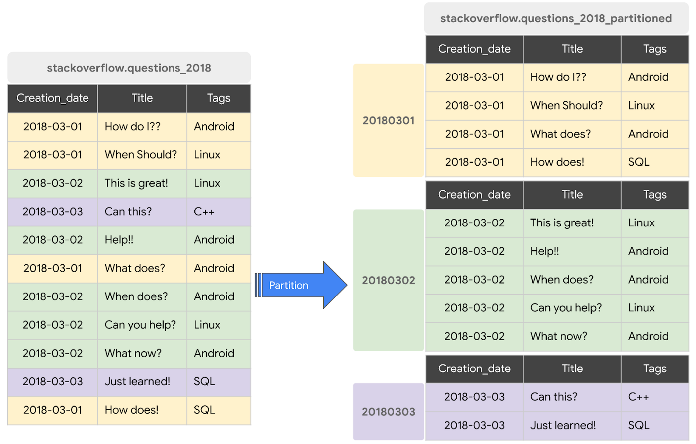

# WEEK 3: DATA WAREHOUSE AND BIGQUERY
---

## Table of Contents


[**3.1 Data Warehouse And BigQuery**](#31-data-warehouse-and-bigquery)
* [OLAP vs OLTP](#olap-vs-oltp)
* [Data Warehouse](#data-warehouse)
* [BigQuery](#bigquery)
* [BigQuery Cost](#--bigquery-cost--)
* [BigQuery Query](#--bigquery-query--)

[**3.2 Partitioning And Clustering**](#32-partitioning-and-clustering)
* [Partition in BigQuery](#partition-in-bigquery)
* [BigQuery Partition Query](#bigquery-partition-query)
* [Clustering in BigQuery](#clustering-in-bigquery)
* [BigQuery Partition + Clustering Query](#bigquery-partition-+-clustering-query)
* [Partitioning vs Clustering](#partitioning-vs-clustering)

[**3.3 BigQuery Best Practices**](#33-bigquery-best-practices)
* [Cost Reduction](#cost-reduction)
* [Query Performance](#query-performance)


## 3.1 Data Warehouse And BigQuery

### **OLAP vs OLTP**

OLAP -> Online Analytical Processing

OLTP -> Online Transactional Processing

|       | OLTP | OLAP |
| ----------- | ----------- |----------- |
| Purpose | Control and run essential business operations in real life | Plan, solve problems, support decisions and discover hidden insights |
| Data update | Shirt, fast updates initiated by users | Data periodically refreshed with scheduled, long running batch job |
| Database design | Normalized databases for effeciency | Denormalized databases for analysis |
| Space requirements | Generally small if historical data is archived | Generally large due to aggregating large dataset |
| Backup and recovery | Regular backups required to ensure business continuity and meet legal and governence requirements | Lost data can be reloaded from OLTP database as needed in lieu of reguler backups |
| Productivity | Increase productivity of end users | Increase productivity of business managers, data analysts and executives |
| Data view | Lists day-to-day business transactions | Multi dimensional view of enterprise data |
| User examples | Customer-facing personel, clerks, online shoppers | Knowledge workers, data analysts, business analyst and executives |


### **Data Warehouse**

Data warehouse is an OLAP solution that can be used for reporting and data analysis


### **BigQuery**

BigQuery is a serverless data warehouse. It is a Software as well as infrastructure that provide scalability and high availability.

Built-in features
  - Machine learning
  - Geospatial analysis
  - Bussiness intelligence
BigQuery maximizes flexibility by separating the compute engine that analyze data from storage

### **BigQuery Cost**

On demand pricing

  - 1 TB of data processed = $5

Flat rate pricing

  - Based on number of pre requested slots
  - 100 slots -> $2000/month = 400 TB data processed on demand pricing

### **BigQuery Query**

Query public available table
``` SQL
SELECT station_id, name FROM
`bigquery-public-data.new_york_citibike.citibike_stations`
LIMIT 100
```
----
Creating external table referring to gcs path

```SQL
CREATE OR REPLACE EXTERNAL TABLE `esoteric-code-377203.de_zoomcamp.external_yellow_tripdata`
OPTIONS (
  format = 'Parquet',
  uris = ['gs://de_zoomcamp_week2/data/yellow/yellow_tripdata_2021-*.parquet']
);
```
Note: this table will be linked to the data in gcs

---
Check external yellow trip data
```SQL
SELECT * FROM `esoteric-code-377203.de_zoomcamp.external_yellow_tripdata`
LIMIT 10
```
---


## 3.2 Partitioning And Clustering

### **Partition in BigQuery**

A [partitioned table](https://cloud.google.com/bigquery/docs/partitioned-tables) is divided into segments, called partitions, that make it easier to manage and query your data. By dividing a large table into smaller partitions, you can improve query performance and control costs by reducing the number of bytes read by a query.



Partition table can be partitioned by:

- time-unit column
- Ingestion time (_PARTITIONTIME)
- Integer range partitioning

Specifically for time unit and ingestion time, you can select Daily (default), hourly, monthly or yearly.

As a remark, number of partitions limit is 4000 partition.

### **BigQuery Partition Query**

Creating a non-partitioned table from external table
```SQL
CREATE OR REPLACE TABLE `esoteric-code-377203.de_zoomcamp.yellow_tripdata_non_partitoned` AS
SELECT * FROM `esoteric-code-377203.de_zoomcamp.external_yellow_tripdata`;
```

---

Creating a partitioned table from external table
```SQL
CREATE OR REPLACE TABLE `esoteric-code-377203.de_zoomcamp.yellow_tripdata_partitoned` AS
SELECT * FROM `esoteric-code-377203.de_zoomcamp.external_yellow_tripdata`;
```

---
**Impact of partition**

Scanning 608 MB MB of data
```SQL
SELECT *
FROM `esoteric-code-377203.de_zoomcamp.yellow_tripdata_non_partitioned`
WHERE DATE(tpep_pickup_datetime) BETWEEN '2021-02-01' AND '2021-02-28';
```
Scanning 178.55 MB of data

```SQL
SELECT *
FROM `esoteric-code-377203.de_zoomcamp.yellow_tripdata_partitioned`
WHERE DATE(tpep_pickup_datetime) BETWEEN '2021-02-01' AND '2021-02-28';
```

---
Taking a look into the partition
```SQL
SELECT table_name, partition_id, total_rows
FROM `de_zoomcamp.INFORMATION_SCHEMA.PARTITIONS`
WHERE table_name = 'yellow_tripdata_partitioned'
ORDER BY total_rows DESC;
```
---

### **Clustering in BigQuery**

[Clustered tables](https://cloud.google.com/bigquery/docs/clustered-tables) in BigQuery are tables that have a user-defined column sort order using *clustered columns*. Clustered tables can improve query performance and reduce query costs.

In BigQuery, a *clustered column* is a user-defined table property that sorts [storage blocks](https://cloud.google.com/bigquery/docs/storage_overview#storage_layout) based on the values in the clustered columns. The storage blocks are adaptively sized based on the size of the table

You can specify up to four clustered columns and the order of the specified columns determines the sort order of the data.


From the picture above, we partition the table according to the `Date` and choose `tags` as the *clustered column*

Clustered column must be top-level, non-repeated columns and have this dtype:

- DATA
- BOOL
- GEOGRAPHY
- INT64
- NUMERIC
- BIGNUMERIC
- STRING
- TIMESTAMP
- DATETIME


### **BigQuery Partition + Clustering Query**

Creating a partition and cluster table
```SQL
CREATE OR REPLACE TABLE `esoteric-code-377203.de_zoomcamp.yellow_tripdata_partitoned_clustered`
PARTITION BY DATE(tpep_pickup_datetime)
CLUSTER BY PULocationID AS
SELECT * FROM `esoteric-code-377203.de_zoomcamp.external_yellow_tripdata`;
```
Note: *Clustered column* cannot be a column with float dtype

---

**Impact of partition + clustering**

Query scans 71.21 MB

```SQL
SELECT count(*) as trips
FROM `esoteric-code-377203.de_zoomcamp.yellow_tripdata_partitioned`
WHERE DATE(tpep_pickup_datetime) BETWEEN '2021-01-01' AND '2021-12-31'
  AND PULocationID=1;
```
Query scans 52.11 MB

```SQL
SELECT count(*) as trips
FROM `esoteric-code-377203.de_zoomcamp.yellow_tripdata_partitoned_clustered`
WHERE DATE(tpep_pickup_datetime) BETWEEN '2021-01-01' AND '2021-12-31'
  AND PULocationID=1;
```

---

### **Partitioning vs Clustering**

Need to be remembered, a table with data size < 1 GB doesn't show significant improvement with partitioning and clustering. On contrary, it will add significant cost since partitioning and clustering tables incur metadata reads and metadata maintenance.

|       | Partitioning | Clustering |
| ----------- | ----------- |----------- |
| Cost | Cost known upfront  | Cost benefit unknown |
| Granularity | Need partition-level management  | Need more granularity than partitioning alone allows |
| Filter/Aggregation Queries | On a single column  | againts multiple particular columns |
| Cardinality | Have a limitation of cardinality (4000)  | suitable for column or group of columns with large cardinality |

**Clustering over Partitioning**

You need to consider to utilize clustering over partitioning, if:
- Partition results in a small amount of data per partition (Approx. less than 1 GB)
- Partitioning results in a large number of partitions beyond the limits on partitioned tables (High Cardinality)
- Partitioning results in your mutation operations modifying the majority of partitions in the table frequently (e.g. update data/query every hour)

## 3.3 BigQuery Best Practices

### **Cost Reduction**

- Avoid ```SELECT *```, Specify the column(s) you need
- Always price your queries before running them (can be seen on the right top corner)
- Use clustered or partitioned tables
- Use streaming inserts with caution
- [Materialize](https://en.wikipedia.org/wiki/Materialized_view) query results in stages

### **Query Performance**
- Filter on partitioned columns
- [Denormalizing data](https://www.geeksforgeeks.org/denormalization-in-databases/), use nested or repeated columns
- Use external data sources appropriately, do not use it if you want a high query performance (will also add more cost)
- Reduce data before using a `JOIN`
- Avoid [oversharding](https://www.techtarget.com/searchoracle/definition/sharding) tables
- `ORDER` statement should be the last part of the query
- Optimize `JOIN` patterns:
  - First, table with the largest number of rows
  - Followed by the table with the fewest rows
  - Then, place the remaining tables by decreasing size